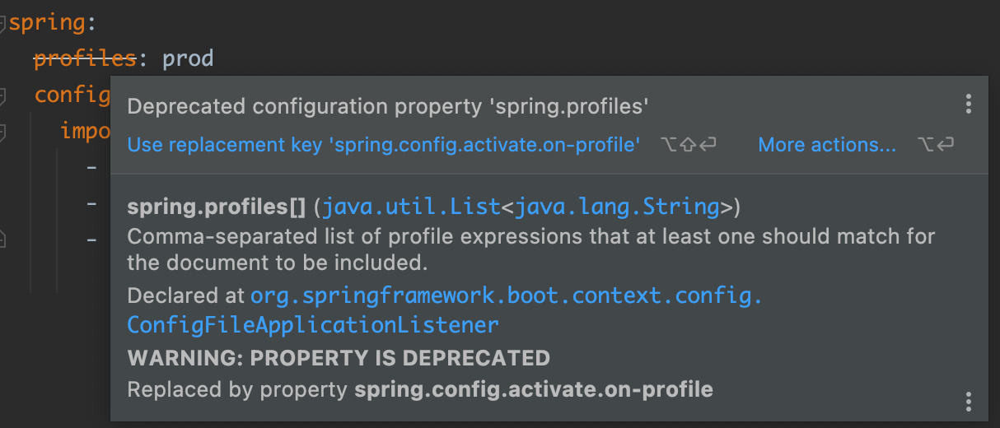
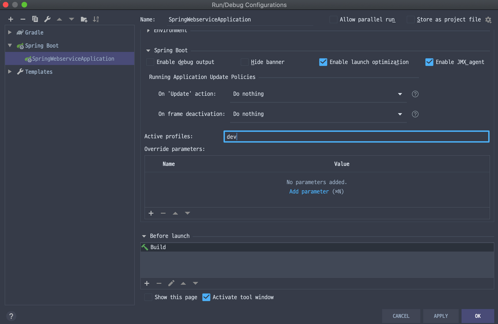

> 해당 포스트는 모모팀 크루 [렉스](https://github.com/Seongwon97)가 작성하였습니다.

# 학습 계기
프로젝트를 진행하며 배포를 진행하다보니 개발서버, 배포서버가 생겨났다. 그 결과 각각의 서버 별로 연결되는 DB가 다른 등의 차이점이 있어 실행환경에 대한 설정 분리가 필요했다.
모모팀은 Spring Profile을 통해 실행환경 설정을 쉽게 변경할 수 있도록 구현하였으며 해당 포스트에서는 Profile을 적용하며 학습한 내용을 정리했다.


# 1. 프로파일(Profile)이란?

애플리케이션을 개발하다보면 실행 환경에 따라 구성 명세를 다르게 설정해야할 때가 존재한다. 예를 들면 배포를 위한 애플리케이션을 개발하다보면 로컬서버, 개발서버, 배포서버 등 실행되는 위치에 따라 실행 환경 설정이 달라지게 된다. 필자는 최근 진행한 프로젝트에서는 로컬의 경우 H2 DB 또는 로컬 PC에 설치해둔 MySQL DB를 연결하였다. 그리고 개발 서버, 배포 서버에는 각각 실행환경에서 사용중인 DB를 연결시킨 후에 개발을 진행하였다.

이러한 환경에 대한 설정은 OS의 환경 변수를 통해 설정할 수도 있지만 변경점이 있을 때마다 직접 환경 변수를 변경해줘야하고, 배포 서버의 경우 여러 서버를 이용할 경우 여러개의 서버를 변경해줘야 하는 등의 번거로움이 동반하게 된다. 그리고 환경변수 변경은 Git을 통한 형상관리도 할 수 없다는 단점도 존재한다. 그래서 스프링 프로젝트를 개발할 때는 환경변수를 사용하기보다 스프링의 프로파일(Profile)기능을 사용하는 것이 좋다.

Spring은 실행 환경에 따라 애플리케이션의 설정을 다르게 해주는 프로파일이라는 기능을 제공하고 있다. 프로파일을 사용하면 런타임시에 활성화되는 프로파일에 따라 서로 다른 빈, 구성 클래스, 구성 속성 들이 적용 또는 무시될 수록 할 수 있다. 앞서 예시로 든 로컬﹒개발﹒배포서버의 설정의 경우, 개발 프로파일을 활성화시키면 개발 서버에서 사용하는 DB를 연결하게되고 배포 프로파일을 활성화시키면 배포 서버의 DB를 연결하는 등 간편하게 환경 설정을 할 수 있다.

# 2. Profile 속성 정의하기

프로파일에 특정한 속성을 정의하려면 각각의 환경의 속성들만을 포함하는 별도의 `.yml`, `.properties` 파일을 만들어야 한다. 이때 파일의 이름은 `application-{프로파일 이름}.yml`, `application-{프로파일 이름}.properties` 의 형식으로 생성을 하여야 한다.

필자는 로컬, 개발, 배포 환경에 맞는 3개의 yml파일을 만들어보았다.

- `application-local.yml`

    ```yaml
    spring:
      datasource:
        username: sa
        url: jdbc:h2:~/momo;DB_CLOSE_DELAY=-1;DB_CLOSE_ON_EXIT=FALSE
      jpa:
        properties:
          hibernate.dialect: org.hibernate.dialect.H2Dialect
        hibernate.ddl-auto: create-drop
        database-platform: org.hibernate.dialect.H2Dialect
    ```

- `application-dev.yml`

    ```yaml
    spring:
      datasource:
        driver-class-name: com.mysql.cj.jdbc.Driver
        username: momo
        password: momo123!
        url: jdbc:mysql://{개발서버DB_IP}:3306/momo?serverTimezone=UTC&characterEncoding=UTF-8
      jpa:
        hibernate.ddl-auto: validate
        database-platform: org.hibernate.dialect.MySQL8Dialect
    ```

- `application-prod.yml`

    ```yaml
    spring:
      datasource:
        driver-class-name: com.mysql.cj.jdbc.Driver
        username: momo
        password: momo123!
        url: jdbc:mysql://{배포서버DB_IP}:3306/momo?serverTimezone=UTC&characterEncoding=UTF-8
      jpa:
        hibernate.ddl-auto: validate
        database-platform: org.hibernate.dialect.MySQL8Dialect
    ```


> 과거에는 하나의 yml 파일 내에서 3개의 하이픈(`---`)을 기준으로 profile을 분리할 수 있었다. 하지만 Spring Boot 2.4버전부터 해당 기능은 deprecated되어 이제는 개별로 프로파일 `yml`파일을 생성해줘야 한다.
>
>
> 
>
> - [[spring-boot] 2.4 부터 변경된 구성파일 처리방식 살펴보기](http://honeymon.io/tech/2021/01/16/spring-boot-config-data-migration.html)
>

# 3. Profile 활성화하기

스프링 부트는 우선 기본적으로 `application.yml` 파일 내 모든 property 를 로드한 후에 활성화(active)된 profile 들에 대한 `.yml` 파일에 대해서만 property 를 로드한다. 활성화시킬 프로파일은 1개 이상일 수가 있으며 활성화시키는 방법은 여러 방법이 존재한다.

지금부터 프로파일을 active하는 방법에 대해 살펴보겠다.

## 3.1. application.yml을 통한 활성화

기본적으로 실행되는 `application.yml` 파일에 `spring.profiles.active` 속성을 통해 실행되는 프로파일을 설정할 수 있다. 하지만 해당 방법은 활성화시킬 기본 프로파일을 yml을 통해 설정하는 것이라 개발 환경에 따라 실행되는 프로파일을 쉽게 설정하는 프로파일의 이점을 살릴 수가 없다. 때문에 해당 방법은 사용하지 않는 것이 좋다.

```yaml
spring:
  profiles:
    active:
      - prod
```

## 3.2. 환경 변수를 통한 활성화

프로덕션 환경의 `SPRING_PROFILES_ACTIVE`환경변수를 설정하며 활성화시킬 프로파일을 설정할 수 있다.

```bash
% export SPRING_PROFILES_ACTIVE=prod
```

환경 변수를 통해 프로파일을 활성화사키면 `application.yml`에서 `spring.profiles.active` 속성을 통해 설정한 기본 프로파일의 동일한 속성보다 더 높은 우선순위를 갖게되어 해당 프로파일이 실행되게 된다.

## 3.3. Jar 파일 실행 설정을 통한 활성화

JAR파일을 통해 애플리케이션을 실행하며 프로파일 설정을 한다면 아래와 같이 `--spring.profiles.active` 옵션을 통해 설정해주면 된다.

```bash
java -jar {파일명}.jar --spring.profiles.active=prod
```

## 3.4. IntelliJ 설정

1. Run > Edit Configurations... 선택
2. Spring Boot Application 선택
3. Active profiles 에서 원하는 profile 명을 입력 후 실행



# 📚 Reference
- [스프링 인 액션 : 네이버 도서](https://search.shopping.naver.com/book/catalog/32441616013?cat_id=50010920&frm=PBOKPRO&query=%EC%8A%A4%ED%94%84%EB%A7%81%EC%9D%B8%EC%95%A1%EC%85%98&NaPm=ct%3Dl73e8ti0%7Cci%3Dfd13b06857fe558f4b9beb699e164f5a995fb85d%7Ctr%3Dboknx%7Csn%3D95694%7Chk%3D700b39cf6841823d167206c12bb45d010f14b68f)
- [Springboot Profile 설정방법 및 가져오기](https://oingdaddy.tistory.com/393)
- [Spring Profiles | Baeldung](https://www.baeldung.com/spring-profiles)
- [Spring Boot - Profile에 따른 properties(yml) 파일 설정하기](https://galid1.tistory.com/664)
- [[spring-boot] 2.4 부터 변경된 구성파일 처리방식 살펴보기](http://honeymon.io/tech/2021/01/16/spring-boot-config-data-migration.html)
