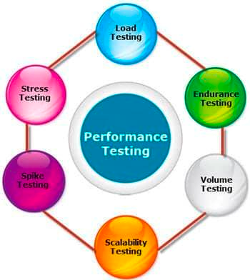
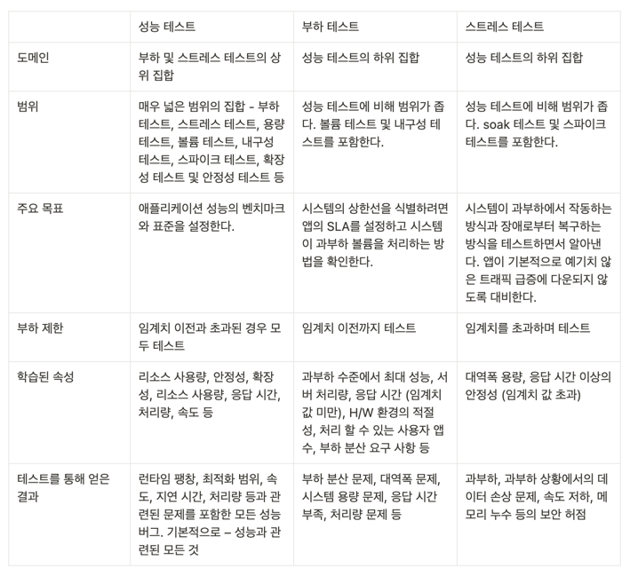

> 해당 포스트는 모모팀 크루 [렉스](https://github.com/Seongwon97)가 작성하였습니다.

# 🧑🏻‍💻 학습 계기

지금까지 개발 공부를 하며 애플리케이션의 성능에 대한 고민과 테스트를 해본적이 없어 성능 관련 테스트에 대한 학습을 할 일이 없었다. 그러다보니 성능 테스트, 부하 테스트, 스트레스 테스트가 모두 같은 의미를 갖는다고 생각을 하였다. 하지만 우테코 크루들과 이야기를 하다보니 성능 테스트, 부하 테스트, 스트레스 테스트가 비슷하지만 서로 다른 테스트라는 것을 알게 되며 프로젝트 성능 개선에 들어가기 앞서 각각 테스트 종류에 대한 개념 정리를 해보고자 한다.

# 🧐 성능(Performance) 테스트란?

성능 테스트는 특정 상황에서 시스템의 구성 요소가 어떻게 수행되는지 확인하기 위해 수행되는 테스트이다. 성능 테스트를 통해 시스템의 자원의 사용량, 확장성, 신뢰성 등을 검증할 수 있다.

일반적으로 개발을 하면서 부하 테스트와 스트레스 테스트 등의 키워드를 많이 접해봤을 것이다. 아래의 사진을 보면 해당 테스트들은 모두 성능 테스트 하위에 있는 것을 알 수 있다. 그만큼 성능 테스트는 매우 광범위한 범위를 갖고 있다.

### 🚀 성능 테스트의 목표

이러한 성능 테스트는 애플리케이션의 결함을 찾는 것을 목표로 하는 것이 아닌 시스템의 데이터 확보하여 벤치마크의 설정을 목표로 한다. 그렇기에 성공과 실패의 개념으로 분석하지 않으며 현재 시스템의 정확하고 객관적인 데이터를 확보하여 성능에 대한 현재 상황을 이해하는 것을 목표로 한다.

> **벤치마크**란?
>
>
> 벤치마크는 컴퓨팅에서 특정 오브젝트에 대해 일반적으로 수많은 표준 테스트와 시도를 수행함으로써 오브젝트의 상대적인 성능 측정을 목적으로 컴퓨터 프로그램을 실행하는 행위이다.
>

성공적인 성능 테스트는 데이터베이스, 네트워크, 소프트웨어, 하드웨어 등과 관련된 대부분의 성능 문제를 예상하여야 한다.

- ex) 특정 시나리오 상황에서의 API 평균 처리 속도를 파악하는 테스트
- 특정 부하에서 응답성 및 안정성 측면에서 시스템이 어떻게 동작하는지 측정하기 위한 비기능 테스트이다.
- 확장성, 신뢰성 및 리소스 사용과 같은 시스템의 다른 품질 속성을 조사, 측정, 검증할 수 있다.

# 🧐 부하 테스트란?

부하 테스트란 임계값 한계에 도달할 때까지 시스템의 부하를 지속적으로 꾸준히 증가시켜 시스템의 성능을 테스트하는 것이다. 부하 테스트는 유저의 수와 초당 API 요청 등을 증가시키며 시스템의 내구성을 테스트하고 결과를 모니터링하며 애플리케이션의 한계를 찾아내는 것을 목표로 한다.

### 🚀 부하 테스트의 목표

- 버퍼 모버플로우, 메모리 누수 및 잘못된 메모리 관리와 관련된 응용 프로그램의 결함을 노출한다.
    - 부하 테스팅의 결과로 발견되는 문제는 로드 밸련싱의 문제, 대역폭 문제, 기존 시스템의 용량 등이 포함될 수 있다.
- 애플리케이션이 미래에 예상되는 부하를 관리할 수 있도록 데이터베이스, 하드웨어, 네트워크 등의 모든 구성요소의 상한을 결정한다.

# 🧐 스트레스 테스트란?

스트레스 테스트는 기존 자원에 초과 작업으로 과부하를 주는 다양한 활동을 수행하며 시스템을 무너졌을 때 어떤 동작을 보이는지 확인하는 테스트이다. 시스템이 커버할 수 있는 대역폭 이상으로 과부하를 주며 과부하 상태일 때 모니터링 도구는 정상적으로 복구되는지, 시스템이 장애 조치를 하는지, 보안상의 문제가 발생하는지 등을 확인한다. 이러한 스트레스 테스트는 피로 테스트라고도 불린다.

### 🚀 스트레스 테스트의 목표

스트레스 테스트의 목표는 시스템의 충돌 후 로그, 보고서 등을 분석하여 애플리케이션의 동작을 정의하는 것이다. 이 중에서 가장 중요한 점은 장애 발생 후에 시스템이 민감한 데이터를 손상시키지 않도록 하는 것이다. 스트레스 테스트를 통해 얻을 수 있는 가장 이상적인 시스템은 부하가 걸려서 시스템이 고장난 이후에도 서비스가 정상 상태로 돌아오는 것이다.

# 📌 성능, 부하, 스트레스 테스트 비교

# 🌝 마치며
이번 포스트를 통해 그동안 몰랐던 성능 테스트, 부하 테스트, 스트레스 테스트가 무엇인지에 대해 학습을 하였다.
이론을 알게 되었으니 이를 바탕으로 현재 진행중인 프로젝트에 부하를 주며 하며 서비스의 성능을 테스트해보려 한다.

현재 계획으로는 nGrinder 또는 JMeter를 통해 부하를 주려고 한다.
자세한 내용은 테스트를 진행한 후, 다음 포스트에 기재하도록 하겠다.

# 📚Reference
- [Performance Testing Vs Load Testing Vs Stress Testing (Difference)](https://www.softwaretestinghelp.com/what-is-performance-testing-load-testing-stress-testing/)
- [부하 테스트란? 부하 테스트 직접 해보기](https://scshim.tistory.com/442)
- [결제 시스템 성능, 부하, 스트레스 테스트 | 우아한형제들 기술블로그](https://techblog.woowahan.com/2572/)
- [성능 테스트, 부하 테스트, 스트레스 테스트에 대해 알아보자](https://loosie.tistory.com/821)
