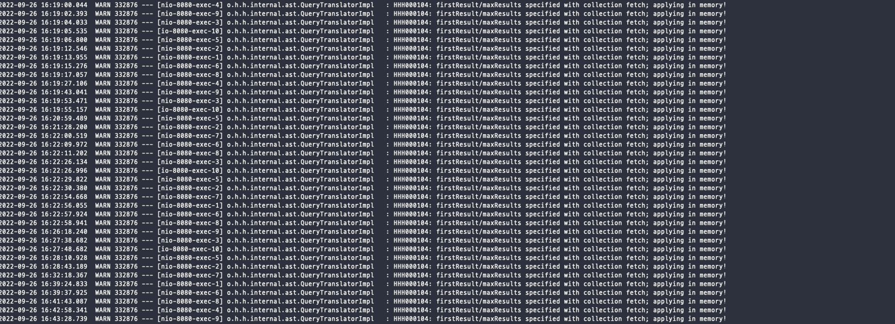
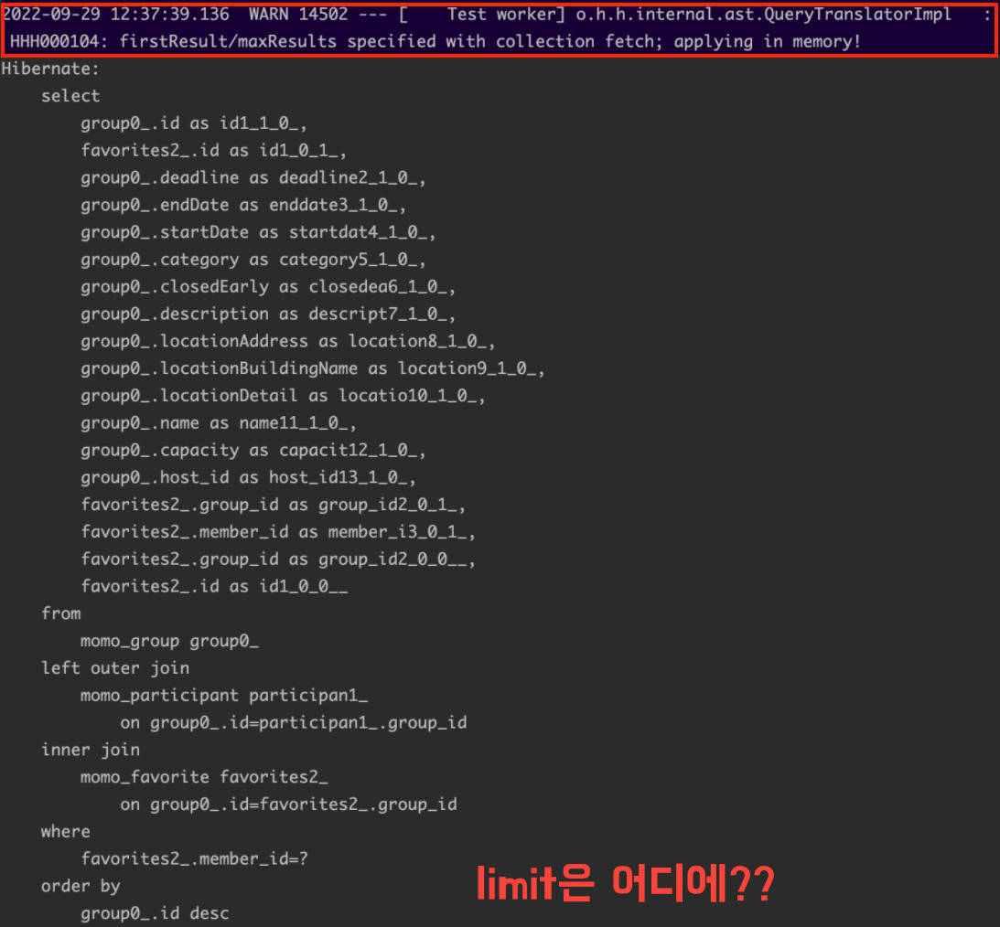
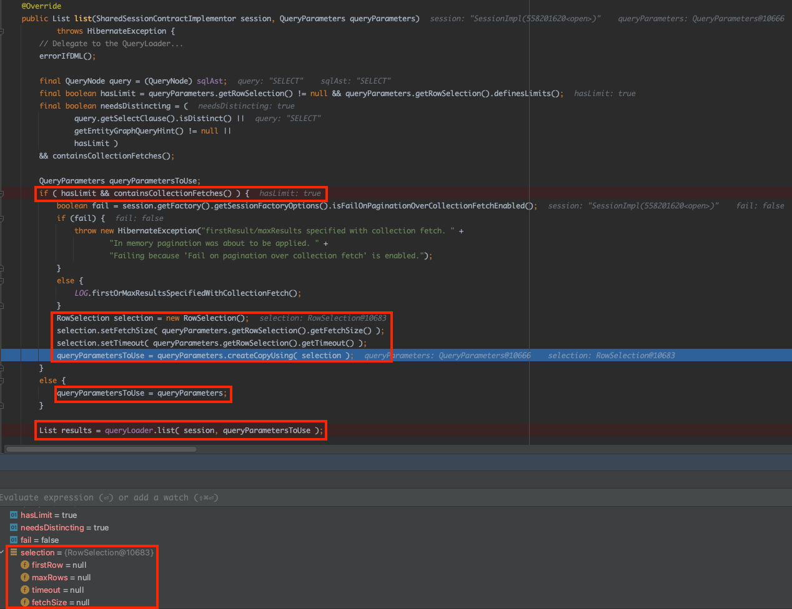
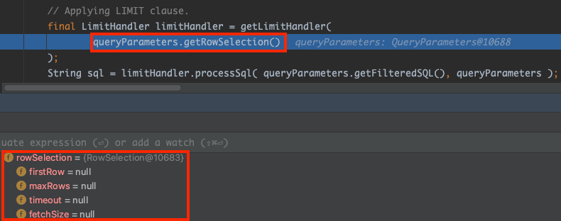
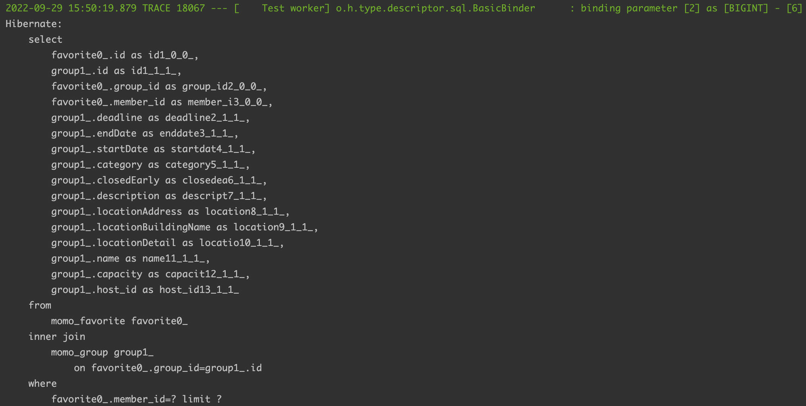
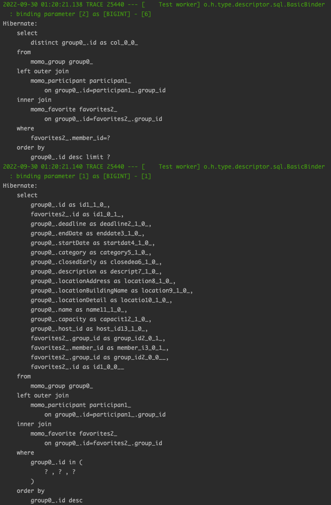

> 해당 포스트는 모모팀 크루 [렉스](https://github.com/Seongwon97)가 작성하였습니다.

# 학습 계기

모모팀 프로젝트를 진행하던중 애플리케이션 로그가 `[WARN] firstResult/maxResults specified with collection fetch; applying in memory!` 라는 한 가지 경고 로그가 도배된 것을 확인하였다. `WARN`레벨의 로그라 현재는 애플리케이션의 기능을 실행하는데에는 문제가 없으나 언제든지 성능상의 문제 등의 여러 문제로 돌아올 수 있기에 해당 경고를 찾아보고 해결하게 되었다.



# 문제 원인 분석

결론부터 말하자면 해당 문제는 JPA에서 OneToMany 연관관계에 fetchJoin과 limit절을 같이 사용하면 DB에서 페이지에 필요한 데이터만 가져오는 것이 아닌 모든 데이터를 가져온 후 JVM상에서 필요한 데이터를 추출하여 발생하는 경고이다.

아래의 코드는 모모팀 프로젝트 코드중 QueryDsl을 통해 찜한 모임 목록을 조회하는 쿼리이다. 해당 쿼리를 살펴보면 `fetchJoin()`과 `limit()`을 함께 사용한 것을 확인할 수 있다.

> 코드상의 Group, Participant, Favorite 간의 연관 관계는 아래와 같다.
> 

> 코드 중 `conditionFilter.filterByCondition(condition)`는 목록 조회시 여러 조건을 통한 데이터 필터링을 위해 걸어둔 조건이다.


```java
@Override
public Page<Group> findLikedGroups(SearchCondition condition, Member member, Pageable pageable) {
    List<Group> groups = queryFactory
            .selectFrom(group)
            .leftJoin(group.participants.participants, participant)
            .innerJoin(group.favorites.favorites, favorite)
            .fetchJoin()
                            .where(
                    favorite.member.eq(member),
                    conditionFilter.filterByCondition(condition)
            )
            .orderBy(orderByDeadlineAsc(condition.orderByDeadline()).toArray(OrderSpecifier[]::new))
            .offset(pageable.getOffset())
            .limit(pageable.getPageSize())
            .fetch();

    ...

    return PageableExecutionUtils.getPage(groups, pageable, countQuery::fetchOne);
}
```

해당 코드를 실행하여 콘솔을 살펴보면 쿼리가 실행될 때, 앞서 살펴봤던 경고 로그가 남은 것을 확인할 수 있다. 또한 SQL문을 살펴보면 코드상으로 지정하였던 `limit`절이 존재하지 않는다.



# 어째서 이러한 일이 발생하였을까?

쿼리를 실행하며 디버깅을 찍어보면 `QueryTranslatorImpl.Java` 의 `public List list(SharedSessionContractImplementor session, QueryParameters queryParameters)` 에서 limit과 fetch를 모두 가졌을 때 분기처리를 하여서 따로 처리를 하는 코드를 확인할 수 있다. limit과 fetchJoin을 모두 갖고 있는 부분에서는 아래의 코드를 보면 알 수 있듯이 `RowSelection` 객체인 selection을 복사해서 `queryParametersToUse` 로 사용한다. 하지만 이때 selection 객체는 우리가 사용하고자 하는 limit 정보를 전부 null로 가지고 있다.



이후 `queryParametersToUse` 는 `org.hibernate.loader` 패키지에 위치한 `Loader` 클래스의 `executeQueryStatement` 메서드를 실행하게 되는데 앞서 `queryParametersToUse` 에 limit 정보가 모두 Null 값이 저장되게 되어 실제 쿼리상에서 limit절이 적용되지 않게 되었다.



이러한 동작을 하게 되며 하이버네이트는 DB에서 조건에 매칭되는 모든 데이터를 JVM 메모리상에 로드하고, 그 이후에 로직으로 필요한 데이터를 반환하게 된다.

# 해결 방법은 무엇이 있을까?

## 해결방법 1
> **OneToMany의 Join 방향을 ManyToOne의 방향으로 스캔을 하며 DB 스캔시 필터링된 데이터만 가져오도록 하는 방법**

앞서 살펴봤던 오류는 OneToMany관계의 조회에서만 발생한다. 테스트를 위해 Group테이블을 시작으로 Favorite테이블을 Join하던 쿼리를 Favorite 테이블을 시작으로 Group을 Join하도록 ManyToOne방향으로 쿼리를 실행해봤다.

```java
@Override
public Page<Favorite> findGroups2(SearchCondition condition, Member member, Pageable pageable) {
    List<Favorite> groups = queryFactory
            .selectFrom(favorite)
            .innerJoin(favorite.group, group)
            .fetchJoin()
            .where(favorite.member.eq(member))
            .offset(pageable.getOffset())
            .limit(pageable.getPageSize())
            .fetch();

    ...

    return PageableExecutionUtils.getPage(groups, pageable, countQuery::fetchOne);
}
```

그 결과 앞서 살펴봤던 경고 메시지가 발생하지 않는 것을 확인할 수 있었다.



### 프로젝트 코드에 적용한 결과

해당 해결 방법을 프로젝트의 코드에도 적용을 해보았다. 하지만 해당 메서드의 쿼리 특성상 필터링 기능을 사용하며 Group, Participant, Favorite 테이블을 Join하며 필터링 및 결과 조회를 진행하고 있다. Favorite과 Group의 연관관계를 역으로 진행하여 Favorite테이블을 통해 조회하며 ManyToOne의 관계로 Join을 한다고 하여도, Participant 테이블을 Join하는 과정에서 OneToMany가 발생하여 문제 해결을 할 수가 없었다.

```java
@Override
public Page<Group> findLikedGroups(SearchCondition condition, Member member, Pageable pageable) {
    List<Group> groups = queryFactory
            .select(favorite.group)
            .from(favorite)
            .innerJoin(favorite.group, group)
            .leftJoin(group.participants.participants, participant) // 해당 과정에서 OneToMany가 발생
            .fetchJoin()
            .where(
                    favorite.member.eq(member),
                    conditionFilter.filterByCondition(condition)
            )
            .groupBy(favorite.group.id)
            .orderBy(orderByDeadlineAsc(condition.orderByDeadline()).toArray(OrderSpecifier[]::new))
            .offset(pageable.getOffset())
            .limit(pageable.getPageSize())
            .fetch();

    ...

    return PageableExecutionUtils.getPage(groups, pageable, countQuery::fetchOne);
}
```

## 해결방법 2
> **fetchJoin없이 엔티티의 모든 데이터가 아닌 id값만 가져오는 쿼리를 날린 후, 해당 ID를 IN절에 넣어 필요한 데이터를 가져오도록 하는 방법**

두번째 방법은 fetchJoin을 하지 않은 채로 필요한 데이터의 ID값만 가져온 후에 가져온 ID값들을 In절에 넣으며 필요한 데이터를 가져오는 방법이 있다. 즉, 쿼리를 ID를 조회하는 쿼리와 데이터를 조회하는 쿼리로 두 번 나눠서 보내는 방법이다.

### 프로젝트 코드에 적용한 결과

해당 방법은 1번 날라가던 쿼리가 2번으로 변경된다는 단점이 있긴 하나 JVM의 부담을 줄여줄 수 있다. 실제로 문제였던 경고 메시지 또한 발생하지 않아 해당 쿼리로 적용하였다.

```java
@Override
public Page<Group> findLikedGroups(SearchCondition condition, Member member, Pageable pageable) {
    List<Group> groups = queryFactory
            .selectFrom(group)
            .leftJoin(group.participants.participants, participant)
            .innerJoin(group.favorites.favorites, favorite)
            .fetchJoin()
            .where(group.id.in(findLikedGroupIds(condition, member, pageable)))
            .orderBy(orderByDeadlineAsc(condition.orderByDeadline()).toArray(OrderSpecifier[]::new))
            .fetch();

    ...

    return PageableExecutionUtils.getPage(groups, pageable, countQuery::fetchOne);
}

private List<Long> findLikedGroupIds(SearchCondition condition, Member member, Pageable pageable) {
    return queryFactory
            .select(group.id).distinct()
            .from(group)
            .leftJoin(group.participants.participants, participant)
            .innerJoin(group.favorites.favorites, favorite)
            .where(
                    favorite.member.eq(member),
                    conditionFilter.filterByCondition(condition)
            )
            .orderBy(orderByDeadlineAsc(condition.orderByDeadline()).toArray(OrderSpecifier[]::new))
            .offset(pageable.getOffset())
            .limit(pageable.getPageSize())
            .fetch();
}
```

그 결과 아래와 같이 1번 날리던 쿼리를 2번 날리게 되며 DB에 대한 접근 횟수는 증가하게 되었지만 DB에서 애플리케이션의 메모리로 불필요하게 모든 데이터를 가져온 후 필터링을 하는 문제는 해결할 수 있었다.



# 📚 Reference
- [How can I avoid the Warning "firstResult/maxResults specified with collection fetch; applying in memory!" when using Hibernate?](https://stackoverflow.com/questions/11431670/how-can-i-avoid-the-warning-firstresult-maxresults-specified-with-collection-fe)
- [[WARN] firstResult/maxResults specified with collection fetch; applying in memory!](https://velog.io/@cksdnr066/WARN-firstResultmaxResults-specified-with-collection-fetch-applying-in-memory)
- [fetch join 과 pagination 을 같이 쓸 때 [HHH000104: firstResult/maxResults specified with collection fetch; applying in memory]](https://javabom.tistory.com/104)
- [fetch join with pagination :: [HHH000104: firstResult/maxResults specified with collection fetch; applying in memory] 에러 해결](https://soon-devblog.tistory.com/40)
