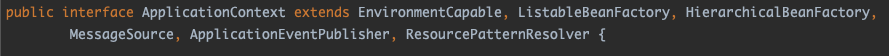
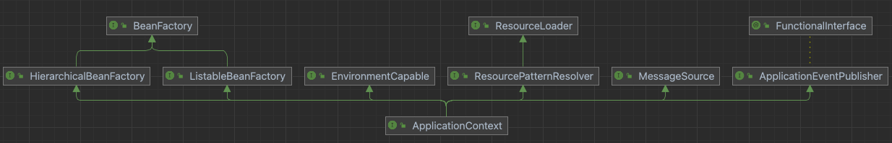
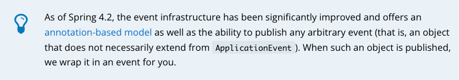
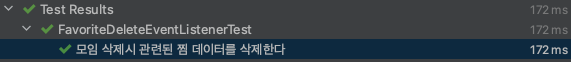

> 해당 포스트는 모모팀 크루 [렉스](https://github.com/Seongwon97)가 작성하였습니다.

# 학습 계기
프로젝트를 진행하며 도메인간의 연관관계를 분리하는 작업을 진행하다보니 Spring의 Event방식에 대해 알게 되었다. 이번 포스트에서는 프로젝트에 Event를 사용하기 위해 학습한 내용에 대해 포스팅해보려 한다.

> 진행하였던 프로젝트의 연관관계 분리 작업에 대해 자세히 알고 싶다면 아래의 포스트를 보길 바란다.
> - [모모팀 서비스 성능 개선기1 (의존관계 개선)](https://seongwon.dev/Spring/20221009-%EB%AA%A8%EB%AA%A8%ED%8C%80-%EC%84%9C%EB%B9%84%EC%8A%A4%EC%84%B1%EB%8A%A5-%EA%B0%9C%EC%84%A0%EA%B8%B01/)

# Event란?

> 컴퓨팅에서 **이벤트**(event)란 프로그램에 의해 감지되고 처리될 수 있는 동작이나 사건을 말한다.
> - [이벤트 (컴퓨팅) - 위키백과, 우리 모두의 백과사전](https://ko.wikipedia.org/wiki/%EC%9D%B4%EB%B2%A4%ED%8A%B8_(%EC%BB%B4%ED%93%A8%ED%8C%85))

위키피디아에서 Event를 위와 같이 정의하고 있다. Spring에서는 이러한 Event 메커니즘을 기본적으로 갖고 있으며 사용자가 쉽게 사용할 수 있도록 제공하고 있다. Spring의 핵심인 `ApplicationContext`를 살펴만봐도 `BeanFactory`외에 `ApplicationEventPublisher`인터페이스도 `extends`하는 것을 확인할 수 있다. 이와 같이 Event 처리 방식은 Spring Framework Core에 있을 정도로 기본적으로 제공하는 중요한 부분이다.





## Event의 용도 및 장점

이벤트는 크게 두 가지 용도로 사용되고 있다.

첫번째 용도는 트리거 역할이다. 도메인의 상태가 바뀔 때, 이후의 작업을 실행하기 위한 용도로 사용할 수 있다. 필자가 Event방식을 학습하게 된 계기와 같이 모임이 삭제되었을 때 연관된 데이터를 삭제하게 하는 트리거 역할에 사용할 수 있다.

두번째 용도는 서로 다른 시스템 간의 동기화 역할이다. A라는 시스템에서 변동이 있었을 때, B라는 서비스에 이벤트를 통해 정보 동기화를 진행할 수 있다. 예를 들자면 11번가에서 CJ대한통운을 통해 배송하는 택배를 주문하였고 해당 배송 주소를 변경하게 된다면 11번가에서는 주문 정보에 배송 주소를 변경시키고 CJ 대한통운에 배송 주소가 변경되었다는 것을 알리기 위해 변경 이벤트를 발생시키며 배송 주소를 동기화할 수 있다.

이러한 이벤트를 잘만 이용하면 각각의 시스템, 도메인 간의 연관관계(의존성)을 제거할 수 있고 의존관계의 제거로 인해 기능 확장 및 축소를 쉽게 진행할 수 있다.

# Event 사용 방법

이벤트의 동작은 크게 설명하자면 publisher를 통해 Event를 발생시키고 Listener가 해당 이벤트를 받아서 처리하는 방법으로 진행이 된다. 지금부터 Event객체, Publisher, Listenr에 대해 하나씩 살펴보겠다.

## Event 객체

Spring은 `ApplicationEvent`라는 추상 클래스를 제공하고 있다. Event는 해당 클래스를 `extends`하는 작업만으로도 쉽게 만들 수 있다.

```java
package org.springframework.context;

import java.time.Clock;
import java.util.EventObject;

public abstract class ApplicationEvent extends EventObject {

    private static final long serialVersionUID = 7099057708183571937L;
    private final long timestamp;

    public ApplicationEvent(Object source) {
        super(source);
        this.timestamp = System.currentTimeMillis();
    }

    public ApplicationEvent(Object source, Clock clock) {
        super(source);
        this.timestamp = clock.millis();
    }

    public final long getTimestamp() {
        return this.timestamp;
    }
}
```

`ApplicationEvent`객체를 상속받고 생성자에서 필드를 통해 데이터를 할당시키고 `super()`를 통해 객체를 전달시키면 된다. 여기서 주입받는 Object객체는 일반적으로 `publishEvent(new GroupDeleteEvent(this, id));` 와 같이 publisher를 통해 event를 발생시키는 객체가 위치한다.

```java
@Getter
public class GroupDeleteEvent extends ApplicationEvent {

    private final Long id;

    public GroupDeleteEvent(Object object, Long id) {
        super(object);
        this.id = id;
    }
}
```

**📌  Spring 4.2버전부터 변경된 내용**

지금까지 살펴본 `ApplicationEvent`를 상속받는 방식은 스프링 구버전부터 정석적으로 사용하던 방식이다. 하지만 Spring 4.2버전 이후는 Event관련 기능이 개선되어 `ApplicationEvent`를 상속하지 않고 사용할 수 있게 되었다. 개발자는 단순히 일반 객체를 `publishEvent()` 메서드이 인자로 넣어주기만 하면 스프링이 해당 객체를 알아서 Event로 감싸주도록 개선되었다.



즉, 이제는 아래와 같이 Event에 필요한 데이터만을 담은 객체를 만들어 사용하여도 된다.

```java
@Getter
@RequiredArgsConstructor
public class GroupDeleteEvent {

    private final Long id;
}
```

## Event Publisher

Event를 생성하기 위해서는 `ApplicationEventPublisher` Bean을 주입받고 해당 객체에서 제공하는 `publishEvent()`메서드를 사용하면 된다. 아래의 코드는 이벤트를 발생시키는 예시 코드이다.

```java
@RequiredArgsConstructor
@Transactional(readOnly = true)
@Service
public class GroupModifyService {

    private final ApplicationEventPublisher applicationEventPublisher;
    ...
    
    @Transactional
    public void delete(Long hostId, Long groupId) {
        // 1. ApplicationEvent를 상속한 Event클래스를 통해 이벤트를 발생시킬 경우
        applicationEventPublisher.publishEvent(new GroupDeleteEvent(this, id));

        // 2. ApplicationEvent를 상속하지 않은 Event클래스를 통해 이벤트를 발생시킬 경우
        applicationEventPublisher.publishEvent(new GroupDeleteEvent(groupId));
        groupRepository.deleteById(groupId);
    }
}
```

코드에서 `publishEvent()`를 사용한 두 가지 코드를 작성하였다. 1번 방법의 경우 앞서 Event에서 살펴봤던 `ApplicationEvent`를 상속한 Event클래스를 이용해 이벤트를 발생시키는 예시를 나타낸 것이며 두번째는 Spring 4.2이후 버전에서 `ApplicationEvent`의 상속을 하지 않은 Event객체를 통해 이벤트를 발생시킨 예시 코드이다.

## EventListener

`EventListener`는 Publisher에서 발행항 Event를 받아 처리하는 부분이다, `EventListener`는 `ApplicationListener`를 구현하는 클래스를 빈으로 등록하고 이벤트를 받았을 때 처리해야할 작업들은 `onApplicationEvent()` 메서드에 작성하면 된다. `ApplicationListener`는 제너릭 타입으로 처리할 Event를 지정할 수 있는데 해당 Event객체는 반드시 `ApplicationEvent`를 상속받은 Event객체어야 한다. 즉, Spring 4.2 버전 이후의 `ApplicationEvent`를 상속받지 않은 Event객체는 해당 방법을 사용할 수 없다.

```java
@RequiredArgsConstructor
@Component
public class FavoriteDeleteEventListener implements ApplicationListener<GroupDeleteEvent> {

    private final FavoriteRepository favoriteRepository;
    
    @Override
    public void onApplicationEvent(GroupDeleteEvent event) {
        favoriteRepository.deleteAllByGroupId(event.getId());
    }
}
```

Spring 4.2 이후 버전에서 `ApplicationEvent` 를 상속받지 않은 이벤트 객체들은 어노테이션 기반의 EventListener를 만들면 된다. 스프링에서 어노테이션 기반의 EventListener가 제공되며 `@EventListener`를 메서드 위에 붙이는 것 만으로도 EventListener를 만들 수 있다. 사용 예시는 아래와 같다.

```java
@RequiredArgsConstructor
@Component
public class FavoriteDeleteEventListener {

    private final FavoriteRepository favoriteRepository;

    @EventListener
    public void deleteGroup(GroupDeleteEvent event) {
        favoriteRepository.deleteAllByGroupId(event.getId());
    }

    @EventListener
    public void deleteMember(MemberDeleteEvent event) {
        favoriteRepository.deleteAllByMemberId(event.getId());
    }
}
```

어노테이션 기반 EventListener은 위의 코드에서 알 수 있듯이 한 개의 클래스에서 여러개의 EventListener를 만들 수 있다는 이점이 있다. 기존의 방식은 한 개의 클래스에서 하나의 이벤트만을 처리할 수 있다는 단점이 있었는데 이러한 단점이 개선되었다.

## 테스트 진행해보기

해당 이벤트 처리 방식이 잘 실행되는지 테스트 해보기 위해 테스트 코드를 작성해봤다. 테스트 초기 데이터는 momo, dudu라는 유저가 studyGroup을 찜한 상태이며, Event의 처리가 올바르게 된다면 studyGroup을 삭제했을 때 이벤트가 발생하여 관련된 favorite데이터들이 없어질 것이다.

> 자세한 코드는 [모모팀 레포지토리](https://github.com/woowacourse-teams/2022-momo)에서 확인하실 수 있다.
>

```java
@Transactional
@TestConstructor(autowireMode = TestConstructor.AutowireMode.ALL)
@RequiredArgsConstructor
@SpringBootTest
class FavoriteDeleteEventListenerTest {
    ...

    @DisplayName("모임 삭제시 관련된 찜 데이터를 삭제한다")
    @Test
    void deleteRelatedGroupData() {
        groupModifyService.delete(momo.getId(), studyGroup.getId());

        synchronize();
        Optional<Favorite> actual1 = favoriteRepository.findByGroupIdAndMemberId(studyGroup.getId(), momo.getId());
        Optional<Favorite> actual2 = favoriteRepository.findByGroupIdAndMemberId(studyGroup.getId(), dudu.getId());

        assertAll(
                () -> assertThat(actual1).isEmpty(),
                () -> assertThat(actual2).isEmpty()
        );
    }
    ...
}
```

테스트를 실행해본 결과 아래와 같이 이벤트가 처리되어 favorite데이터들 삭제 쿼리가 실행되고 테스트도 통과한 것을 확인할 수 있다.

```java
Hibernate: 
    delete 
    from
        momo_favorite 
    where
        group_id=?
...
Hibernate: 
    delete 
    from
        momo_group 
    where
        id=?
```



# 마치며

이번 포스트에서는 Spring에서 제공하는 Event를 사용하는 기본적인 방법에 대해 살펴보았다. 이벤트는 이번 포스트에서 다룬 내용 외에도 많은 기능들을 제공한다. 이번 포스팅에서 다룬 내용대로 이벤트를 사용한다면 기본적으로 동기식 이벤트로 동작할 것이다. 하지만 스프링은 어노테이션을 통해 비동기 이벤트와 트랜잭션 단계에 따라 이벤트를 동작시키는 Transaction-Bound Event 기능을 제공하고 있다. 해당 내용은 추후에 학습을 한 후 포스팅을 진행해보겠다.

# 📚 Reference
- [Core Technologies](https://docs.spring.io/spring-framework/docs/current/reference/html/core.html#context-functionality-events)
- [Spring Events](https://www.baeldung.com/spring-events)
- [ApplicationEventPublisher (Spring Framework 5.3.23 API)](https://docs.spring.io/spring-framework/docs/current/javadoc-api/org/springframework/context/ApplicationEventPublisher.html#publishEvent-java.lang.Object-)
- [[Spring] Spring의 Event를 어떻게 사용하는지에 대해서 알아봅시다](https://sabarada.tistory.com/184)
- [호식이 : 네이버 블로그](https://blog.naver.com/gngh0101/222020512119)
- [Spring - Event Driven](https://velog.io/@backtony/Spring-Event-Driven)
- [이벤트 기반, 서비스간 강결합 문제 해결하기 - ApplicationEventPublisher](https://velog.io/@znftm97/%EC%9D%B4%EB%B2%A4%ED%8A%B8-%EA%B8%B0%EB%B0%98-%EC%84%9C%EB%B9%84%EC%8A%A4%EA%B0%84-%EA%B0%95%EA%B2%B0%ED%95%A9-%EB%AC%B8%EC%A0%9C-%ED%95%B4%EA%B2%B0%ED%95%98%EA%B8%B0-ApplicationEventPublisher)
