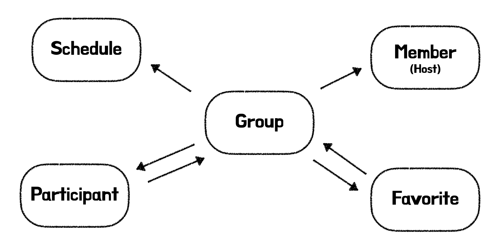
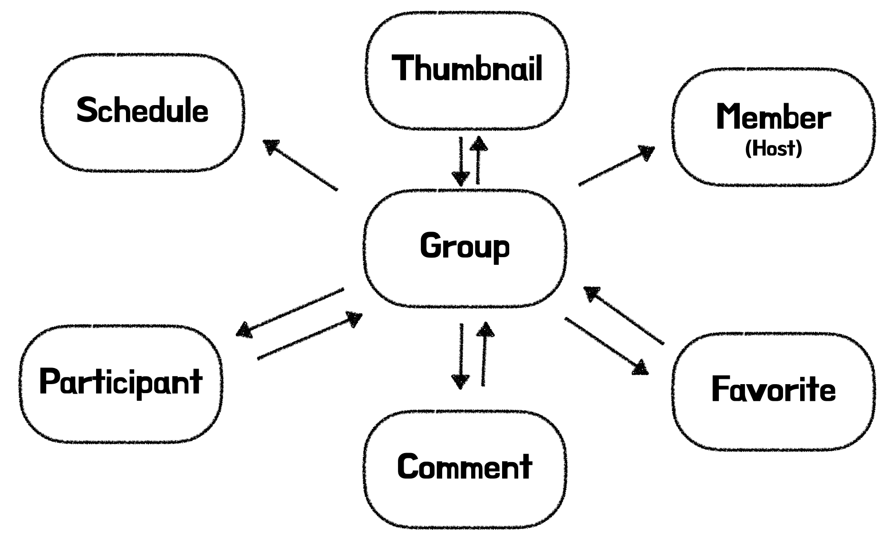
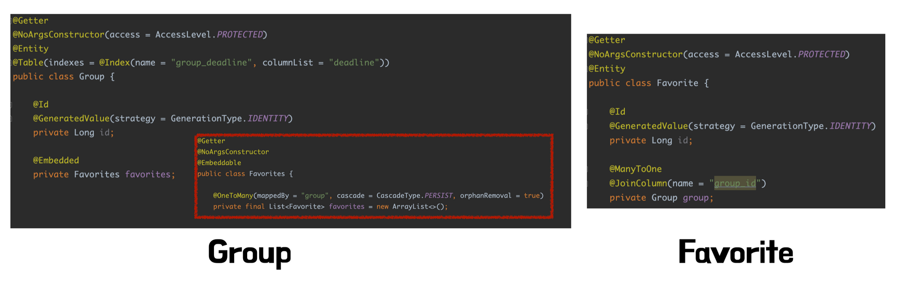
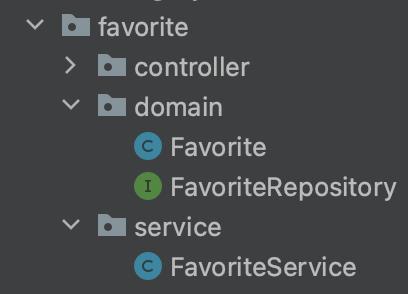
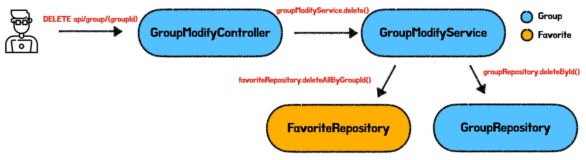
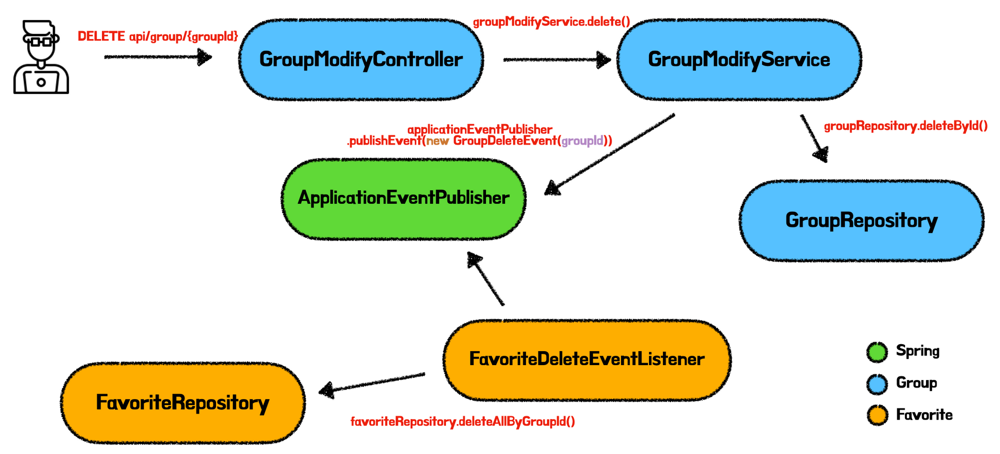
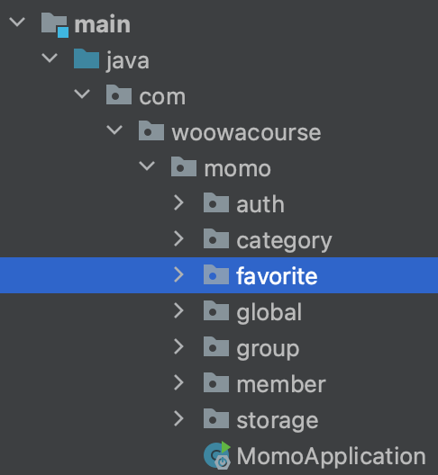

> 해당 포스트는 모모팀 크루 [렉스](https://github.com/Seongwon97)가 작성하였습니다.

# 기존 객체 의존관계의 문제점

[모모팀 프로젝트](https://github.com/woowacourse-teams/2022-momo)는 모임 관련 서비스인만큼 모임 찜하기, 모임 참여하기 등의 기능이 추가될 때마다 Group(모임)객체를 중심으로 개발이 진행되게 되었다. 처음에는 성능 생각 없이 주먹구구식으로 개발을 진행하다보니 Group객체에 기능이 하나씩 붙게 되며 Group이라는 객체가 점점 커지게 되었다. Group과 관계를 맺고 있는 객체들의 관계는 아래와 같다.



지금까지의 개발 방식으로 서비스를 확장할 경우 확장성을 고려하였을 때, 모임에 Q&A 기능을 추가하였을 때 추가되는 Comment, 이미지 기능을 추가하였을 때 추가되는 Thumbnail과 같은 객체들이 모두 Group과 서로 의존하게 되며 Group의 크기는 아래와 같이 점점 비대해질 것이다.



지금 생각나는 위와 같이 **Monolithic**과 유사한 구조의 단점은 다음과 같다.

### 1. 점점 많아지는 객체의 책임

위와 같은 구조의 개발은 새로운 기능을 추가할 때마다 Group객체에 새로 추가되는 기능의 코드들이 추가될 것이다. 즉, Group 객체가 갖는 책임이 그만큼 커질 것이다.

### 2. 성능 저하

또한 Group도메인에 애플리케이션의 성능 상에서도 좋지 못할 것이다. Group의 Host가 누구인지 알기 위한 단순한 조회를 하려고 하더라도 Group은 연관된 모든 객체들을 생성할 것이다. 물론 JPA에서 지연로딩을 통해 Proxy객체를 생성하여 사용한다 하더라도 이 또한 객체이기는 하여서 메모리와 GC의 동작 측면에서 비효율적일 것이다.

### 3. 독립적이지 못한 기능

그림으로 보면 알겠지만 Participant, Favorite, Comment, Thumbnail과 같은 부가기능들은 Group과 양방향 연관관계를 형성하고 있다. 서비스를 운영하며 특정 기능을 제거시킬 때, 기능을 분리하려면 Group과 관련된 전체 서비스 코드를 건드려야 할 것이다. 부가 기능을 추가하거나 제거할 때 서비스의 핵심 객체인 Group객체의 변경을 주게 되는 것은 혹여나 잘못된 코드를 건드려서 예상하지 못한 오류를 발생시킬 수도 있어 매우 위험한 작업이다. 또한 한 곳에 모여있지 않고 분산되어있는 코드들을 모두 삭제하지 못하고 일부 코드를 남기게 되며 레거시 코드가 만들어질 수도 있다.

위와 같은 여러 이유들 때문에 같이 분리할 수 있는 기능들 사이의 의존성을 분리하고 각각의 기능들을 모듈화 하여 **MSA(MicroService Architecture)**와 유사한 구조로 리펙터링을 진행하였다.

> Monolithic, MSA 아키텍처는 애플리케이션 내부의 객체간의 관계를 설명하기 위한 예시로 말한 것일 뿐, 실제 MSA, Monolithic은 각각의 애플리케이션을 작은 서비스로 나누어 구축하는지, 하나로 묶어서 운영하는지 등의 서비스 아키텍처를 의미한다.
즉, Monolithic는 실제로 하나의 애플리케이션 안에 모임 참여하기, 찜하기, 코멘트 남기기와 같은 모든 기능을 하나의 서비스에 담은 것이며 이를 MSA로 분리할 경우 기능들이 각각의 서비스가 되어 운영이 된다.
>

# 찜하기(Favorite) 기능의 모듈화

찜하기 기능은 모임 서비스의 핵심 기능이 아닌 부가 기능이라 판단하였다. 이에 찜하기 기능을 앞서 언급한바와 같이 Group 객체와 의존 관계를 끊어내며 모듈화 작업을 진행하였다.

모모팀 서비스의 Group과 Favorite은 다음과 같이 서로의 객체를 갖고 있는 양방향 의존 관계를 갖고 있었다.



찜하기 기능을 완전히 분리하기 위해서는 먼저 Group객체가 Favorite의 존재를 모르도록 객체간의 의존성을 단방향 관계로 변경해야 했다.

## Group과 Favorite객체간 의존관계 변경

기존 로직에서는 JPA의 `cascade`와 `orphanRemoval`을 통해 찜하기, 찜하기 취소 등의 로직이 수행되게 하였다.  덕분에 `FavoriteRepository`, `FavoriteService`와 같은 클래스들 없이 단순히 Group객체 내부에 있는 `List<Favorite>`에 데이터를 넣고 빼는 작업만으로 DB에서의 CUD작업을 진행할 수 있었다.

```java
@Getter
@NoArgsConstructor
@Embeddable
public class Favorites {

    @OneToMany(mappedBy = "group", cascade = CascadeType.PERSIST, orphanRemoval = true)
    private final List<Favorite> favorites = new ArrayList<>();

    public void like(Group group, Member member) {
        validateMemberNotYetLike(member);
        Favorite favorite = new Favorite(group, member);
        favorites.add(favorite);
    }

    public void cancel(Member member) {
        validateMemberAlreadyLike(member);
        favorites.stream()
                .filter(favorite -> favorite.isSameMember(member))
                .findAny()
                .ifPresent(favorites::remove);
    }
}
```

하지만 Group 객체와 Favorite객체를 완전히 분리하며 `cascade`와 `orphanRemoval`를 통한 Favorite 데이터의 생명주기를 관리할 수 없게 되었고 그 결과 `FavoriteRepository`, `FavoriteService` 가 생겨나게 되었다. 즉, 기존에 JPA의 `cascade`와 `orphanRemoval` 기능에 의존하여 실행하던 CUD 작업을 직접 Service, Repository를 통해 명시적으로 직접 진행하게 변경되었다.

```java
@RequiredArgsConstructor
@Transactional(readOnly = true)
@Service
public class FavoriteService {

    private final GroupValidator groupValidator;
    private final MemberValidator memberValidator;
    private final FavoriteRepository favoriteRepository;

    @Transactional
    public void like(Long groupId, Long memberId) {
        groupValidator.validateExistGroup(groupId);
        memberValidator.validateExistMember(memberId);
        validateMemberNotYetLike(groupId, memberId);

        Favorite favorite = new Favorite(groupId, memberId);
        favoriteRepository.save(favorite);
    }

    @Transactional
    public void cancel(Long groupId, Long memberId) {
        Favorite favorite = favoriteRepository.findByGroupIdAndMemberId(groupId, memberId)
                .orElseThrow(() -> new GroupException(MEMBER_NOT_YET_LIKE));

        favoriteRepository.delete(favorite);
    }
    ...
}
```

Favorite 엔티티에 대한 작업을 진행해주는 `FavoriteRepository`, `FavoriteService` 를 만들고 해당 클래스들을 favorite패키지에서 관리를 하니 “찜하기”, “찜하기 취소” 기능에 대해서는 확실히 Group과 Favorite의 관계를 단방향 의존 관계로 변경하게 되었다.



하지만 아직 아직 아래의 두가지 상황에 대해서는 의존을 분리하지 못한 상태이다.

- 모임이 삭제될 때, 해당 모임과 관련있는 찜하기 데이터를 삭제하여야 한다.
- 찜한 모임 조회 기능을 아직 `GroupSearchService`에서 진행하고 있어, Group과 Favorite 패키지 간의 의존성이 아직 완전히 끊어지지 않았다.

## Group이 삭제될 때 기존 Favorite의 데이터는 어떻게!?

이전 작업을 통해 단순히 찜하기, 찜하기 취소 등의 단일 요청에 대해서는 의존을 완전히 분리하였다. 하지만 모임이 삭제요청이 들어왔을 때, 아래의 이미지와 같이 연관된 찜하기 데이터를 삭제하기 위해서는 `GroupService`가 `FavoriteRepository`의 존재를 여전히 알고 있어야 했다.



```java
@RequiredArgsConstructor
@Transactional(readOnly = true)
@Service
public class GroupModifyService {	   
    private final FavoriteRepository favoriteRepository;
    ...

    @Transactional
    public void delete(Long hostId, Long groupId) {
        ifMemberIsHost(hostId, groupId, (host, group) -> {
            group.validateGroupIsProceeding();
            favoriteRepository.deleteAllByGroupId(groupId);
            groupRepository.deleteById(groupId);
        });
    }
}
```

즉, Group 패키지가 여전히 Favorite 패키지의 존재를 알고 있는 상황이다. 이를 개선하기 위해 Spring의 Event방식을 도입하였다.

> Spring의 Event방식은 Spring의 Bean과 Bean사이에 데이터를 전달하는 방법 중 하나이다.
>

Event방식을 사용하며 `GroupModifyService` 는 아래의 이미지와 같이 `ApplicationEventPublisher`에  `GroupDeleteEvent` 를 던져주는 작업만을 진행하도록 수정하며 `FavoriteRepository` 의 존재 자체를 모르게 끊어내었다.

```java
@RequiredArgsConstructor
@Transactional(readOnly = true)
@Service
public class GroupModifyService {
    ...

    @Transactional
    public void delete(Long hostId, Long groupId) {
        ifMemberIsHost(hostId, groupId, (host, group) -> {
            group.validateGroupIsProceeding();
            applicationEventPublisher.publishEvent(new GroupDeleteEvent(groupId));
            groupRepository.deleteById(groupId);
        });
    }
}
```

Event 방식을 적용하여 모임을 삭제하였을 때 요청부터 데이터 삭제까지 하는 동작 Flow는 아래와 같다. 그림으로 보면 알 수 있듯이 **Group**과 **Favorite**사이에 **Spring**의 **ApplicationEventPublisher**가 존재하여 둘 사이의 직접적인 관계를 끊어낸 것을 확인할 수 있다.



GroupDeleteEvent와 FavoriteDeleteEventListener의 코드는 아래와 같다.

- **GroupDeleteEvent.class**

    ```java
    @Getter
    public class GroupDeleteEvent {
    
        private final Long id;
    
        public GroupDeleteEvent(Long id) {
            this.id = id;
        }
    }
    ```

- **FavoriteDeleteEventListener.class**

    ```java
    @RequiredArgsConstructor
    @Component
    public class FavoriteDeleteEventListener {
    
        private final FavoriteRepository favoriteRepository;
    
        @EventListener
        public void deleteGroup(GroupDeleteEvent event) {
            favoriteRepository.deleteAllByGroupId(event.getId());
        }
    
        @EventListener
        public void deleteMember(MemberDeleteEvent event) {
            favoriteRepository.deleteAllByMemberId(event.getId());
        }
    }
    ```


# 끝나지 않은 분리

패키지 분리와 Event처리 방식을 통해 찜하기와 연관된 모든 CUD작업을 분리하게 되었다. CUD에 대해서 찜하기 기능을 삭제하고 싶다면 단순히 favorite 패키지만을 삭제하면 된다.



하지만 아직 읽기에 대해서는 완전한 분리를 이루지 못하였다. 모모팀 서비스는 찜한 모임 목록 조회 기능을 제공하고 있다. 해당 기능은 현재 “참여한 목록 조회”, “주최한 목록 조회”와 같은 기능들과 함께 Group패키지 안에 위치하고 있다.

Favorite의 CUD작업을 진행하며 해당 로직을 분리하지 않은 이유는 API상에서 다른 조회 로직들과 같은 prefix를 갖고 있어 분리를 한다면 같은 Prefix URL을 가진 조회 기능에 대한 API들이 여러 패키지에 분산되어 코드를 파악하기 어렵다고 생각했다. 또한 Favorite패키지로 분리를 할 경우 른 조회 로직들과 중복 로직이 발생하기도 하였다.

현재 드는 생각으로는 추후 다른 모듈화된 기능이 추가될 경우에도 조회에 대해서는 API 반환값에 따라 Group이 의존하게 될 것이라 생각되어 CQRS패턴을 적용하여 CUD를 진행하는 비즈니스 로직과 조회를 담당하는 R 로직을 큰 패키지로 분리하여 관리를 하는 것이 좋을까? 하는 생각을 하고 있다. 그럴 경우 CUD에 해당하는 Command에 대해서는 확실히 모듈간의 의존성이 분리되고 Query에 대해서만 필요에 따라 서로 엮여있기에 확실히 이점이 있지 않을까 싶다.

CQRS에 대해서는 아직 학습이 부족하다 판단하여 추가적인 학습을 진행한 후에 프로젝트에 적용할지 결정해보려한다.

# 마치며

모모팀 서비스를 키워가며 Group 객체가 점점 커지는 것을 느껴 부가 기능에 대해서는 모듈화를 통해 객체간의 의존 관계를 단방향으로 변경해가는 작업을 진행해봤다. 아직 Read에 대해서는 Group 패키지가 Favorite의 존재를 알고 있다는 점에서 완전한 분리가 되지 않은 상태지만 CUD작업을 진행함에 있어서 불필요한 객체와 조회로직이 줄어들어 성능 개선이 되었다 생각한다. 실제 각각 API별로 실행되는 쿼리를 비교해봐도 애플리케이션으로 읽어오는 데이터의 양과 날라가는 쿼리가 줄어든 것을 확인하였다. 또한 모듈화 분리를 진행하며 객체간의 의존관계에 대한 많은 고민과 학습을 하고 Spring의 Event처리 방식에 대해 학습을 하는 좋은 시간을 가졌던 것 같다.

객체간의 의존 관계 작업은 여기서 마치고 앞으로는 애플리케이션의 쿼리를 분석 및 개선하는 작업을 진행해보려한다.
