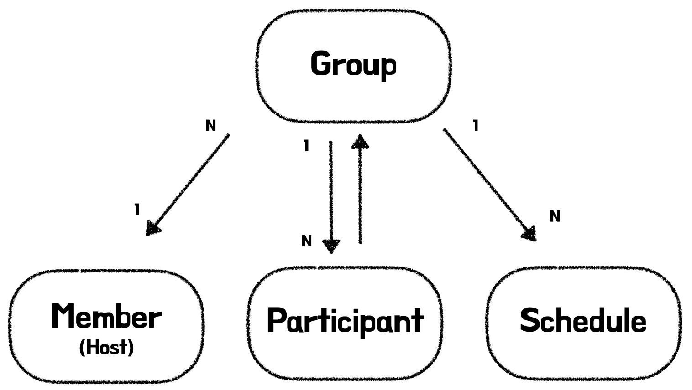
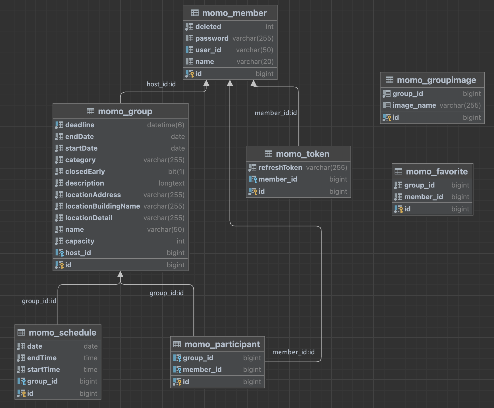
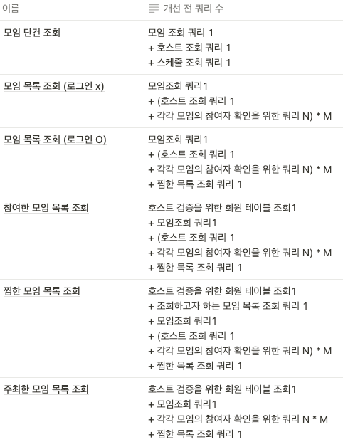
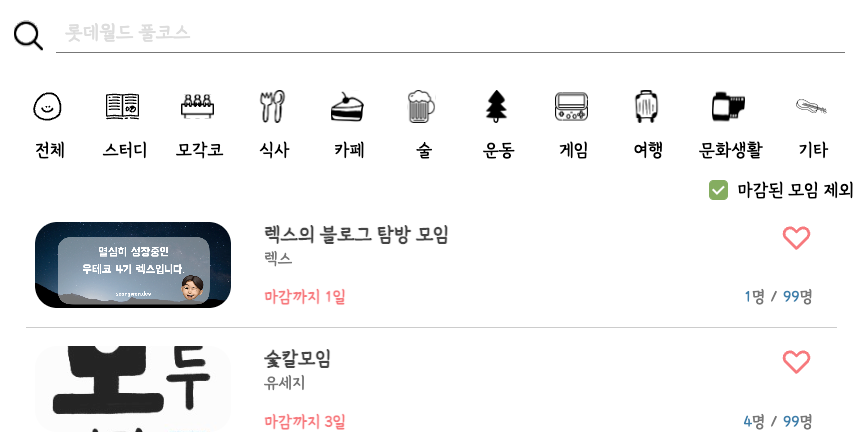
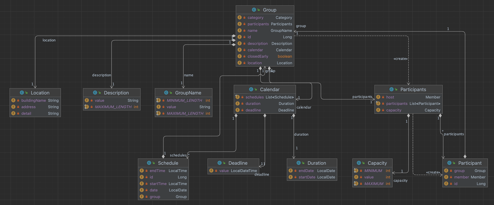
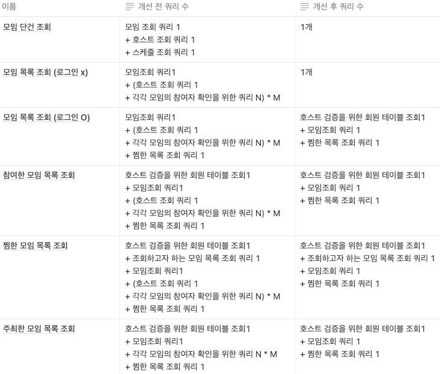

# 들어가며

지금까지는 서비스 개발을 진행하며 API를 호출하였을 때 실행되는 쿼리의 수, 성능상의 문제점 등을 생각하지 않고 일단 돌아가는 코드를 만들자! 하면서 기능 개발에만 몰두하였었다. 하지만 성능상의 문제를 생각하지 않고 개발을 진행하고 우리 서비스의 목표 인원(우테코 크루 + 코치, 약 150명)이 동시 접속을 하여 서비스를 이용한다는 상황으로 부하 테스트를 진행하였을 때 애플리케이션이 올라간 EC2가 버티지 못하는 문제가 발생하였다.


실제로 부하를 준 후에 Grafana와 Prometheus를 통해 Spring 프로젝트를 모니터링 해본 결과 EC2가 종료되기 전에 많은 객체를 생성하여 메모리 사용량과 GC의 동작이 활발한 것을 확인할 수 있고 DB에 많은 조회요청이 있어 HikariCP의 DB 커넥션이 항상 높거나 부족한 것을 확인할 수 있었다.

이에 서비스의 API별 실행되는 쿼리의 개수를 파악하여 개선해야한다는 것을 느꼈고 가장 많은 요청이 있는 조회 쿼리에 대한 개선을 먼저 진행해보려고 한다.

# 객체 및 테이블의 연관관계

조회 로직 개선을 하기 앞서 먼저 객체와 테이블들 사이의 연관관계를 살펴보겠다. 모두모여라 서비스는 모임 서비스인만큼 모임(Group)객체/테이블을 중심으로 다른 객체/테이블들이 연관관계를 맺고 있다.





실제로 객체의 연관관계를 나타낸 이미지와 DB 테이블의 다이어그램을 살펴보면 Group이 Member, Schedule, Participant와 연관관계를 맺고 있는 것을 확인할 수 있다.

# 개선 전 쿼리 분석

서비스의 조회 쿼리를 개선하기 앞서 개선 전 조회 API별 쿼리를 먼저 분석해봤다.



결과를 보면 알 수 있듯이 심각한 여러번 재귀적으로 발생하는 N+1문제는 아니지만 N+1문제가 존재하는 것과 불필요하게 많은 쿼리가 실행되는 것을 확인할 수 있었다. 지금부터 해당 쿼리를 어떠한 방식을 통해 개선하였는지 살펴보겠다.

# FetchJoin을 통한 단건 조회 쿼리 개선

모임 단건 조회의 경우, 모임의 상세 조회를 한 것이기에 다음과 같이 많은 데이터를 조회 후 반환하여야 했다. 단건 조회 요청에 대한 반환 값은 아래와 같다.

```json
{
  "name" : "모모의 스터디",
  "host" : {
    "id" : 6,
    "name" : "모모"
  },
  "categoryId" : 1,
  "capacity" : 10,
  "duration" : {
    "start" : "2022-10-22",
    "end" : "2022-10-22"
  },
  "schedules" : [ {
    "date" : "2022-10-22",
    "startTime" : "10:00:00",
    "endTime" : "12:00:00"
  } ],
  "finished" : false,
  "deadline" : "2022-10-21T23:59",
  "location" : {
    "address" : "서울 송파구 올림픽로 289",
    "buildingName" : "시그마타워",
    "detail" : "1층"
  },
  "like" : false,
  "description" : ""
}
```

해당 데이터를 조회하기 위해서는 여러 테이블에 분산된 데이터를 조회하기 위해 아래와 같이 Group, Schedule, Member테이블을 각각 조회하여야 했다.

```sql
Hibernate: 
    select
        group0_.id as id1_1_0_,
        group0_.deadline as deadline2_1_0_,
        group0_.endDate as enddate3_1_0_,
        group0_.startDate as startdat4_1_0_,
        group0_.category as category5_1_0_,
        group0_.closedEarly as closedea6_1_0_,
        group0_.description as descript7_1_0_,
        group0_.locationAddress as location8_1_0_,
        group0_.locationBuildingName as location9_1_0_,
        group0_.locationDetail as locatio10_1_0_,
        group0_.name as name11_1_0_,
        group0_.capacity as capacit12_1_0_,
        group0_.host_id as host_id13_1_0_ 
    from
        momo_group group0_ 
    where
        group0_.id=?
Hibernate: 
    select
        member0_.id as id1_2_0_,
        member0_.deleted as deleted2_2_0_,
        member0_.password as password3_2_0_,
        member0_.user_id as user_id4_2_0_,
        member0_.name as name5_2_0_ 
    from
        momo_member member0_ 
    where
        member0_.id=?
Hibernate: 
    select
        value0_.group_id as group_id5_4_0_,
        value0_.id as id1_4_0_,
        value0_.id as id1_4_1_,
        value0_.date as date2_4_1_,
        value0_.endTime as endtime3_4_1_,
        value0_.startTime as starttim4_4_1_ 
    from
        momo_schedule value0_ 
    where
        value0_.group_id=?
```

해당 쿼리들은 엔티티들간의 연관관계 패치 타입을 `LAZY`가 아닌 `EAGER`로 설정하면 한 번의 쿼리로 조회를 할 수 있다. 하지만 패치 타입을 `EAGER`로 설정하게 된다면 우리가 예상하지 못한 쿼리들이 발생할 수 있기에 패치타입을 변경하는 방법이 아닌 fetch join을 하는 JPQL쿼리문을 작성하여 한 번의 쿼리로 모든 데이터를 조회하도록 하였다.

작성한 쿼리는 아래와 같다. schedule, host의 정보를 fetch join을 통해 한번에 가져오는 쿼리를 만들어 한 번의 쿼리로 모든 데이터를 갖고 오도록 하였다.

```java
    @Query("SELECT g FROM Group g "
            + "JOIN FETCH g.calendar.schedules.value "
            + "JOIN FETCH g.participants.host "
            + "WHERE g.id = :id")
    Optional<Group> findByIdWithHostAndSchedule(Long id); 
```

쿼리를 실행한 결과는 계획했던바와 같이 테이블별로 각각 조회하던 데이터를 join을 통해 한 번의 쿼리로 모든 데이터를 가져오도록 변경되었다.

```sql
Hibernate: 
    select
        group0_.id as id1_1_0_,
        value1_.id as id1_4_1_,
        member2_.id as id1_2_2_,
        group0_.deadline as deadline2_1_0_,
        group0_.endDate as enddate3_1_0_,
        group0_.startDate as startdat4_1_0_,
        group0_.category as category5_1_0_,
        group0_.closedEarly as closedea6_1_0_,
        group0_.description as descript7_1_0_,
        group0_.locationAddress as location8_1_0_,
        group0_.locationBuildingName as location9_1_0_,
        group0_.locationDetail as locatio10_1_0_,
        group0_.name as name11_1_0_,
        group0_.capacity as capacit12_1_0_,
        group0_.host_id as host_id13_1_0_,
        value1_.date as date2_4_1_,
        value1_.endTime as endtime3_4_1_,
        value1_.startTime as starttim4_4_1_,
        value1_.group_id as group_id5_4_0__,
        value1_.id as id1_4_0__,
        member2_.deleted as deleted2_2_2_,
        member2_.password as password3_2_2_,
        member2_.user_id as user_id4_2_2_,
        member2_.name as name5_2_2_ 
    from
        momo_group group0_ 
    inner join
        momo_schedule value1_ 
            on group0_.id=value1_.group_id 
    inner join
        momo_member member2_ 
            on group0_.host_id=member2_.id 
    where
        group0_.id=?
```

# DTO를 통한 모임 목록 조회

모임 상세 조회를 제외한 모임 관련 조회 API는 모두 모임 목록 조회 API이다. 모모팀 서비스의 메인 페이지를 비롯해 여러 모임 목록 조회 페이지를 보면 아래와 같이 모임의 이름, 호스트, 마감일까지 남은 기간, 참여자 수, 최대 인원의 정보만을 출력하고 있는 것을 확인할 수 있다.



즉, 사용자에게 정보를 보여주기 위해서는 모임 상세와 다르게 모임의 모든 정보가 아닌 일부의 데이터만을 필요로 하고 있다. 기존의 로직에서는 일부 데이터만을 필요로 하는 목록 조회에서도 전체 모임 정보를 읽어와 Group객체를 만들었다. 이러한 구조는 메모리와 DB 측면에서 성능 저하를 일으키고 있었다.

## 메모리 측면에서의 성능 저하

모모팀은 서비스를 개발하며 각각의 값들에 대한 안정성을 보장하기 위해 값 객체를 만들다보니 온전한 Group객체를 만들려면 수많은 객체들을 생성하여야 했다.

모모팀 서비스의 Group 도메인 구조를 살펴보면 아래와 같이 수 많은 객체들이 엮여있는 것을 확인할 수 있다.



해당 클래스들을 단순 조회를 하였을 때 항상 만들어지는 객체와 Proxy로 만들어지는 객체를 정리해보면 다음과 같다.

- 항상 만들어지는 객체: Group, GroupName, Location, Description, Calender, Deadline, Duration, Participants, Capacity
- 지연로딩으로 만들어지는 Proxy객체: Schedule, Participant

Group객체를 만들 때는 `9 + (N개의 Schedule Proxy객체) + (N개의 Participant객체)` 가 만들어지고 있었다. 우리 서비스의 타겟 인원(150명)이 동시에 모임 목록 조회 요청을 보냈을 때를 생각해보겠다. 모모 서비스는 목록 조회시 페이지네이션의 적용으로 인해 12개의 모임을 조회 및 반환하고 있다. 12개의 모임 조회를 150명이 동시에 요청을 한다면 요청을 처리하기 위해 만들어져야하는 도메인 레이어의 객체의 수는 `{9 + (N개의 Schedule Proxy객체) + (N개의 Participant객체)} * 12 * 150` 개가 된다. 이는 많은 메모리를 사용할 것이고 GC가 해야할 일이 너무 많아질 것이다.

> 실제 요청을 처리하기 위해서는 Request, Response DTO, Participant의 실제 객체를 만드는 등의 추가적인 객체들이 만들어져야합니다.
>

우리의 타겟 인원 150명만을 생각해도 셀 수도 없이 많은 객체들이 만들어지는데, 우리의 서비스가 배민과 같이 초당 요청이 수 십, 수 백만 건의 모임 목록 조회 요청을 받게 된다고 생각하면 진짜 상상할 수도 없을 정도의 객체들이 만들어질 것이다.

즉, 값 객체를 만들어 애플리케이션의 안정성은 높일 수 있었으나 메모리 측면의 성능에서는 확실히 많은 손해를 보고 있던 것이다.

## DB 측면에서의 성능 저하

### 불필요한 데이터 요청

실제 사용되지 않는 모든 데이터를 조회하는 것은 DB와의 통신 측면에서도 좋지 않다. Spring 애플리케이션과 DB는 서로 다른 인스턴스에 위치해있고 둘 사이에서도 필요한 데이터를 가져오기 위해 요청과 응답 과정을 거치며 네트워크 통신을 하게 된다. 둘 사이에 통신을 할 때 불필요한 데이터들도 조회 및 전송을 한다면 해당 부분에서도 확실히 성능 저하가 발생할 것이다.

### 보내지는 쿼리의 수

성능 개선 전 모임 목록 조회를 하였을 경우 DB에 `모임조회 쿼리1 + (호스트 조회 쿼리 1 + 각각 모임의 참여자 확인을 위한 쿼리 N) * 모임 수` 개의 쿼리가 날라갔다. 여기서 모임 참여자 확인을 위한 쿼리는 모임을 참여하는 인원 수를 비즈니스 로직에서 확인을 하다보니 Group이 갖고 있는 지연 로딩으로 인해 Proxy객체로 조회되었던 `List<Participant>`의 데이터를 하나씩 조회하는 과정에서 실행이 되었다.

```sql
Hibernate: 
    select
        distinct group0_.id as id1_1_,
        group0_.deadline as deadline2_1_,
        group0_.endDate as enddate3_1_,
        group0_.startDate as startdat4_1_,
        group0_.category as category5_1_,
        group0_.closedEarly as closedea6_1_,
        group0_.description as descript7_1_,
        group0_.locationAddress as location8_1_,
        group0_.locationBuildingName as location9_1_,
        group0_.locationDetail as locatio10_1_,
        group0_.name as name11_1_,
        group0_.capacity as capacit12_1_,
        group0_.host_id as host_id13_1_ 
    from
        momo_group group0_ 
    left outer join
        momo_participant participan1_ 
            on group0_.id=participan1_.group_id 
    order by
        group0_.id desc limit ?
Hibernate: 
    select
        member0_.id as id1_2_0_,
        member0_.deleted as deleted2_2_0_,
        member0_.password as password3_2_0_,
        member0_.user_id as user_id4_2_0_,
        member0_.name as name5_2_0_ 
    from
        momo_member member0_ 
    where
        member0_.id=?
Hibernate: 
    select
        participan0_.group_id as group_id2_3_0_,
        participan0_.id as id1_3_0_,
        participan0_.id as id1_3_1_,
        participan0_.group_id as group_id2_3_1_,
        participan0_.member_id as member_i3_3_1_ 
    from
        momo_participant participan0_ 
    where
        participan0_.group_id=?
(참여자 수 N만큼 참여자 조회 쿼리가 날라간다.)
```

즉, 하나의 모임 데이터를 조회하는 것만 생각하여도 Group테이블에 대한 조회뿐만 아니라 Member테이블에 1번, Participant 테이블에 N번 조회하여 셀 수 없이 많은 쿼리들이 실행되고 있었다. 이 또한 DB Connection을 그만큼 오래 잡고 많은 요청을 하기에 성능상의 저하를 유발시켰다.

## 문제 해결

해당 문제들은 모임 목록 조회를 할 때, Repository레이어에서 DTO를 반환하도록 로직을 수정하며 해결하였다. 코드를 살펴보겠다. 기존의 모임 목록 조회 로직은 QueryDsl의 로직을 통해 처리되었었다

> QueryDsl을 통해 모임 목록을 조회한 이유는 모임 목록 조회시 카테고리별 조회, 마감된 모임 목록 조회, 키워드를 통한 조회 등의 여러 검색 조건을 걸 수 있어 동적 쿼리를 만들기 위해 사용하였다.
>

```java
@Repository
public class GroupSearchRepositoryImpl implements GroupSearchRepositoryCustom {
	...
	private Page<Group> findGroups(SearchCondition condition, Pageable pageable,
                                   Supplier<BooleanExpression> mainCondition) {
        List<Group> groups = queryFactory
                .select(group).distinct()
                .from(group)
                .leftJoin(group.participants.participants, participant)
                .where(
                        mainCondition.get(),
                        conditionFilter.filterByCondition(condition)
                )
                .orderBy(orderByDeadlineAsc(condition.orderByDeadline()).toArray(OrderSpecifier[]::new))
                .offset(pageable.getOffset())
                .limit(pageable.getPageSize())
                .fetch();

        JPAQuery<Long> countQuery = queryFactory
                .select(group.countDistinct())
                .from(group)
                .leftJoin(group.participants.participants, participant)
                .where(
                        mainCondition.get(),
                        conditionFilter.filterByCondition(condition)
                );
        return PageableExecutionUtils.getPage(groups, pageable, countQuery::fetchOne);
    }
```

코드를 보면 요청에 대한 반환값이 Group인 것을 확인할 수 있다. 이제 Group전체 데이터가 아닌 필요한 데이터만을 조회하도록 코드를 변경해보겠다. 모임 목록 조회 API 호출시 반환값은 아래와 같다.

```json
{
  "hasNextPage" : false,
  "pageNumber" : 0,
  "groups" : [ {
    "id" : 46,
    "name" : "모모의 리엑트 스터디",
    "host" : {
      "id" : 12,
      "name" : "모모"
    },
    "categoryId" : 1,
    "capacity" : 10,
    "numOfParticipant" : 1,
    "finished" : false,
    "deadline" : "2022-10-21T23:59",
    "like" : false
  } ]
}
```

여기서 필요한 데이터만을 추출하여 데이터를 담아올 `GroupSummaryRepositoryResponse` DTO를 먼저 만들어보겠다.

```java
@Getter
@AllArgsConstructor
public class GroupSummaryRepositoryResponse {

    private Long groupId;
    private String groupName;
    private Long hostId;
    private String hostName;
    private Category category;
    private int capacity;
    private int numOfParticipant;
    private boolean isClosedEarly;
    private LocalDateTime deadline;
}
```

해당 DTO를 바로 반환하도록 로직을 수정해보겠다. DTO반환의 경우 QueryDsl의 select문에 DTO생성에 대한 코드를 작성해야하지만 코드의 가독성 향상을 위해 `makeProjections()` 메서드로 분리하였다.

```java
@Repository
public class GroupSearchRepositoryImpl implements GroupSearchRepositoryCustom {
	...
	private Page<GroupSummaryRepositoryResponse> findGroups(SearchCondition condition, Pageable pageable,
                                                            Supplier<BooleanExpression> mainCondition) {
        List<GroupSummaryRepositoryResponse> groups = queryFactory
                .select(makeProjections())
                .from(group)
                .innerJoin(group.participants.host, member)
                .leftJoin(group.participants.participants, participant)
                .where(
                        mainCondition.get(),
                        conditionFilter.filterByCondition(condition)
                )
                .groupBy(group.id)
                .orderBy(orderByDeadlineAsc(condition.orderByDeadline()).toArray(OrderSpecifier[]::new))
                .offset(pageable.getOffset())
                .limit(pageable.getPageSize())
                .fetch();

        JPAQuery<Long> countQuery = queryFactory
                .select(group.countDistinct())
                .from(group)
                .leftJoin(group.participants.participants, participant)
                .where(
                        mainCondition.get(),
                        conditionFilter.filterByCondition(condition)
                );
        return PageableExecutionUtils.getPage(groups, pageable, countQuery::fetchOne);
    }

    private static ConstructorExpression<GroupSummaryRepositoryResponse> makeProjections() {
        int host = 1;
        return Projections.constructor(GroupSummaryRepositoryResponse.class,
                group.id,
                group.name.value,
                group.participants.host.id,
                member.userName.value,
                group.category,
                group.participants.capacity.value,
                participant.count().intValue().add(host),
                group.closedEarly,
                group.calendar.deadline.value
        );
    }
```

변경된 코드는 이게 전부이다.

이제 실제 요청을 보내 변경된 쿼리를 살펴보겠다. 앞서 개선전 요청을 처리하기 위해서는 `모임조회 쿼리1 + (호스트 조회 쿼리 1 + 각각 모임의 참여자 확인을 위한 쿼리 N) * 모임 수` 개의 쿼리가 실행되었다. 하지만 개선 후의 쿼리 실행 결과를 보면 아래의 쿼리 한개만 실행된다.

```sql
Hibernate: 
    select
        group0_.id as col_0_0_,
        group0_.name as col_1_0_,
        group0_.host_id as col_2_0_,
        member1_.name as col_3_0_,
        group0_.category as col_4_0_,
        group0_.capacity as col_5_0_,
        cast(count(participan2_.id) as integer)+? as col_6_0_,
        group0_.closedEarly as col_7_0_,
        group0_.deadline as col_8_0_ 
    from
        momo_group group0_ 
    inner join
        momo_member member1_ 
            on group0_.host_id=member1_.id 
    left outer join
        momo_participant participan2_ 
            on group0_.id=participan2_.group_id 
    group by
        group0_.id 
    order by
        group0_.id desc limit ?
```

> 참여한 목록, 찜한 목록, 주최한 목록 조회의 경우 기본 모임 목록 조회와 사용하는 베이스 메서드가 같아서 포스트에 따로 남기지는 않겠다.
>

# 개선 전/후 실행되는 쿼리 수 비교



# 마치며

이번 포스트에서는 모모팀 서비스의 조회로직 관련 쿼리 개선기에 대해 다뤄봤다. JPA공부를 시작하고 영한님의 인프런 강의를 수강하며 성능 개선에 대한 이야기를 들을 때마다 모모팀의 서비스도 전반적으로 둘러보며 성능 개선을 해야겠다는 생각을 줄곧 해왔지만 서비스 개발하는데 급급하여 성능 개선은 미뤄오기만 했었다. 미뤄왔던 조회 성능 개선을 진행하며 우리 서비스의 성능상의 많은 문제점들을 발견하고 개선해보는 시간을 가져봤다.

개선을 진행하며 확실히 애플리케이션 개발 중간중간 이와 같이 쿼리를 확인하는 시간을 가져봐야한다는 필요성을 느끼었고 JPA의 동작과정에 대해 다시 한번 학습해보는 좋은 시간을 가지며 한 단계 더 성장한 것 같다 뿌듯함을 느끼었다.

지금까지 조회 관련 성능 개선을 완료하였으니 이제 내일부터는 CUD관련 쿼리를 분석 및 개선해보는 시간을 가져보려한다.

> 코드 변경에 대한 자세한 내용은 아래의 PR과 모모 레포지토리를 통해 확인하실 수 있습니다.
> 코드 변경에 대한 자세한 내용은 아래의 PR과 모모 레포지토리를 통해 확인하실 수 있습니다.
>
> - [woowacourse-teams/2022-momo](https://github.com/woowacourse-teams/2022-momo)
> - [woowacourse-teams/2022-momo/pull/441](https://github.com/woowacourse-teams/2022-momo/pull/441)
>
