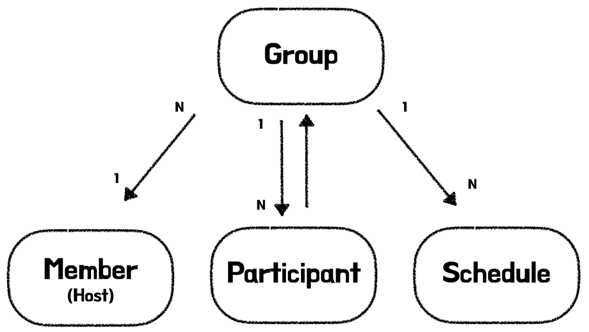
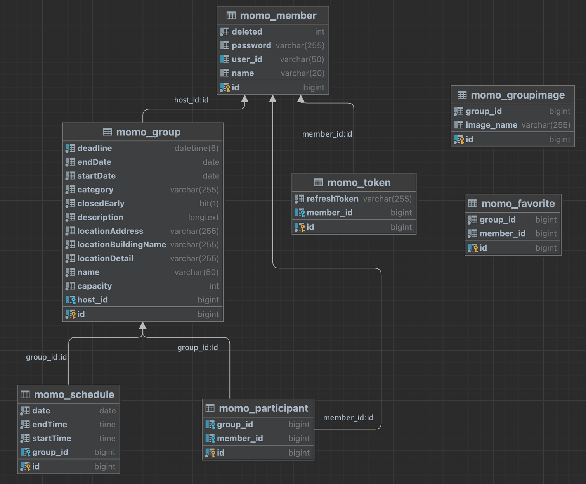
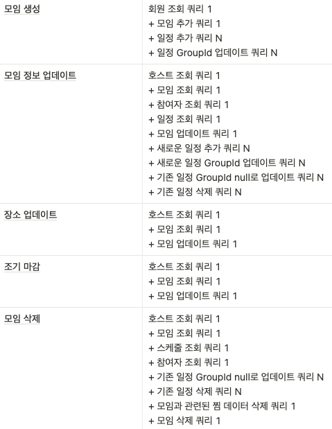
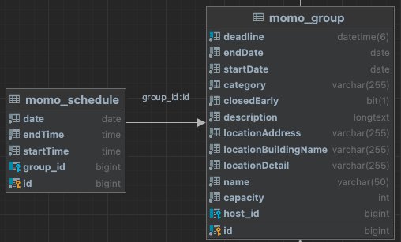
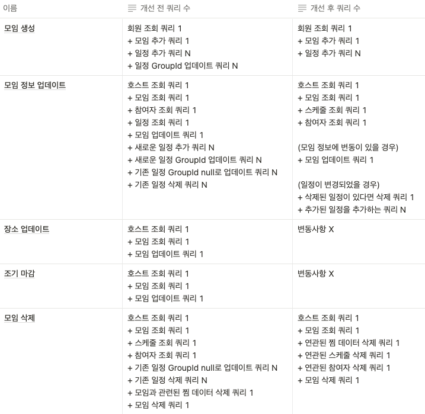

# 들어가며

모모팀 서비스 개선을 하며 지금까지 의존관계와 조회 쿼리 개선을 진행하였다. 이번 포스트에서는 지난 조회쿼리 개선에 이어서 남은 CUD관련 기능의 쿼리를 분석 및 개선하며 경험한 내용에 대해 정리를 해보려고 한다.

> 앞서 진행한 의존관계 개선과 조회 쿼리 개선 관련 내용을 확인하고 싶다면 아래의 포스트를 확인하길 바란다.
>
>
> [모모팀 서비스 성능 개선기1 (의존관계 개선)](https://seongwon.dev/Spring/20221009-%EB%AA%A8%EB%AA%A8%ED%8C%80-%EC%84%9C%EB%B9%84%EC%8A%A4%EC%84%B1%EB%8A%A5-%EA%B0%9C%EC%84%A0%EA%B8%B01/)
>
> [모모팀 서비스 성능 개선기2 (조회 쿼리 개선)](https://seongwon.dev/Spring/20221014-%EB%AA%A8%EB%AA%A8%ED%8C%80-%EC%84%9C%EB%B9%84%EC%8A%A4%EC%84%B1%EB%8A%A5-%EA%B0%9C%EC%84%A0%EA%B8%B02/)
>

# 객체 및 테이블의 연관관계

모두모여라 서비스는 모임 서비스인만큼 모임(Group)객체/테이블을 중심으로 다른 객체/테이블들이 연관관계를 맺고 있다.





실제로 객체의 연관관계를 나타낸 이미지와 DB 테이블의 다이어그램을 살펴보면 Group이 Member, Schedule, Participant와 연관관계를 맺고 있는 것을 확인할 수 있다.

# 개선 전 쿼리 분석

모임 관련 CUD로직을 개선하기 앞서 개선 전 API별 쿼리를 분석한 결과는 아래와 같다.



요청별 실행되는 쿼리를 보면 셀 수도 없이 많은 쿼리들이 실행되는 것을 확인할 수 있다. 실제로 너무 많은 쿼리가 실행되어 쿼리를 분석하는 과정에서 각각의 쿼리가 왜 나가는지 이해 못하는 쿼리들이 존재하여 분석에 어려움을 느끼기도 하였다.

지금부터 문제가 많은 서비스의 CUD기능들의 쿼리를 어떻게 개선하였는지 자세히 살펴보겠다.

# Group과 Schedule..OneToMany 단방향 관계의 문제점

기존 코드에서는 Group과 Schedule은 1:N 단방향 관계로 Group은 Schedule의 존재를 알지만 Schedule은 Group의 존재를 알지 못하였다. 하지만 DB 테이블 상에서는 반대로 Schedule이 외래키로 Group의 id를 갖고 Group은 Schdeule의 정보를 알지 못하였다. 이와 같이 객체지향 코드와 데이터베이스 상에서 불일치가 존재하더라도 JPA는 `@JoinColumn`과 같은 어노테이션들을 잘 설정해주면 DB에 올바른 테이블을 만들고 자동으로 매핑까지 해준다.



하지만 이러한 OneToMany 단방향 구조는 개발자가 의도하지 않은 쿼리를 발생시킨다는 문제가 존재한다. 문제에대해 더욱 자세히 살펴보겠다.

기존 로직에서는 모임을 만들고 일정 데이터인 Schedule을 객체지향적으로 프로그래밍하며 Java의 컬렉션에 데이터를 넣는 것처럼 Group객체를 만들 때 생성자를 통해 주입하도록 작성하였다.

```java
@Getter
@NoArgsConstructor(access = AccessLevel.PROTECTED)
@Entity
public class Group {

    @Id
    @GeneratedValue(strategy = GenerationType.IDENTITY)
    private Long id;

    @OneToMany(orphanRemoval = true, cascade = CascadeType.PERSIST)
    @JoinColumn(name = "group_id")
    private final List<Schedule> schedules = new ArrayList<>();

    public Group(List<Schedule> schedules, ...) {
        this.schedules = schedules;
        ...
    }
    ...
}
```

> 📌 실제 코드는 일급 컬렉션과 값 객체들로 이루어져있어 위의 코드는 독자들의 이해를 돕고자 필요한 부분을 추출하여 코드로 표현했습니다.
>

위와 같이 코드를 작성한 이유는 객체지향적인 코드를 생각하였을 때 해당 코드와 같은 방식이 올바르다고 생각했기 때문이다. 그리고 데이터 저장에 대한 결과를 봤을 때 `ScheduleRepository`에 접근하여 직접 데이터를 추가하지 않아도 JPA는 Schedule 테이블에 일정 데이터를 저장해줬기에 괜찮은 방법이라 생각했다.

하지만 1:N 단방향 관계에서 연관관계 주인이 1이 되는 방법은 생성 로직을 수행해보면 치명적인 단점을 발견할 수 있다. 일반적으로 일정을 담은 모임 생성을 할 때 우리는 모임 insert, 일정 insert 이렇게 두 종류의 쿼리가 실행되는 것을 예상할 것이다. 실제로 실행되는 쿼리는 어떨까..? 테스트를 진행해본 결과 우리의 예상과는 너무나도 다른 쿼리가 실행된 것을 확인할 수 있었다. 실행된 쿼리는 아래와 같다.

```sql
Hibernate: 
    insert 
    into
        momo_group
        (id, deadline, endDate, startDate, category, closedEarly, description, locationAddress, locationBuildingName, locationDetail, name, capacity, host_id) 
    values
        (default, ?, ?, ?, ?, ?, ?, ?, ?, ?, ?, ?, ?)
Hibernate: 
    insert 
    into
        momo_schedule
        (id, date, endTime, startTime) 
    values
        (default, ?, ?, ?)
Hibernate: 
    insert 
    into
        momo_schedule
        (id, date, endTime, startTime) 
    values
        (default, ?, ?, ?)
Hibernate: 
    update
        momo_schedule 
    set
        group_id=? 
    where
        id=?
Hibernate: 
    update
        momo_schedule 
    set
        group_id=? 
    where
        id=?
```

모임과 일정을 Insert하는 쿼리까지는 예상했던 쿼리라 문제가 없었다. 하지만 그 이후에 나오는 Update쿼리는 도대체 왜 나온 것일까?? 해당 쿼리가 실행되는 이유는 JPA에서 Schedule을 처음 DB에 저장할 때 GroupId를 모르기 때문에 Group의 Id없이 Schedule의 데이터가 먼저 저장되고 그 후에 비어있는 Schedule의 GroupId 컬럼 데이터를 채워주기 위해 Update쿼리가 날리기 때문이다.

생성에서도 문제가 발생하지만 삭제할 때도 우리의 예상과 다른 쿼리들이 발생한다. 모임 삭제 요청을 하였을 때 실행되는 쿼리는 아래와 같다.

```sql
Hibernate: 
    delete 
    from
        momo_favorite 
    where
        group_id=?
Hibernate: 
    select
        value0_.group_id as group_id5_4_0_,
        value0_.id as id1_4_0_,
        value0_.id as id1_4_1_,
        value0_.date as date2_4_1_,
        value0_.endTime as endtime3_4_1_,
        value0_.startTime as starttim4_4_1_ 
    from
        momo_schedule value0_ 
    where
        value0_.group_id=?
Hibernate: 
    update
        momo_schedule 
    set
        group_id=null 
    where
        group_id=?
Hibernate: 
    delete 
    from
        momo_schedule 
    where
        id=?
Hibernate: 
    delete 
    from
        momo_schedule 
    where
        id=?
Hibernate: 
    delete 
    from
        momo_group 
    where
        id=?
```

생성에 이어 삭제를 할 때도 일반적으로 예상되는 쿼리는 Delete Group과 Delete Schedule 쿼리가 발생되어야 하는데 중간에 Schedule의 GroupId를 `null`로 변환하는 예상하지 못한 쿼리가 발생하였다. 해당 쿼리도 바로 1:N 단방향 관계에서 나오는 문제점이었다.

> Schedule 유무에 대한 조회 쿼리와 Schedule을 직접 삭제하는 쿼리는 `orphanRemoval`옵션을 활성화시켜서 실행된 쿼리이다. 해당 옵션을 실행하지 않으면 해당 쿼리들은 발생하지 않을 것이다.
>

해당 문제는 1:N 단방향 관계를 양방향 관계로 수정하며 해결할 수 있다. 양방향 연관관계는 서로를 의존하게되어 신경써야 할 부분이 많아 가급적 사용하지 않는 것이 좋다. 하지만 해당 부분에 대해서는 단방향 관계를 걸게 된다면 개발자들이 예상하지 못한 쿼리를 발생시켜 개발에 혼란을 줄 수 있기에 양방향 관계를 걸어주는 것이 좋다.

> 양방향 관계는 ‘하면 안되는 것’이 아닌 ‘위험하여 주의해야하는 것’이다. 무조건 피하기보다 필요에 따라 양방향 연관관계를 만들기도 해야한다.
>

> 1:N 연관관계에 대해 자세히 알고 싶다면 아래의 포스트를 참고하길 바란다.
>
>
> [[JPA] 엔티티간 연관관계](https://seongwon.dev/Spring/20220824-JPA-%EC%97%94%ED%8B%B0%ED%8B%B0%EA%B0%84_%EC%97%B0%EA%B4%80%EA%B4%80%EA%B3%84/#52-%EC%9D%BC%EB%8C%80%EB%8B%A4-1n)
>

모임과 일정의 관계를 단방향에서 양방향으로 변경하는 과정을 진행한 후, 모임 생성 요청에서 실행된 쿼리를 확인해본 결과 초기에 우리가 예상했던 쿼리들만이 실행되는 것을 확인할 수 있었다.

```sql
Hibernate: 
    select
        member0_.id as id1_2_0_,
        member0_.deleted as deleted2_2_0_,
        member0_.password as password3_2_0_,
        member0_.user_id as user_id4_2_0_,
        member0_.name as name5_2_0_ 
    from
        momo_member member0_ 
    where
        member0_.id=?
Hibernate: 
    insert 
    into
        momo_group
        (id, deadline, endDate, startDate, category, closedEarly, description, locationAddress, locationBuildingName, locationDetail, name, capacity, host_id) 
    values
        (default, ?, ?, ?, ?, ?, ?, ?, ?, ?, ?, ?, ?)
Hibernate: 
    insert 
    into
        momo_schedule
        (id, date, endTime, group_id, startTime) 
    values
        (default, ?, ?, ?, ?)
Hibernate: 
    insert 
    into
        momo_schedule
        (id, date, endTime, group_id, startTime) 
    values
        (default, ?, ?, ?, ?)
```

🤓 1:N 단방향을 양방향으로 변경하는 과정에서 JPA에게 위임하였던 Schedule 데이터의 저장을 위해`ScheduleRepository`가 만들어지고 저장 로직이 Service레이어까지 올라가는 객체지향과 멀어지는 변화가 있었다. 하지만 해당 변화를 거치며 예상하지 못한 쿼리가 사라지게 되어 유지보수 측면에서는 훨씬 개선되었다고 생각된다.

# orphanRemoval에 의존적인 삭제 로직의 문제점

프로젝트를 진행하며 모모팀은 최대한 객체지향적인 코드를 작성하기 위해 orphanRemoval과 Cascade옵션을 활용하여 모임에 참여자 또는 일정이 추가되거나 빠졌을 때, 각각의 컬렉션에 데이터를 `add()`, `remove()` 메서드를 통해 데이터의 Insert, Delete가 이루어지도록 하였다.

기존에 모임을 삭제하였을 때 participant와 schedule 데이터들의 삭제도 `orphanRemoval`을 통해 삭제되도록 진행하였었다. 하지만 쿼리 분석을 하며 해당 부분에 대해서도 예상하지 못한 쿼리가 발생한 것을 확인하였다. 모임 삭제를 하였을 때 실행되는 쿼리 중에 Schedule과 Participant의 삭제 쿼리에 대해 자세히 살펴보겠다.


위의 쿼리들을 살펴보면 연관된 일정과 참여자 데이터가 존재하는지를 확인하는 조회 쿼리와 각각의 데이터들을 삭제하는 N개의 쿼리가 발생하는 것을 확인할 수 있다. 개인적으로 고아객체들이 존재하는지의 조회 쿼리는 쓰레기 데이터를 남기지 않기 위해 양보할 수 있는 쿼리라 생각한다. 하지만 삭제된 모임과 연관된 N개의 데이터들을 각각 Delete쿼리를 개별로 실행하여 삭제하는 것은 큰 문제가 있다고 생각되어 이를 Service레이어에서 GroupId를 통해 연관된 Schedule과 Participant데이터를 모두 삭제하는 방식으로 코드를 수정하였다.

```java
@RequiredArgsConstructor
@Transactional(readOnly = true)
@Service
public class GroupModifyService {
	// 기존 코드
	@Transactional
    public void delete(Long hostId, Long groupId) {
        ifMemberIsHost(hostId, groupId, (host, group) -> {
            group.validateGroupIsProceeding();
            applicationEventPublisher.publishEvent(new GroupDeleteEvent(groupId));
            groupRepository.deleteById(groupId);
        });
    }
	// 변경 후 코드
	@Transactional
    public void delete(Long hostId, Long groupId) {
        ifMemberIsHost(hostId, groupId, (host, group) -> {
            group.validateGroupIsProceeding();
            applicationEventPublisher.publishEvent(new GroupDeleteEvent(groupId));
            scheduleRepository.deleteAllByGroupId(groupId);
            participantRepository.deleteAllByGroupId(groupId);
            groupRepository.deleteById(groupId);
        });
    }
```

기존에는 모임 삭제를 할 때, 단순히 `groupRepository.deleteById(groupId);` 만을 실행시켰던 로직을 `scheduleRepository`와 `participantRepository`의 `deleteAllByGroupId();` 를 각각 실행시키도록 수정한 결과 아래와 같이 모임 삭제를 요청하였을 때 발생하는 N개의 쿼리들을 모두 제거할 수 있었다.

```sql
Hibernate: 
    delete 
    from
        momo_favorite 
    where
        group_id=?
Hibernate: 
    delete 
    from
        momo_schedule 
    where
        group_id=?
Hibernate: 
    delete 
    from
        momo_participant 
    where
        group_id=?
Hibernate: 
    delete 
    from
        momo_group 
    where
        id=?
```

# 모임 수정 로직의 문제점

모모팀 서비스 쿼리 분석을 하며 가장 문제가 많았던 API는 바로 모임 정보 업데이트이다. JPA는 트랜잭션 안에서 처음 엔티티 데이터를 읽어왔을 때와 트랜잭션이 끝나서 entityManager가 flush될 때 객체의 변화가 생기면 Dirty Checking을 하여 변경된 데이터에 대해 Update쿼리를 날려준다. 그렇기에 업데이트 로직을 살펴보면 Schedule을 제외한 다른 모임 정보 데이터들은 객체의 값을 재할당하는 과정만을 진행하고 있었다.

```java
@NoArgsConstructor(access = AccessLevel.PROTECTED)
@Entity
public class Group {
	...
	public void update(Capacity capacity, Calendar calendar, GroupName name, Category category,
                       Location location, Description description) {
        validateGroupIsProceeding();
        this.participants.updateCapacity(capacity);
        this.calendar.update(calendar.getDeadline(), calendar.getDuration(), calendar.getSchedules());
        this.name = name;
        this.category = category;
        this.location = location;
        this.description = description;
    }
}
```

Schedule의 경우 `final`로 재할당이 막힌 `List`이기에 재할당이 아닌 `clear()`를 통한 초기화와 `addAll()`을 통한 데이터 추가를 진행하였다.

```java
@Getter
@NoArgsConstructor(access = AccessLevel.PROTECTED)
@Embeddable
public class Schedules {

    @OneToMany(orphanRemoval = true, cascade = CascadeType.PERSIST)
    @JoinColumn(name = "group_id")
    private final List<Schedule> value = new ArrayList<>();

    public Schedules(List<Schedule> schedules) {
        value.addAll(schedules);
    }

    public void change(Schedules schedules) {
        value.clear();
        value.addAll(schedules.value);
    }
}
```

`clear()`과 `addAll()`과정을 거쳤을 때 Schedule도 다른 데이터들처럼 Dirty Checking을 하며 기존에 없던 일정에 대해서만 업데이트 쿼리를 날려주면 좋을 텐데 실제 동작은 그렇지 못한다. Schedule은 별도의 테이블에 저장되어 id값을 할당받기에 같은 일정에 대해서도 id값의 유뮤 차이가 발생하여 JPA는 다른 객체로 인지한다. 그 결과 기존 데이터를 삭제하는 Delete쿼리와 새로운 데이터를 추가하는 Insert쿼리를 날리게 된다.

이러한 동작은 모모팀의 업데이트 요청 처리 성능상에 큰 저하를 불러일으켰다. 일정 변경의 유무와 상관없이 `List<Schedule>`을 `clear()`, `addAll()` 을 진행하다보니 매번 불필요한 Schedule Delete, Update쿼리가 발생하게 되었다. 실제로 2개의 일정이 있는 모임에 같은 일정을 담아 요청을 보낼 경우, 실제 일정 값에는 변화가 없지만 해당 데이터를 새로 추가하고 기존의 데이터를 삭제하는 쿼리들이 실행되는 것을 확인할 수 있다.

```sql
Hibernate: 
    insert 
    into
        momo_schedule
        (id, date, endTime, startTime) 
    values
        (default, ?, ?, ?)
Hibernate: 
    insert 
    into
        momo_schedule
        (id, date, endTime, startTime) 
    values
        (default, ?, ?, ?)
Hibernate: 
    update
        momo_schedule 
    set
        group_id=null 
    where
        group_id=? 
        and id=?
Hibernate: 
    update
        momo_schedule 
    set
        group_id=null 
    where
        group_id=? 
        and id=?
Hibernate: 
    update
        momo_schedule 
    set
        group_id=? 
    where
        id=?
Hibernate: 
    update
        momo_schedule 
    set
        group_id=? 
    where
        id=?
Hibernate: 
    delete 
    from
        momo_schedule 
    where
        id=?
Hibernate: 
    delete 
    from
        momo_schedule 
    where
        id=?
```

> groupId를 null로 변경하는 update 쿼리는 `orphanRemoval`이 있어서 발생한 쿼리이다.
>

이를 개선하기 위해 id를 제외한 일정 값만을 비교하여 변경점에 대해서만 데이터를 추가,삭제하는 Dirty Checking 로직을 직접 구현하였다.

```java
@RequiredArgsConstructor
@Transactional(readOnly = true)
@Service
public class GroupModifyService {
	...
	@Transactional
    public void update(Long hostId, Long groupId, GroupRequest request) {
        ifMemberIsHost(hostId, groupId, (host, group) -> {
            updateGroup(group, request);
            updateSchedules(group, request.getSchedules());
        });
    }

	private void updateSchedules(Group group, List<Schedule> newSchedules) {
        List<Schedule> presentSchedules = group.getSchedules();
        List<Schedule> toBeDeletedSchedules = presentSchedules.stream()
                .filter(schedule -> notContainSchedules(newSchedules, schedule))
                .collect(Collectors.toList());

        List<Schedule> toBeSavedSchedules = newSchedules.stream()
                .filter(schedule -> notContainSchedules(presentSchedules, schedule))
                .collect(Collectors.toList());

        reflectSchedules(group, toBeDeletedSchedules, toBeSavedSchedules);
    }

    private boolean notContainSchedules(List<Schedule> schedules, Schedule schedule) {
        return schedules.stream()
                .noneMatch(schedule::equalsDateTime);
    }

    private void reflectSchedules(Group group, List<Schedule> toBeDeletedSchedules, List<Schedule> toBeSavedIds) {
        if (!toBeDeletedSchedules.isEmpty()) {
            scheduleRepository.deleteAllInSchedules(toBeDeletedSchedules);
        }

        for (Schedule schedule : toBeSavedIds) {
            group.addSchedule(schedule);
        }
    }
}
```

update()메서드의 동작을 살펴보면 일정 정보를 업데이트하는 로직을 따로 분리한 것을 확인할 수 있다. 일정 정보 업데이트 부분을 분리하여 변경된 값에 대해서만 반영하도록 수정한 결과, 일정 변경의 유무와 관련없이 3N개의 쿼리가 발생하던 문제를 일정 변경이 발생하였을 때만 아래의 쿼리가 발생하도록 개선할 수 있었다.

- 삭제된 일정이 있다면 삭제 쿼리 1 + 추가된 일정을 추가하는 쿼리 N

# 개선 전/후 실행되는 쿼리 수 비교



# 마치며

이로써 모모팀의 쿼리 분석 및 개선 작업이 끝이 났다. 쿼리 개선 과정을 진행하며 성능 개선을 위해 많은 고민을 하고 많은 트러블 슈팅이 존재하여 힘들었지만 실행되는 쿼리를 대폭 줄일 수 있어서 보람찼다.

이제 개선된 코드를 통해 다시 성능 테스트를 진행해보며 개선 전/후를 비교해보고자 한다. 테스트 결과는 다음 포스팅을 통해 확인해보겠다.

> 코드 변경에 대한 자세한 내용은 아래의 PR과 모모 레포지토리를 통해 확인하실 수 있습니다.
> 코드 변경에 대한 자세한 내용은 아래의 PR과 모모 레포지토리를 통해 확인하실 수 있습니다.
>
> - [woowacourse-teams/2022-momo](https://github.com/woowacourse-teams/2022-momo)
> - [woowacourse-teams/2022-momo/pull/446](https://github.com/woowacourse-teams/2022-momo/pull/446)
>
