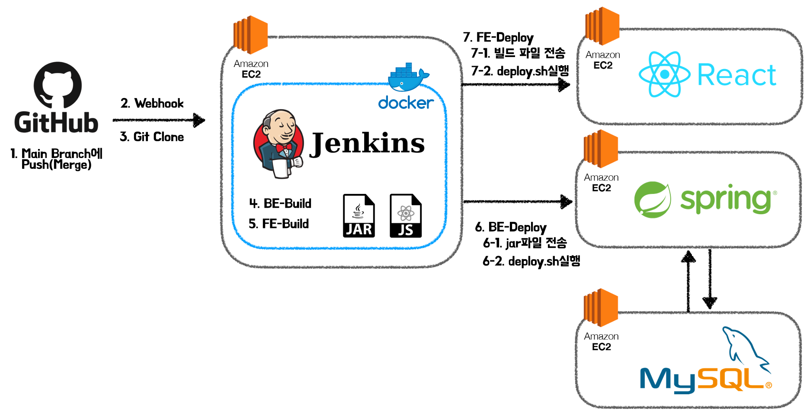
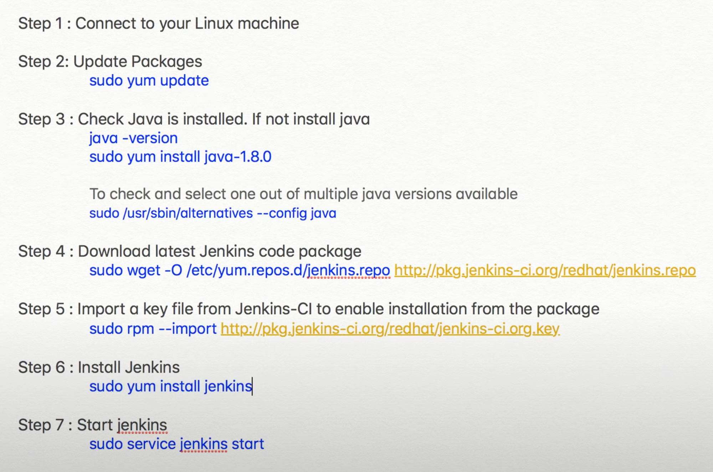
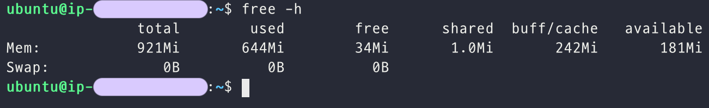
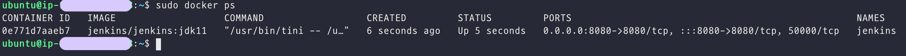
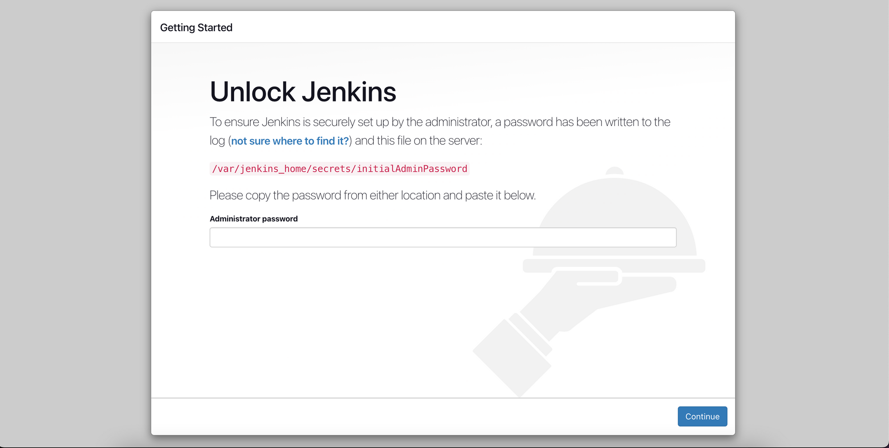
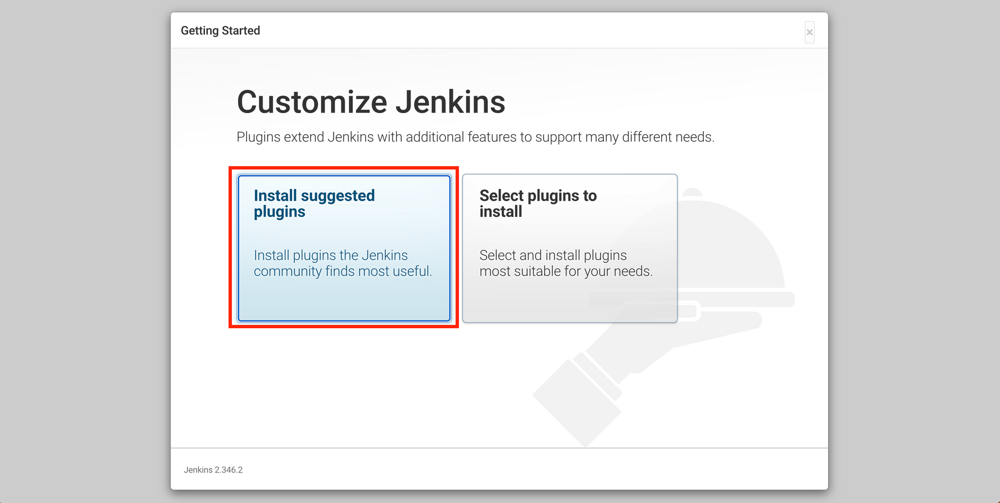
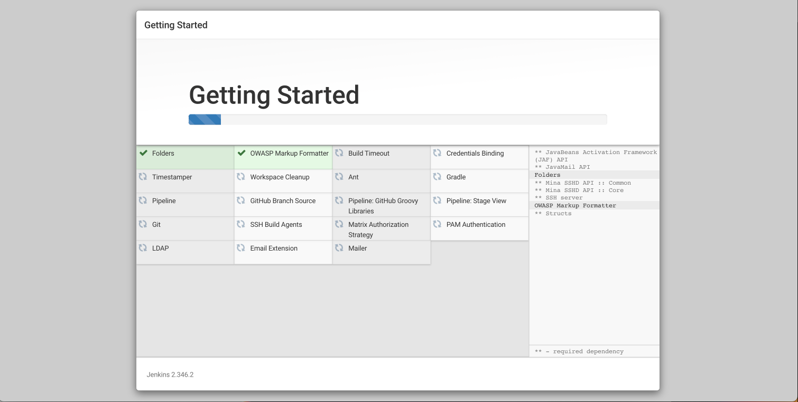
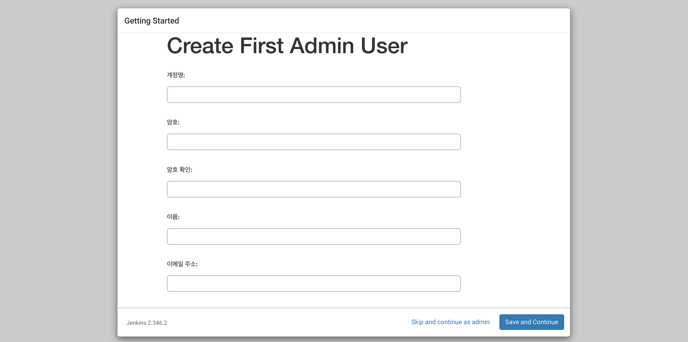
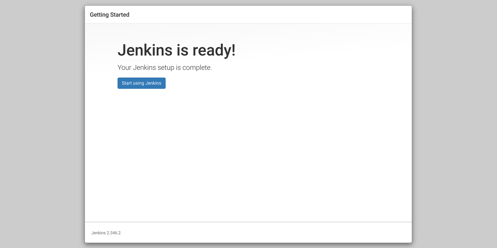
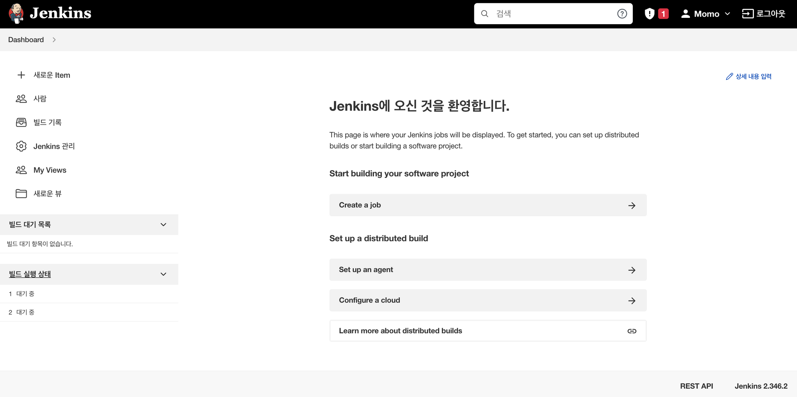

> 해당 포스트는 모모팀 크루 [렉스](https://github.com/Seongwon97)가 작성하였습니다.

이전 포스트에서 CI/CD란 무엇인가에 대해 알아보았다. 이번 포스트에서는 우테코에서 진행중인 프로젝트에 Jenkin를 통해 CI/CD 구축한 과정을 정리해보고자 한다.

우선 이번 프로젝트에서 구축하려는 CI/CD 구조는 다음과 같다. 이번 포스트를 시작으로 Jenkins의 개념 및 환경 설정으로부터 시작하여 CI/CD 구축 과정을 살펴보겠다.



# 1. Jenkins란 무엇일까?

프로젝트를 진행하게 된다면 서비스를 배포하기까지 개발, 테스트, 빌드 배포 등의 많은 과정들이 필요하다. 개발자들이 개발 외에도 테스트, 빌드, 배포 등의 과정을 매번 수행하기에는 번거로과 시간적으로 많은 투자가 필요하다. 이러한 반복적인 작업을 해결하기 위해 만들어진 것이 바로 CI/CD이다.

젠킨스(Jenkins)는 세계적으로 많은 개발자들이 사용중인 CI 툴이다. 젠킨스는 CI 툴답게 다수의 개발자들이 하나의 프로그램을 개발할 때 공유 영역인 Git등의 저장소에 저장된 프로젝트를 버전 충돌을 방지하며 지속적 통합이 가능하도록 해 준다. 젠킨스는 원래 허드슨 프로젝트로 개발되었다. 허드슨의 개발은 2004년 여름에 썬 마이크로시스템즈에서 시작되었다. 2005년 2월에 java.net에 처음 출시되었다.

> - 웹사이트: jenkins-ci.org
> - 발표일: 2011년 2월 2일
> - 프로그래밍 언어: Java
> - 최근 버전: 2.23.3
> - 운영체제: 크로스 플랫폼
> - 종류: 지속적 통합
> - 라이선스: MIT

> CI/CD에 대해 더욱 자세히 알고싶다면 해당 게시글을 참고하세요👍

# 2. 우리는 왜 Jenkins를 사용했을까?

CI 툴은 젠킨스 외에도 Buildkite, Github Actions, GitLab CI/CD, Bitbucket Pipelines, Circleci 등의 많은 툴 들이 존재한다. 이렇게 많은 툴 중에서 우리는 왜 젠킨스를 사용했을까? 그것은 젠킨스가 주는 아래의 이점과 같다.

1. 젠킨스는 전 세계적으로 많은 유저들이 이용하고 있다. 많은 유저들을 보유한 만큼 많은 레퍼런스들이 존재한다. 이와 같이 레퍼런스가 많은 툴일수록 사용중 문제가 발생하였을 때 해당 문제를 해결하기 쉽다고 생각했다.
2. 젠킨스는 개발자의 편의를 위한 많은 플러그인들을 제공하고 있다. 덕분에 Git 연동이라던가 다른 EC2와의 통신을 위한 SSH등을 편리하게 할 수 있다.
3. 웹 인터페이스를 제공하여 사용이 편리하다. 젠킨스 설치 이후에는 CLI가 아닌 GUI화면에서 편하게 이용할 수 있다.
4. Java 기반이라 JDK, Gradle, Maven의 설정을 편리하게 할 수 있어 Java 기반의 프로젝트를 진행하는 사용자들이 빌드 설정을 하기 간편하다.

이와 같은 많은 이유들이 존재하여 우리는 많은 CI 툴 중에 젠킨스를 택하게 되었다.

# 3. Docker?? 왜 사용했을까?

일반적으로 구글에 젠킨스 설치 방법을 찾아보면 아래와 같이 많은 과정을 거쳐야하는 것을 확인할 수 있다.



하지만 Ubuntu Machine에 젠킨스를 바로 설치하는 것이 아닌 도커를 사용한다면 젠킨스 컨테이너만을 받아와 사용하면 된다. 즉, 위의 많은 과정들이 생략되고 단순히 젠킨스 컨테이너를 받아와 실행만 하면 되는 것이다. 우리는 이러한 도커의 이점을 이용하고자 도커를 사용하였다.

# 4. Jenkins 설치

## 4.1. Swap 메모리 설정

우테코에서 제공하는 EC2와 AWS에서 제공하는 프리티어의 경우 메모리가 1GB라서 Jenkins가 실행중에 메모리 부족으로 멈출 수도 있다. 이를 방지하기 위해서는 스왑메모리를 설정해야한다.

먼저 스왑메모리를 설정하기 앞서 현재 메모리 상태를 확인해보자.

```bash
// 메모리 상태 확인
$free -h
```



사진을 보면 현재 메모리 상태가 메모리만 1기가이고 스왑메모리는 0B인 것을 확인할 수 있다. 이제 아래의 명령어들을 통해 스왑메모리를 설정해보겠다.

```bash
// swap 파일을 생성해준다. (메모리 상태 확인 시 swap이 있었지만 디렉토리 파일은 만들어줘야한다.)
$ sudo mkdir /var/spool/swap
$ sudo touch /var/spool/swap/swapfile
$ sudo dd if=/dev/zero of=/var/spool/swap/swapfile count=2048000 bs=1024

// swap 파일을 설정한다.
$ sudo chmod 600 /var/spool/swap/swapfile
$ sudo mkswap /var/spool/swap/swapfile
$ sudo swapon /var/spool/swap/swapfile

// swap 파일을 등록한다.
$ sudo vim /etc/fstab
파일이 열리면 해당 파일 아래쪽에 하단 내용 입력 후 저장
- 입력 할 수 있도록 하는 명령어 -> if
- 파일 수정 후 저장하는 명령어-> esc키 누른 후 :wq 입력 후 엔터
/var/spool/swap/swapfile    none    swap    defaults    0 0

// 메모리 상태 확인
$free -h
```


이렇게 스왑 메모리 설정이 끝났다.

> Swap메모리를 욕심을 부려서 4기가를 설정하는 경우에도 EC2가 버티지 못해 중단될 수 있다. 적당하게 2기가로 설정하는 것을 추천한다.

## 4.2. Docker 설치

> 도커 설치 내용은 [Docker docs](https://docs.docker.com/engine/install/ubuntu/)에 더 상세히 나와있습니다.

1. `apt` package index 최신으로 업데이트 및 `apt`가 HTTPS를 통해 저장소를 사용할 수 있도록 패키지를 설치

   ```bash
   $ sudo apt-get update
   $ sudo apt-get install \
       ca-certificates \
       curl \
       gnupg \
       lsb-release
   ```

2. Docker의 GPG키 추가

   ```bash
   $ sudo mkdir -p /etc/apt/keyrings
   $ curl -fsSL https://download.docker.com/linux/ubuntu/gpg | sudo gpg --dearmor -o /etc/apt/keyrings/docker.gpg
   ```

3. 저장소 설정

   ```bash
   $ echo \
     "deb [arch=$(dpkg --print-architecture) signed-by=/etc/apt/keyrings/docker.gpg] https://download.docker.com/linux/ubuntu \
     $(lsb_release -cs) stable" | sudo tee /etc/apt/sources.list.d/docker.list > /dev/null
   ```

4. Docker Engine 설치

   ```bash
   $ sudo apt-get update
   $ sudo apt-get install docker-ce docker-ce-cli containerd.io docker-compose-plugin
   ```

5. Docker의 기본 이미지인 Hello-world 이미지를 통해 정상적으로 설치되었는지 테스트

   ```bash
   $ sudo docker run hello-world
   ```

   위의 명령어를 입력하였을 때 해당 이미지가 정상적으로 실행된다면 설치가 잘 된 것이다👍

## 4.3. Jenkins 컨테이너 설치

```bash
$ sudo docker run -d --name jenkins -p 8080:8080 jenkins/jenkins:jdk11
```



- `-d`: 컨테이너를 데몬으로 띄운다.
- `--name`: 컨테이너의 이름을 jenkins로 설정한다
- `-p 8080:8080`: 컨테이너의 외부와 통신할 포트(앞의 값)를 내부적으로 사용할 포트(뒤의 값)를 포워딩해준다.

## 4.4. Jenkins 설정

앞의 과정들을 모두 수행하면 젠킨스의 설치가 끝나게 된다. 이제 젠킨스의 웹 인터페이스에 접근해보겠다. 젠킨스의 접근하려면 젠킨스가 올라간 EC2의 `{Pulbic IP}:8080` 주소를 웹에 입력하면 된다. 그러면 아래와 같은 화면을 볼 수 있다.



초기 접속을 하기 위해서는 관리자 패스워드 등록을 하여야 한다. 해당 키를 확인하기 위해서는 젠킨스가 설치된 EC2에 접속해 아래의 명령어를 입력해 확인하면 된다.

```bash
// jenkins 컨테이너에 접속
$ sudo docker exec -it jenkins bash
// 초기 관리자 키 확인
$ cat /var/jenkins_home/secrets/initialAdminPassword
```

위에서 찾은 키를 정상적으로 입력하면 아래와 같이 젠킨스 초기 플러그인 설정이 나온다. 우리는 추천 플러그인들을 설치하고 넘어가도록 하겠다.



플러그인 설치를 누르면 아래와 같이 플러그인들이 하나씩 설치되는 것을 확인할 수 있다.



플러그인 설치가 끝난다면 이제 유저 설정을 할 차례이다.



유저 설정이 끝났다면 마지막으로 Jenkins에 접속할 URL을 설정할 차례이다. 우리는 기본적으로 설정되어있는 EC2의 `{Pulbic IP}:8080` 주소를 유지하도록 하였다.


앞의 과정을 거치면 젠킨스의 모든 설치가 끝나게 된다.



앞서 만든 사용자 계정으로 젠킨스에 접속하게 되면 아래와 같은 화면이 나오게 된다. 아래와 같이 젠킨스가 웹 인터페이스를 제공하는 덕분에 우리는 CLI가 아닌 GUI화면을 통해 CI/CD 를 구축할 수 있다.



이제 모든 설치를 마쳤으니 CI 구축을 해보겠다.

# Reference

- [[우젠구2편] 젠킨스 파이프라인을 활용한 배포 자동화](https://velog.io/@sihyung92/%EC%9A%B0%EC%A0%A0%EA%B5%AC2%ED%8E%B8-%EC%A0%A0%ED%82%A8%EC%8A%A4-%ED%8C%8C%EC%9D%B4%ED%94%84%EB%9D%BC%EC%9D%B8%EC%9D%84-%ED%99%9C%EC%9A%A9%ED%95%9C-%EB%B0%B0%ED%8F%AC-%EC%9E%90%EB%8F%99%ED%99%94)
- [Jenkins pipeline 사용해보기](https://velog.io/@revelation/Jenkins-pipeline-%EC%82%AC%EC%9A%A9%ED%95%B4%EB%B3%B4%EA%B8%B0)
- [[AWS] Jenkins를 활용한 Docker x SpringBoot CI/CD 구축](https://velog.io/@haeny01/AWS-Jenkins%EB%A5%BC-%ED%99%9C%EC%9A%A9%ED%95%9C-Docker-x-SpringBoot-CICD-%EA%B5%AC%EC%B6%95)
- [[Jenkins] Jenkins를 이용한 배포 자동화(1) - Docker로 Jenkins 설치 방법](https://minsoolog.tistory.com/43?category=971650)
- [Jenkins 와 Docker 그리고 AWS CLI 삽질기 정리하기](https://pks2974.medium.com/jenkins-%EC%99%80-docker-%EA%B7%B8%EB%A6%AC%EA%B3%A0-aws-cli-%EC%82%BD%EC%A7%88%EA%B8%B0-%EC%A0%95%EB%A6%AC%ED%95%98%EA%B8%B0-e728986960e2)
- [Jenkins + CodeDeploy를 사용하여 자동배포 구현하기](https://velog.io/@bluewind8791/jenkins-with-docker-ci)
- [📙 AWS EC2에 Jenkins 서버 구축](https://velog.io/@hmyanghm/AWS-EC2%EC%97%90-Jenkins-%EC%84%9C%EB%B2%84-%EA%B5%AC%EC%B6%95#---%ED%94%84%EB%A6%AC%ED%8B%B0%EC%96%B4-ec2-%EC%8A%A4%EC%99%91-%ED%8C%8C%ED%8B%B0%EC%85%98-%EC%83%9D%EC%84%B1)
- [Pipeline Syntax](https://www.jenkins.io/doc/book/pipeline/syntax/)
- [java.nio.file.AccessDeniedException at Jenkins build](https://stackoverflow.com/questions/35011699/java-nio-file-accessdeniedexception-at-jenkins-build)
- [젠킨스 파이프라인 문법(Pipeline Syntax) 총정리](https://blog.voidmainvoid.net/104)
