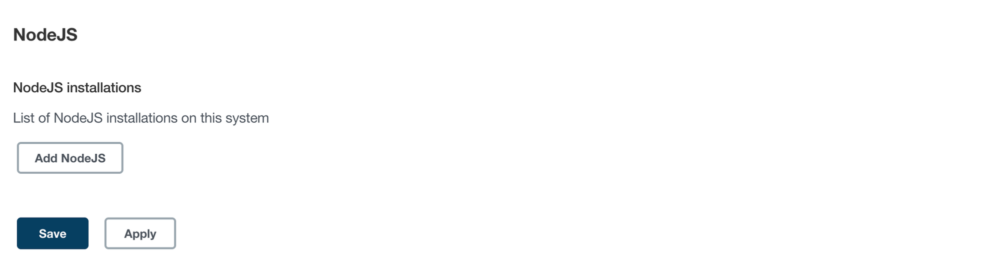

> 해당 포스트는 모모팀 크루 [렉스](https://github.com/Seongwon97)가 작성하였습니다.

# 프론트엔드 CI/CD 배포

앞서 백엔드의 CI/CD 구축 과정을 다뤘다. 이번 포스팅에서는 Jenkins를 통한 프론트의 CI/CD 구축을 다뤄보려한다.

# 1. 배포 서버에 NGINX 설치하기

우리 프론트는 React를 기반으로 구현되었다. React 프로젝트를 배포하기 위해 Nginx를 먼저 설치해보겠다.

> Nginx에 대해 모르시는 분은 아래의 게시글을 참조하길 바란다.
>

1. **Nginx 설치**

    ```bash
    sudo apt install nginx
    ```

2. **기본 설정파일 제거**

   Nginx는 설치를 완료하게 된다면 /etc/nginx 경로에 기본 화면으로 연결되는 설정 파일들이 생성되는데, 프로젝트 설정과 충돌날 수 있기에 삭제를 해둔다.

    ```bash
    sudo rm /etc/nginx/sites-available/default
    sudo rm /etc/nginx/sites-enabled/default
    ```

3. **Nginx 설정파일 생성하기**

    ```bash
    sudo vi /etc/nginx/sites-available/project.conf
    ```

   위의 명령어를 통해 `/etc/nginx/sites-available/` 경로에 설정 파일을 생성하고 아래와 같이 코드를 입력해준다.

    ```bash
    server {
      listen 80;
      location / {
        root   root /home/ubuntu/dist;
        index  index.html index.htm;
        try_files $uri $uri/ /index.html;
      }
    }
    ```

   각각의 코드의 의미는 아래와 같다.

    - `listen 80`: HTTP의 포트인 80포트의 입력에 대한 설정을 하겠다는 의미이다.
    - `location /`: URL에 `/`이 포함된 경로에 대한 설정을 의미한다.
    - `root`: 실행할 파일들의 루트 디렉터리 위치를 의미한다. react 프로젝트를 빌드한 파일 경로를 입력해주면 된다.
    - `index`: 인덱스 파일들을 지정한다. 이때 최소 한개 이상의 파일은 root 경로 안에 있어야 한다.
    - `try_files`: 어떤 파일을 찾을 때 명시된 순서대로 찾으며 가장 먼저 발견되는 파일을 사용하겠다는 의미이다.

4. **`/etc/nginx/sites-enabled/`경로에 심볼릭 링크 생성**

   `/etc/nginx/sites-enabled/` 경로에는 `/etc/nginx/sites-available/` 에 있는 설정 파일에 대해 심볼릭 링크를 만들어야 웹 서버가 동작할 때 `sites-enabled`에 있는 설정 파일들을 참조할 수 있다. 아래의 명령어를 통해 심볼릭 링크를 설정한다.

   > 심볼릭 링크(Symbolic link)란?
   >
   >
   > 윈도우의 바로가기와 같이 링크를 연결하여 원본 파일을 직접 사용하는 것과 같은 효과를 내는 링크이다. 심볼릭 링크를 생성하는 리눅스 명령어는 다음과 같다.
   >
   > ```bash
    > ln -s {대상 원본 파일} {새로 만들 파일 이름}
    > ```
   >

    ```bash
    sudo ln -s /etc/nginx/sites-available/project.conf /etc/nginx/sites-enabled/project.conf
    ```

5. **Nginx 재실행**

    ```bash
    sudo systemctl restart nginx // nginx 재실행
    sudo systemctl status nginx // nginx 상태 확인
    ```


# 2. Jenkins에 NodeJs 플러그인 설치하기

이전 단계에서는 배포 서버에 React프로젝트 실행을 위한 Nginx를 설치하였다. 이제 다시 Jenkins가 설치된 서버로 이동하여 React 프로젝트의 CI/CD작업을 진행해보겠다.

Jenkins에는 Java와 다르게 NodeJs의 빌드를 기본적으로 제공하고 있지 않다. 하지만 이를 지원하는 NodeJs플러그인이 존재하여 사용자는 해당 플러그인을 설치하는 과정만으로 NodeJs 프로젝트를 빌드할 수 있는 환경을 구축할 수 있다.

그렇다면 먼저 NodeJS 플러그인을 설치해보겠다.

> Jenkins관리 → System Configuration_플러그인 관리 → NodeJS 플러그인 선택 및 설치
>

플러그인이 정상적으로 설치되었다면 아래의 경로로 들어가보도록 하자.

> Jenkins관리 → System Configuration_Global Tool Configuration
>


플러그인이 정상적으로 설치가 되었다면 아래와 같이 NodeJS 환경을 설정할 수 있는 항목이 생겼을 것이다. Add NodeJS를 클릭하여 빌드를 하고자하는 Node환경을 설정해보겠다.



우리는 NodeJS버전을 16.14.0버전을 택하였다.


# 3. 프론트 CI/CD Item생성하기

이전 포스트에서는 Jenkins Item을 생성하는 내용을 자세히 다뤘기에 이번 포스트에서는 Item생성과 관련된 자세한 설명은 생략하겠다.

그럼 Item에서 가장 중요한 내용인 Pipeline Script 작성을 설며해보겠다.

```bash
pipeline {
    agent any

    stages {
        stage('Git Clone') {
            steps {
                git branch: 'develop-fe', url: 'https://github.com/woowacourse-teams/2022-momo.git'
            }
        }
        stage('FE-build') {
            steps {
                dir("./frontend") {
                    nodejs(nodeJSInstallationName: 'NodeJS 16.14.0') {
                        sh 'npm install && npm run build'
                    }
                }
            }
        }
        stage('Compression') {
            steps {
                dir("./frontend") {
                    sh '''
                    rm -rf node_modules
                    tar -cvf dist.tar dist
                    '''
                }
            }
        }
        stage('Deploy') {
            steps {
                sshagent(credentials: ['aws_key']) {
                    sh '''
                        scp /var/jenkins_home/workspace/FE/frontend/dist.tar ubuntu@192.xxx.xxx.xxx:/home/ubuntu
                        ssh -t ubuntu@192.xxx.xxx.xxx ./deploy.sh
                    '''
                }
            }
        }
    }
}
```

프론트 CI/CD로 작성한 스크립트는 위와 같다. 스크립트의 각각의 Stage를 설명해보면 다음과 같다.

1. stage('Git Clone')

   우리의 프로젝트 레포지토리의 develop-be 브랜치에서 최신 코드를 clone해온다.

2. stage('FE-build')

   프론트 코드가 있는 디렉터리로 이동 후 프로젝트를 빌드한다. 이때 프론트의 리엑트 프로젝트를 빌드하려면 NodeJS가 필요한데 해당 내용은 앞선 단계에서 NodeJS 플러그인을 통해 설정한 환경을 이용하면 된다. 환경은 `nodejs(nodeJSInstallationName: 'NodeJS 16.14.0')`와 같이 사용하면 된다.

3. stage('Compression')

   해당 단계에서는 2가지 일을 하고 있다. 먼저 `npm install`을 통해 설치된 `node_modules` 디렉터리를 제거하였다. 인스턴스의 용량이 많으면 별 문제가 없겠지만 현재 모모팀이 사용하는 Jenkins 인스턴스는 `t4g.micro`로 8기가의 용량만을 사용하기에 용량 부족 문제를 해결하고자 삭제하였다.

   `node_modules`를 삭제한 이후에는 배포 서버로 실행 파일들을 보내기 위해 빌드된 디렉터리를 `tar파일`로 압축시켜준다.

4. stage('Deploy')

   앞선 단계에서 만들어진 `tar파일`을 `scp`명령을 통해 프론트 배포 서버로 전송을 해준다. 그 후 프론트 배포 서버에 만들어둔 `deploy.sh` 스크립트를 실행하며 최신화 코드의 배포가 끝나게 된다.

   `deploy.sh` 파일의 내용은 아래와 같다.

    ```bash
    #!/bin/bash
    tar -xvf dist.tar
    rm -rf dist.tar

    sudo service nginx restart
    ```


# 4. 결과 확인하기

지금까지 설정한 파이프라인을 실행하면 아래와 같이 프론트의 CI/CD과정도 정상적으로 구축된 것을 확인할 수 있다.


# 마치며

이번 포스팅까지 진행을 하며 백엔드, 프론트 서버의 CI/CD환경 구축을 다뤄봤다. 이제 다음 포스트에서는 백엔드의 DB인스턴스를 생성하며 이를 백엔드 인스턴스에 연결하는 과정을 다뤄보겠다.

# Reference
- [Nginx로 React 배포하기 (우분투 환경)](https://tobegood.tistory.com/entry/Nginx%EB%A1%9C-React%EB%A5%BC-%EB%B0%B0%ED%8F%AC%ED%95%98%EA%B8%B0-%EC%9A%B0%EB%B6%84%ED%88%AC-%ED%99%98%EA%B2%BD)
