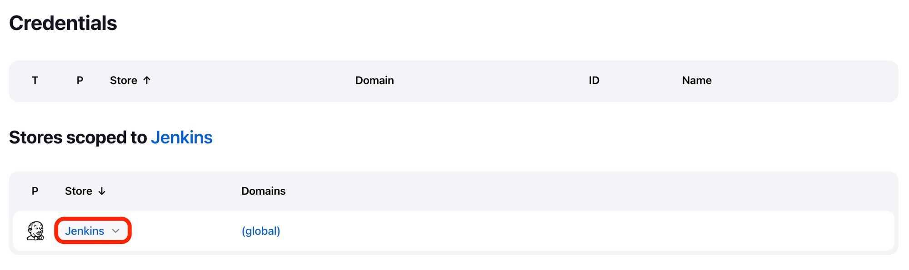
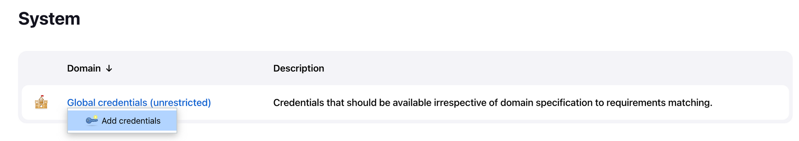
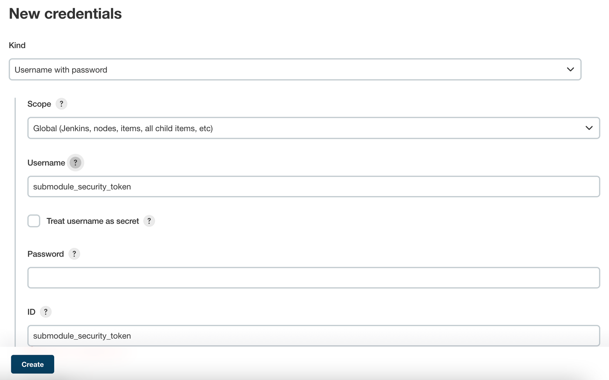
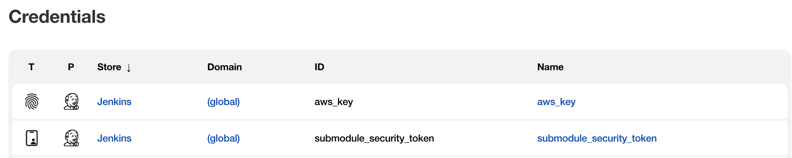
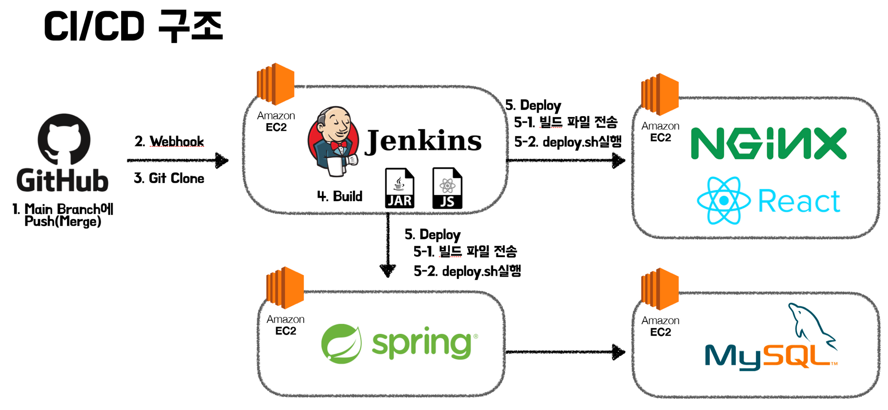

> 해당 포스트는 모모팀 크루 [렉스](https://github.com/Seongwon97)가 작성하였습니다.

이전까지의 과정으로는 DB를 Spring의 인메모리 H2 DB를 사용하여 CI/CD과정이 진행될 때마다 DB데이터들이 초기화되었다. 이번 포스팅에서는 DB를 영구적으로 보관하기 위해 MySQL DB를 구축 및 연결하는 과정을 다뤄보려 한다.

# 1. DB서버 생성 및 MySQL 설치

DB서버는 앞선 과정에서 만들었던 EC2와는 다르게 외부와의 접근을 열어둘 필요가 없기에 Public IP할당 없이 EC2를 생성하면 보안적으로 이점을 얻을 수 있다. Private IP만을 갖고있는 EC2를 생성한 후, 아래의 게시글을 따라 MySQL을 설치해보겠다.

> MySQL설치 내용만으로도 내용이 방대하여 포스트를 분리하였다.
> - [[AWS] Private Ec2에 MySQL설치 및 원격 접속 설정하기](https://seongwon.dev/DevOps/20220813-MySQL%EC%84%A4%EC%B9%98_%EC%9B%90%EA%B2%A9%EC%A0%91%EC%86%8D%EC%84%A4%EC%A0%95/)

# 2. 서브모듈을 통한 DB 정보 관리

이제 앞서 만든 DB서버를 우리가 만든 Spring 프로젝트에 연결하여야 한다. 이때 DB정보는 외부에 노출되면 안되기에 다른 프로젝트 파일들과 함께 올려서는 안 되기에 DB정보 연결에 대해서는 생각을 좀 해봐야 한다.

지금 생각나는 DB 정보를 외부에 노출 없이 적용하는 방법은 아래와 같다.

1. 배포서버에 DB정보를 환경 변수로 설정하여 연결하는 방법
2. 스크립트를 통해 빌드 이전에 프로젝트 설정 파일을 업데이트하는 방법
3. 서브모듈을 통해 관리하는 방법

하지만 각각의 방법을 생각해봤을 때, 첫번째 방법은 각각의 실행 서버에 DB정보를 환경변수로 설정해줘야하기에 배포 서버가 1개가 아닌 여러개가 존재한다면 여러개의 서버에 직접 접근하여 설정을 해줘야 할 것이다. 또한 DB정보가 업데이트될 경우 다시 여러개의 서버에 직접 접근하여 각각 업데이트를 해줘야 하는 불편함이 발생할 것이다.

두번째 방법은 빌드 이전에 프로젝트 설정 파일을 한 번만 업데이트 해주면 되기에 앞서 있던 문제는 해결할 수 있으나, 해당 방법 또한 DB의 변경점이 있을 경우 빌드를 담당하는 Jenkins 서버에 직접 접근하여 스크립트를 수정하는 번거로움이 발생할 것이다. 그래서 최종적으로 서브모듈을 도입하게 되었다. 서브모듈을 도입함으로써 해당 문제를 해결하였다.

> [Git Submodule](https://seongwon.dev/Git/20220811-Git%20Submodule%EC%9D%B4%EB%9E%80/)에 대한 자세한 사용법은 내용은 다음 포스트를 참고하길 바란다.
>

위의 포스트를 참조하여 DB와 JWT토큰 값과 같이 외부에 노출되면 안되는 정보를 담기 위한 Private 레포를 만들어 아래와 같은 DB 서버의 MySQL정보를 추가하고 Submodule을 연동했다.

```yaml
spring:
  datasource:
    driver-class-name: com.mysql.cj.jdbc.Driver
    username: {userName}
    password: {password}
    url: jdbc:mysql://xxx.xxx.xxx.xxx:3306/momo?serverTimezone=UTC&characterEncoding=UTF-8
  jpa:
    hibernate.ddl-auto: validate
    database-platform: org.hibernate.dialect.MySQL8Dialect
```

# 3. Jenkins 파이프라인에 Submodule 설정하기

Private 레포를 만들어 Submodule을 연동했다면 Jenkins에서도 해당 서브모듈에 접근을 하기 위한 권한을 주기 위해 Github Token을 추가해줘야 한다.



📌 add credentials



📌 submodule에 접근 가능한 Github 유저의 Github Token을 Password에 입력하며 Credential을 추가한다.



Token을 추가함으로써 이제 Jenkins에서도 프로젝트에 연결된 서브모듈에 접근할 수 있다.



마지막으로 Pipeline에서 git에서 최신화 파일을 clone할 때, 앞서 추가한 credential로 submodule파일을 가져오는 코드를 추가하면 DB연결 과정이 끝나게 된다.

Git Clone Stage에 서브모듈을 가져오는 코드를 추가한 스크립트는 아래와 같다.

```bash
pipeline {
    agent any

    stages {
        stage('Git Clone') {
            steps {
                git branch: 'develop-be', url: 'https://github.com/woowacourse-teams/2022-momo.git'
                withCredentials([GitUsernamePassword(credentialsId: 'submodule_security_token', gitToolName: 'Default')]) {
                    sh 'git submodule update --init --recursive'
                }
            }
        }
        ...
    }
}
```

# 마치며

지금까지 Jenkins를 통한 CI/CD 구축1~4 과정들을 통해 Jenkins를 통해 백엔드, 프론트엔드의 배포 자동화를 구축하였다. 처음 인프라를 구축해본만큼 많은 학습과 시행착오를 겪으며 완성한 현재의 프로젝트의 인프라 구조는 아래와 같다.



인프라 구조는 HTTPS를 도입하고 Load Balancing을 위해 배포 서버를 여러개 생성하는 등의 작업을 하게 된다면 구조가 변경될 수 있다고 생각한다. 인프라도 우리가 작성하는 비즈니스 코드를 리펙터링 하는 것과 같이 지속적으로 더 나은 구조가 없는지 생각하고 찾아보며 유동적으로 구조를 변경해보고자 한다.
