# 1. 이전까지의 모모팀 인프라 구조

모모팀 프로젝트를 진행하며 인프라개발은 CI/CD환경 구축과 HTTPS 적용, Sonarqube적용을 마지막으로 멈춰있었다.

> CI/CD 환경 구축과정은 아래의 링크를 통해 확인할 수 있다.
>
> - [[DevOps] Jenkins를 통한 CI/CD 구축기 1편 (Jenkins 설치)](https://seongwon.dev/DevOps/20220715-CICD%EA%B5%AC%EC%B6%95%EA%B8%B01/)
> - [[DevOps] Jenkins를 통한 CI/CD 구축기 2편 (Backend CI/CD 구축)](https://seongwon.dev/DevOps/20220717-CICD%EA%B5%AC%EC%B6%95%EA%B8%B02/)
> - [[DevOps] Jenkins를 통한 CI/CD 구축기 3편 (Frontend CI/CD 구축)](https://seongwon.dev/DevOps/20220728-CICD%EA%B5%AC%EC%B6%95%EA%B8%B03/)
> - [[DevOps] Jenkins를 통한 CI/CD 구축기 4편 (Backend DB 구축)](https://seongwon.dev/DevOps/20220814-CICD%EA%B5%AC%EC%B6%95%EA%B8%B04/)


이전까지의 과정을 모두 거친 후, 모모팀 백엔드 CI/CD 및 인프라 구조는 다음과 같았다.

- 모모팀의 CI/CD 구조

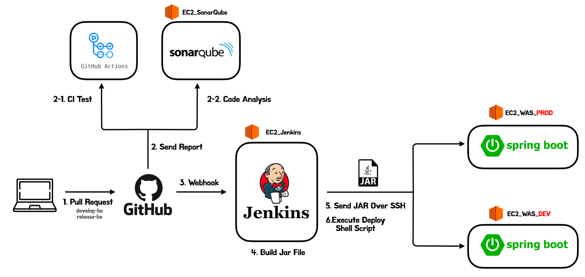

- 모모팀의 인프라 아키텍처 구조

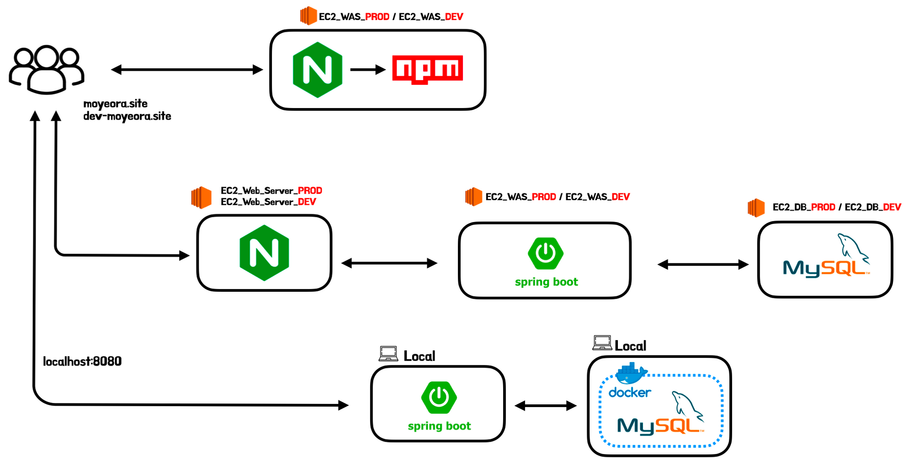

# 2. 개선하게된 계기

### 반복해서 중단되는 EC2

프로젝트의 기능 개발이 점점 끝나가며 이전까지는 진행하지 않았던 성능 테스트 및 성능 개선 작업을 진행하게 됐다. 성능 테스트를 시작하기 전에는 진짜 말 그대로 “성능 테스트”이기에 별다른 문제없이 성능을 측정할 수 있을 거라 생각했다. 하지만 이게 무슨일인가.. 우리 서비스의 목표 인원(우테코 크루 + 코치, 약 150명)이 동시 접속을 하여 서비스를 이용한다는 상황으로 부하 테스트를 진행하였을 뿐인데 애플리케이션이 올라간 EC2 인스턴스가 버티지 못하여 멈춰버리는 일들이 발생하였다. 150명보다 적은 인원수로 테스트를 하여도 결과는 크게 변하지 않았다. 요청을 유저별 요청을 조금만 보낸다면 문제가 없지만 지속적인 요청을 보내는 설정으로 테스트를 진행하면 어김없이 EC2가 멈추게 됐다. EC2자체가 멈추게 된다면 개발자가 할 수 있는 일은 스스로 복구가 되길 기다리거나 강제 재시작을 하는 방법밖에 없기에 EC2가 멈춰버리는 일은 막을 방법이 있다면 무조건 막는 것이 좋다고 판단했다.

> 프로젝트를 진행하며 사용한 인스턴스 정보는 아래와 같다.
>
> - t4g.micro
> - CPU Core: 2
> - RAM: 1GB
> - Memory: 8GB

### 로드 밸런싱

EC2가 중단되는 현상은 우리의 서비스 성능 개선이 안 된 상태라 발생하는 문제라 판단하여 성능 개선 작업을 진행하였다.

> 성능 개선을 진행한 과정은 아래의 링크에서 확인할 수 있다.
>
>
> [모모팀 서비스 성능 개선기2 (조회 쿼리 개선)](https://seongwon.dev/Spring/20221014-%EB%AA%A8%EB%AA%A8%ED%8C%80-%EC%84%9C%EB%B9%84%EC%8A%A4%EC%84%B1%EB%8A%A5-%EA%B0%9C%EC%84%A0%EA%B8%B02/)
>
> [모모팀 서비스 성능 개선기1 (의존관계 개선)](https://seongwon.dev/Spring/20221009-%EB%AA%A8%EB%AA%A8%ED%8C%80-%EC%84%9C%EB%B9%84%EC%8A%A4%EC%84%B1%EB%8A%A5-%EA%B0%9C%EC%84%A0%EA%B8%B01/)
>
> [모모팀 서비스 성능 개선기3 (CUD 쿼리 개선)](https://seongwon.dev/Spring/20221017-%EB%AA%A8%EB%AA%A8%ED%8C%80-%EC%84%9C%EB%B9%84%EC%8A%A4%EC%84%B1%EB%8A%A5-%EA%B0%9C%EC%84%A0%EA%B8%B03/)
>

성능 개선 작업을 통해 확실히 우리 서비스의 성능이 개선되었다. 하지만 여전히 많은 수의 유저들이 지속적으로 우리 서비스를 이용한다면 Tomcat의 Thread 또는 HikariCP의 connection을 기다리는 큐에서 병목현상이 발생하였다.

이것은 t4g micro가 코어가 2개라 동시에 2개의 일만 처리할 수 있어서 어쩔 수 없는 문제라 판단하였고 로드 밸런싱의 도입을 고려하기 시작했다.

WAS의 부하로 계속 중단되는 EC2와 로드 밸런싱의 환경 구축을 쉽게 하는 방법을 생각하던중 도커가 떠올랐다.

> 도커에 대한 개념을 알고 싶다면 아래의 링크를 통해 학습할 수 있다.
>
>
> [Docker 🐳란 무엇일까?](https://seongwon.dev/DevOps/20221020-Docker%EB%9E%80/)
>

# 3. 도커를 프로젝트에 도입하였을 때 얻는 이점

도커의 이점은 여러가지가 있다. 이번 포스트에서는 도커 자체의 이점보다는 진행중인 프로젝트에 도입하였을 때 얻는 이점에 대해서만 생각해보겠다.

### PC 자원 사용량 제한

도커는 컨테이너가 사용하는 CPU, RAM등의 자원을 제한할 수 있다. 이를 활용해 WAS 컨테이너가 사용하는 자원을 제한한다면 WAS에 병목현상이 발생해 속도가 느려지는 현상은 발생할 수 있어도 EC2자체가 중단되는 일은 발생하지 않을 것이라 판단했다.

### 동일한 운영 환경

여러 서버에 동일한 환경을 구축하는 것은 쉽지 않다. 같은 명령들어을 통해 환경을 구축하였다 하더라도 운영체제,컴파일러, 설치된 패키지까지 완벽하게 같게 구축하기는 쉽지 않다. OS만 생각하더라도 시간이 지남에 따라 끊임없이 개발되고 있고 의존하는 라이브러리들이 변경되고있다. 이렇게 서로 모양이 다른 서버들이 존재하는 상황을 **눈송이 서버(snowflakes server)**라고 한다.

도커를 사용한다면 동일한 Image를 기반으로 컨테이너를 생성하였을 때, 어떤 PC에서 실행더라도 동일한 환경을 구축할 수 있는 이점을 얻을 수 있다.

### 환경 변경의 편리함 (feat. 로드밸런싱)

로드 밸런싱은 동일한 N개의 WAS서버를 구축하여야 할 것이다. 눈송이 서버라 문제는 뒤로 하고 N개의 서버를 구축하고 운영중이라 생각해보겠다. 만약 운영중에 프로젝트의 Java버전이 11에서 17로 변경되었다 생각하였을 때, 개발자는 모든 EC2에 접속하여 수작업으로 Java를 새로 설치하여야 할 것이다. 이는 매우 반복적인 작업이고 개발자의 실수를 유발할 수 있는 작업이다.

해당 부분도 도커를 사용하면 dockerfile과 같이 Image를 빌드하는 설정만 변경해주면 편리하게 환경 변경을 할 수 있다는 이점을 얻을 수 있다.

# 4. 이미지 빌드하기

도커에서 이미지를 빌드하기 위해서는 `dockerfile`을 작성해야 한다. dockerfile은 이미지 빌드를 위한 스크립트로 해당 파일을 작성한 후 빌드하면 도커는 dockerfile에 나열된 명령들을 차례대로 수행하며 이미지를 생성한다.

> dockerfile만 잘 작성해두면 해당 이미지가 어떠한 설정들을 갖고 있는지 파악할 수도 있다.
>

### dockerfile스크립트 작성

```bash
# 1
FROM openjdk:11-jre-slim

# 2
ARG JAR_FILE=momo-0.0.1-SNAPSHOT.jar

# 3
COPY ${JAR_FILE} app.jar

#4
ENV PROFILE prod

#5
EXPOSE 8080

#6
RUN mkdir -p momo

#7
CMD java -jar app.jar --spring.profiles.active="${PROFILE}" >>/momo/application.log 2>/dev/null
```

각각의 명령어들이 의미하는 동작은 아래와 같다.

1.  `openjdk:11-jre-slim` 이미지로 컨테이너 생성한다.
2. `JAR_FILE`이름에 대한 환경변수 지정한다. 해당 환경변수는 build시 입력받을 수 있으며 default값은 `momo-0.0.1-SNAPSHOT.jar`로 지정하였다.
3. dockerfile과 같은 패키지에 있는 `JAR_FILE`을 `app.jar`이라는 이름으로 컨테이너 내부에 복사한다.
4. 실행할 spring의 `profile`의 환경변수 지정한다.
5. 8080 컨테이너의 포트를 외부에 노출한다.
6. 컨테이너가 실행될 때 jar파일 실행한다.

### dockerfile을 통한 이미지 빌드

이제 만들어진 dockerfile를 통해 로컬에서 이미지를 생성해보겠다.

```bash
docker build -t [이미지 이름:이미지 버전] [Dockerfile의 경로]

# ex)
# docker build -t momo-sping-application:0.0 ./
```

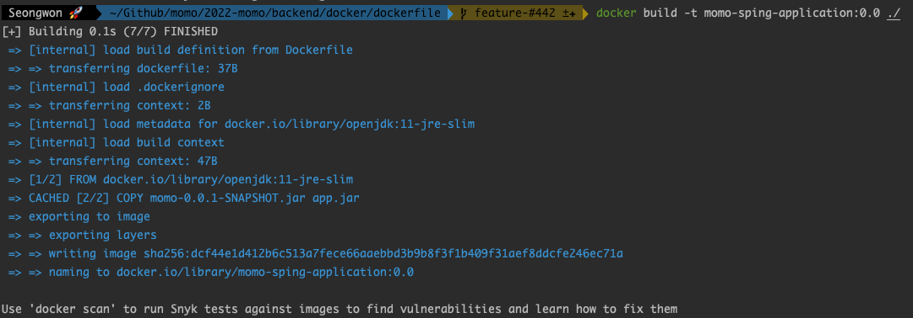

# 5. Docker Registry 만들기

도커는 기본적으로 Github과 유사하게 이미지를 무료로 업로드 및 Pull할 수 있는 `DockerHub`를 제공하고 있다. 하지만 DockerHub는 기본적으로 돈을 지불하지 않는 무료 버전에서는 Public 레포지토리만 사용할 수 있고 Private 레포지토리는 사용할 수 없다.

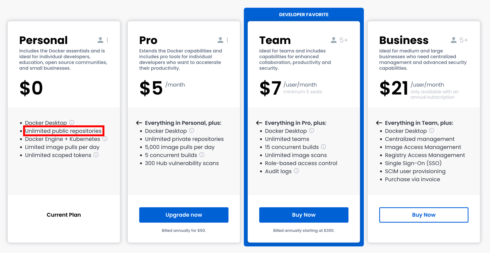

우리의 프로젝트에는 외부에 JWT 토큰 값, OAuth Key 등 외부에 노출되면 안되는 파일들이 존재한다. 만약 해당 값들이 포함된 상태로 만들어진 도커 이미지가 DockerHub에 올라가게 된다면 누군가가 악의적으로 이미지 내부에 있는 Jar파일을 디컴파일하여 정보를 추출할 수 있을 것이다. 그럼.. 돈을 지불하여 Private로 레포를 사용하는 방법밖에 없을까? 물론 아니다. 도커는 개인용 DockerHub인 Private Registry를 쉽게 구축할 수 있는 방법을 제공하고 있다. 모모팀도외부에 이미지가 노출되는 것을 막기 위해 Docker Registry를 만들어 이미지를 관리하였다. Registry를 만드는 과정은 아래와 같다.

### Private Registry만들기

먼저 Private Registry를 설치할 전용 EC2를 만들어야 한다. 생성한 Private Registry EC2에 접근 후, 아래의 작업을 진행하면 된다.

- (Registry EC2) registry이미지 pull받기

    ```bash
    $ docker pull registry
    ```

  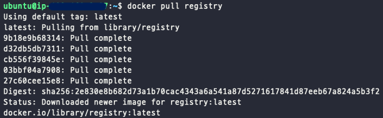

  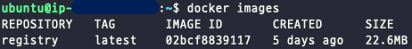

- (Registry EC2) registry container생성

    ```bash
    $ docker run -d --name private-registry -p 8080:5000 --restart=always registry
    ```

  > 컨테이너의 포트를 호스트 포트와 바인딩해주는 `-p`옵션은  `{호스트 포트}{컨테이너 포트}`의 형식으로 입력하면 된다.
  >

  > registry는 기본적으로 5000포트를 사용한다. 이를 사용중인 EC2 인바운드 규칙에 있는 8080포트로 바인딩 해주었다.
  >

  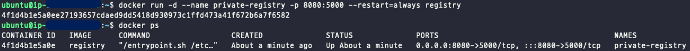

- (Local) Hub에 올리기 위한 Tag를 달은 Image생성

  registry 또는 DockerHub에 올리기 위해서는 `[저장소 이름]/[이미지 이름]:[태그]` 의 형태로 이미지를 만들어야 한다. 이는 기존 이미지에 Tag를 걸어 만들 수 있다.

    ```bash
    $ docker tag momo-sping-application:0.0 {Private-Registry-public-ip:port}/momo-sping-application:0.0
    ```

  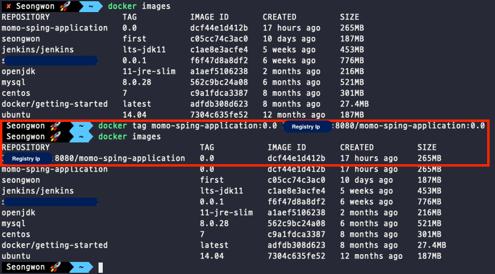

- Registry에 Image Push

    ```bash
    $ docker push {Private-Registry-public-ip:Port}/momo-sping-application:0.0
    ```

  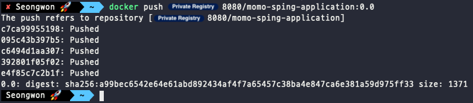

    - 이미지 받기

    ```bash
    $ docker pull {Private-Registry-public-ip:Port}/momo-sping-application:0.0
    ```

  > 📌 도커의 `push`, `pull`은 `https` 기반으로 동작하는데 레지스트리는 `http`로 동작하여 문제가 발생한다.
  >
  >
  > 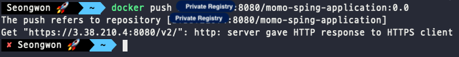
  >
  > 이를 해결하기 위해 Private Registry에 Https적용을 하는 방법도 있지만 도커 레지스트리를 이용하는 클라이언트의 `daemon.json` 파일에 `insecure-registries` 설정을 추가하면 해결하는 방법도 존재한다.
  >
  > - 맥북 `daemon.json` 파일 위치 - `~/.docker/daemon.json`
  > - 리눅스 `daemon.json` 파일 위치 - `/etc/docker/daemon.json`
  > - 윈도우 `daemon.json` 파일 위치 - `C:\ProgramData\docker\config\daemon.json`
  >
  > 각각 환경별에 맞는 위치의 파일을 열어 아래의 스크립트를 추가한 후 Docker 재시작을 해주면 된다. → `sudo service docker restart`
  >
  > ```bash
    > {
    >   "insecure-registries": [
    >     "{Private-registry-ip}:8080"
    >   ]
    > }
    > ```
>
- {이미지를 실행할 장소} 이미지 받기

```bash
$ docker pull {Private-Registry-public-ip:Port}/momo-sping-application:0.0
```

# 6. Jenkins Pipeline에 Docker를 통한 CI/CD적용하기

지금까지의 과정을 통해 우리의 프로젝트를 Image로 만들고 해당 이미지를 업로드하고 다운받을 수 있는 저장소 구축까지 완료하였다. 이제 해당 과정들을 기존 젠킨스의 Pipeline코드에 적용시켜보겠다. 먼저 완성한 코드를 보여준 후 각각의 과정을 상세히 설명해보겠다.

```bash
 pipeline {
    agent any
    
    stages {
        stage("Set Variable") {
            steps {
                script {
                    JENKINS_ITEM_NAME = "Momo_BE_Branch_Test"
                    BRANCH = "docker-test"
                    EXECUTE_PROFILE = "dev"
                    SSH_CONNECTION = "ubuntu@{WAS_SERVER_IP}"
                    SSH_CONNECTION_CREDENTIAL = "aws_key"
                }
            }
        }
        stage('Git Clone') {
            steps {
                git branch: BRANCH, url: 'https://github.com/woowacourse-teams/2022-momo.git'
                withCredentials([GitUsernamePassword(credentialsId: 'submodule_security_token', gitToolName: 'Default')]) {
                    sh 'git submodule update --init --recursive'
                }
            }
        }
        stage('Gradlew Build') {
            steps {
                dir("./backend") {
                    sh "./gradlew clean build"
                }
            }
        }
        stage('Move Jar File To dockerfile directory') {
            steps {
                sh "mv /var/lib/jenkins/workspace/${JENKINS_ITEM_NAME}/backend/build/libs/momo-0.0.1-SNAPSHOT.jar /var/lib/jenkins/workspace/${JENKINS_ITEM_NAME}/backend/docker/dockerfile/momo-0.0.1-SNAPSHOT.jar"
            }
        }
        stage('Docker Image Build') {
            steps {
                dir("./backend/docker/dockerfile") {
                    sh "docker build -t momo-sping-application:0.0 ./"
                }
            }
        }
        stage('Docker Image Push') {
            steps {
                sh '''
                docker tag momo-sping-application:0.0 {Private Registry IP}/momo-sping-application:0.0
                docker push {Private Registry IP}/momo-sping-application:0.0
                '''
            }
        }
        stage('Deploy') {
            steps {
                sshagent(credentials: [SSH_CONNECTION_CREDENTIAL]) {
                    sh "ssh -o StrictHostKeyChecking=no ${SSH_CONNECTION} uptime"
                    sh "ssh -t ${SSH_CONNECTION} 'docker rm -f momo-app'"
                    sh "ssh -t ${SSH_CONNECTION} 'docker rmi -f {Private Registry IP}/momo-sping-application:0.0'"
                    sh "ssh -t ${SSH_CONNECTION} 'docker pull {Private Registry IP}/momo-sping-application:0.0'"
                    sh "ssh -t ${SSH_CONNECTION} 'docker run -d -p 8080:8080 -v /home/ubuntu/applicationlog:/momo -e PROFILE=${EXECUTE_PROFILE} --name momo-app {Private Registry IP}/momo-sping-application:0.0'"
                }
            }     
        }
    }
}
```

### Git clone & Gradle Build

```bash
stage('Git Clone') {
    steps {
        git branch: BRANCH, url: 'https://github.com/woowacourse-teams/2022-momo.git'
        withCredentials([GitUsernamePassword(credentialsId: 'submodule_security_token', gitToolName: 'Default')]) {
            sh 'git submodule update --init --recursive'
        }
    }
}
stage('Gradlew Build') {
    steps {
        dir("./backend") {
            sh "./gradlew clean build"
        }
    }
}
```

해당 코드는 이전과 변화가 없다. Submodule을 포함한 프로젝트의 코드를 Jenkins workspace로 clone해온 후 Jar파일을 빌드하는 과정이다.

### Jar 파일 이동

```bash
stage('Move Jar File To dockerfile directory') {
    steps {
        sh "mv /var/lib/jenkins/workspace/${JENKINS_ITEM_NAME}/backend/build/libs/momo-0.0.1-SNAPSHOT.jar /var/lib/jenkins/workspace/${JENKINS_ITEM_NAME}/backend/docker/dockerfile/momo-0.0.1-SNAPSHOT.jar"
    }
}
```

이전 stage에서 빌드한 Jar파일이 만들어질 docker image에 포함되어야 하기에 `dockerfile`에서 설정한 디렉터리로 파일을 이동해준다.

### Image Build

```bash
stage('Docker Image Build') {
    steps {
        dir("./backend/docker/dockerfile") {
            sh "docker build -t momo-sping-application:0.0 ./"
        }
    }
}
```

앞서 살펴본 이미지 빌드를 위해 `dockerfile`이 위치한 디렉터리로 이동 후 `docker build` 명령어를 통해 이미지를 만들어준다.

### Image Push

```bash
stage('Docker Image Push') {
    steps {
        sh '''
        docker tag momo-sping-application:0.0 {Private Registry IP}/momo-sping-application:0.0
        docker push {Private Registry IP}/momo-sping-application:0.0
        '''
    }
}
```

만들어진 이미지를 구축한 Private Registry로 업로드하는 과정이다. Push를 하기 앞서 업로드를 하기 위해 Tag를 걸어주는 작업도 진행하였다.

### Deploy

```bash
stage('Deploy') {
    steps {
        sshagent(credentials: [SSH_CONNECTION_CREDENTIAL]) {
            sh "ssh -o StrictHostKeyChecking=no ${SSH_CONNECTION} uptime"
            sh "ssh -t ${SSH_CONNECTION} 'docker rm -f momo-app'"
            sh "ssh -t ${SSH_CONNECTION} 'docker rmi -f {Private Registry IP}/momo-sping-application:0.0'"
            sh "ssh -t ${SSH_CONNECTION} 'docker pull {Private Registry IP}/momo-sping-application:0.0'"
            sh "ssh -t ${SSH_CONNECTION} 'docker run -d -p 8080:8080 -m 700m --cpus=1.8 -v /home/ubuntu/applicationlog:/momo -e PROFILE=${EXECUTE_PROFILE} --name momo-app {Private Registry IP}/momo-sping-application:0.0'"
        }
    }     
}
```

Private Registry에 업로드된 이미지를 Pull받아 새로운 컨테이너를 실행시키는 과정이다. 기존에 실행중인 컨테이너와 이미지를 삭제 후, 새로운 이미지를 받아 실행시키고 있다. 마지막 이미지를 실행시키는 run 명령어를 더욱 자세히 살펴보겠다.

```bash
docker run -d -p 8080:8080 -m 700m --cpus=1.8 -v /home/ubuntu/applicationlog:/momo -e PROFILE=${EXECUTE_PROFILE} --name momo-app {Private Registry IP}/momo-sping-application:0.0
```

- `-p 8080:8080` : 컨테이너 내부의 8080포트와 외부의 8080포트를 바인딩
- `-m 700m` : 메모리 사용량을 700메가로 제한 (t4g.micro는 Memory(Ram)이 1GB)
- `--cpu=1.8` : cpu사용량을 1.8로 제한 (t4g.micro는 core가 2개)
- `-v /home/ubuntu/applicationlog:/momo` : 이미지를 사용하는 Ec2의 `/home/ubuntu/applicationlog`경로를 컨테이너 내부의 `/momo`와 매핑
- `-e PROFILE=${EXECUTE_PROFILE}` : 컨테이너의 PROFILE환경 변수를 ${EXECUTE_PROFILE}로 설정
- `--name momo-app`: 컨테이너 이름을 momo-app으로 설정

> Docker container 자원 사용량 제한 결과 확인
>
>
> 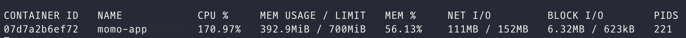
>

## Jenkins관련 발생한 트러블 슈팅

Jenkins에서 이미지 빌드할 때, 아래와 같이 권한 오류가 발생하였다.

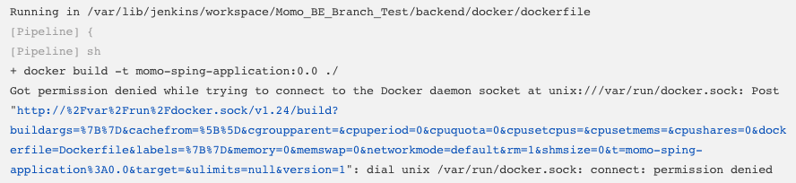

해결 방법은 간단하였다. 아래의 명령어를 통해 jenkins의 권한을 추가한 후 재시작을 하면 됐다.

```bash
# jenkins의 권한 추가
& sudo usermod -aG docker jenkins
# jenkins재시작
& sudo service jenkins restart
```

# 7. 마무리

모든 과정을 거치며 변경된 CI/CD 인프라 구조는 아래와 같다.

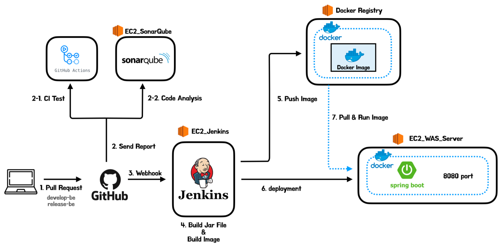

이번 포스트에서는 프로젝트에 Docker를 사용하게 된 계기와 Docker를 적용한 과정에 대해 정리해봤다. 환경을 구축하는 과정에서 Docker에 대한 많은 학습과 시간이 필요하였으나 결과를 봤을 때는 만족스러운 결과를 얻었다. 부하테스트를 진행할 때 인스턴스가 터지는 문제도 EC2 자원 사용량에 제한을 걸어둔 후 일부러 EC2에 버틸 수 없는 부하를 주며 테스트를 해봤으나 요청의 처리 에러는 발생하더라도 EC2자체가 중단되는 일은 발생하지 않는 것을 확인하였다.

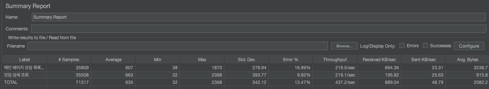

이렇게 프로젝트의 Docker 도입 작업이 끝이 났다. 이제 다음 포스트에서는 프로젝트에서 진행한 Nginx를 통한 로드밸런싱 구축에 대해 정리해보겠다.

# 📚 Reference
- [왜 굳이 도커(컨테이너)를 써야 하나요? - 컨테이너를 사용해야 하는 이유](https://www.44bits.io/ko/post/why-should-i-use-docker-container)
