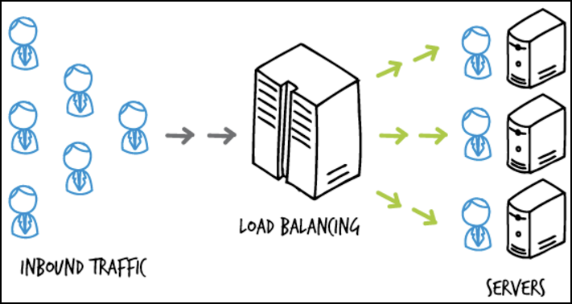
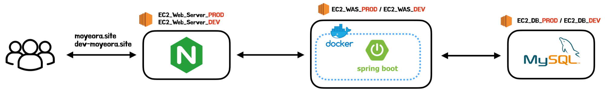
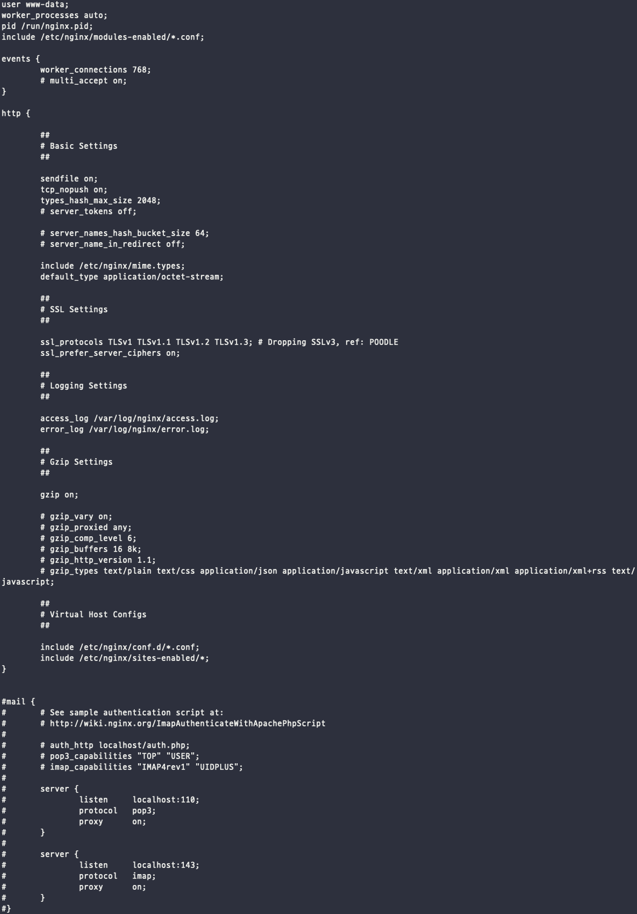
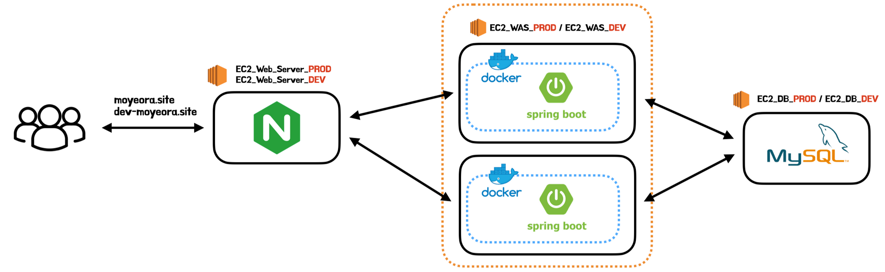

# 1. 로드 밸런싱(Load Balancing)이란?

서비스의 규모가 커지고 이용자 수가 증가하게 된다면 서비스 동작이 원활하게 이루어지지 않을 수 있다. 특히 하나의 WAS 서버만을 이용할 경우 해당 서버가 모든 요청을 감당해야할 것이기에 많은 부하가 걸릴 경우 서비스 전체가 동작을 멈추는 단일 장애점(SPOF)가 생기게 된다.

서버에서 많은 요청을 감당할 수 있게 대처할 수 있는 방법은 Scale-up과 Scale-out방식이 존재한다. 먼저 Scale-up방식은 기존 서버의 성능을 향상하는 방식이다. 하지만 서버의 성능 향상은 하드웨어 상의 한계가 있을 뿐더러 성능을 향상할 수록 기하급수적으로 비용이 증가하게 된다. 또한 여전히 하나의 서버만을 운영하기에 SPOF의 문제가 존재한다.

두번째 방법으로는 Scale-out방식이 있다. 해당 방법은 기존의 서버와 동일하거나 낮은 성능의 서버를 증설하는 방법이며 이것이 바로 로드 밸런싱이다.



로드 밸런싱은 말 그대로 부하(Load)를 여러 컴퓨터에 분산(Balancing) 시켜주는 기술이다. 즉, 하나의 서버로 모든 트래픽을 감당하기 어려워 여러대의 서버에 트래픽을 분산시켜주는 방법을 로드 밸런싱이라 한다. 로드 밸런싱을 할 경우 요청을 받을 수 있는 서버가 2개 이상이어서 해당 계층에 대해서는 SPOF의 문제도 해결되게 된다.

# 2. 로드 밸런싱 종류

로드 밸런싱은 실행되는 네트워크 계층에 따라 L4 로드밸런서와 L7로드 밸런서로 나뉜다. 네트워크 4계층인 전송 계층에서 실행된다면 L4로드밸런서로 불리며 7계층인 애플리케이션 계층에서 실행되면 L7로드밸런서라고 불린다.

## L4 로드 밸런싱

- Layer 4인 전송 계층에서 동작하는 로드 밸런서로 네트워크 계층(IP, IPX)이나 전송 계층(TCP, UDP)의 정보(IP주소, 포트번호, MAC주소, 전송 프로토콜)를 바탕으로 로드를 분산한다.
- 데이터의 안을 들여다보지 않고 패킷 레벨에서 로드를 분산하기에 속도가 빠르고 효율이 높다.
- 데이터의 내용을 복호화할 필요가 없기에 안전하다.
- L7보다 가격이 저렴하다.
- 패킷의 내용을 살펴볼 수 없기에 섬세한 라우팅이 불가능하고 사용자의 IP가 바뀌면 연속적인 서비스를 제공하기 어렵다는 단점이 있다.

## L7 로드 밸런싱

- Layer 7인 응용 계층에서 동작하는 로드 밸런서로 애플리케이션 계층(HTTP, FTP, SMTP)에서 로드를 분산하기 때문에 HTTP 헤더, 쿠키 등과 같은 사용자의 요청을 기준으로 특정 서버에 트래픽을 분산하는 것이 가능하다.
    - TCP/ UDP정보 뿐만 아니라 HTTP의 URI, FTP의 파일명, 쿠키 정보 등을 바탕으로 한다.
    - 패킷의 내용을 확인하고 해당 내용에 따라 로드를 특정 서버에 분배하는 것이 가능하다.
- 상위 계층에서 로드를 분산하기에 섬세한 라우팅이 가능하다.
    - URl에 따라 부하를 분산시키거나, HTTP 헤더의 쿠키 값에 따라 부하를 분산하는 등의 클라이언트의 요청을 세분화하여 서버에 전달할 수 있다.
- 캐싱 기능을 제공한다.
- 비정상적인 트래픽을 필터링해 서비스의 안정성이 높다.
    - DoS/DDoS와 같은 비정상적인 트래픽을 필터링할 수 있어 네트워크 보안 분야에서도 활용되고 있다.
- 패킷의 내용을 복호화하기에 L4보다 더 많은 비용을 지불해야하며 클라이언트가 로드 밸런서와 인증서를 공유하기 때문에 공격자가 로드 밸런서를 통해 클라이언트의 데이터에 접근할 위험성이 있다는 단점이 있다.

# 3. 모모팀이 로드밸런싱을 도입한 이유

모모팀 인프라 개선을 하며 로드밸런싱을 도입하게 되었다. 로드 밸런싱을 처음 도입하게 된 이유는 크게 성능 개선과 무중단 배포가 있다. 그 외에도 로드 밸런싱을 도입하면 WAS레벨의 SPOF제거의 이점을 얻을 수도 있다.

각각의 이유와 로드 밸런싱을 도입했을 때 자연스럽게 오는 이점의 자세한 내용은 아래와 같다.

### 성능 개선



모모팀의 인프라는 웹 서버인 Nginx는 하나의 WAS 서버를 가르키고 있다. 이러한 구조는 많은 요청이 몰릴 경우, 하나의 WAS서버에서 모든 요청을 처리해야 하여 부담이 커진다. 쿼리 성능 개선을 하여 서비스의 최소 타겟 인원인 150명을 하나의 WAS에서 요청을 감당할 수 있지만 더 많은 유저가 서비스를 이용할 경우 WAS서버가 버티지 못할 수 있다. WAS에서 더 많은 요청을 처리하도록 하는 가장 간단한 방법은 Scale-up방식이다. 하지만 Scale-up의 경우 현재 우아한형제들에서 제공받는 EC2는 t4g.micro로 한정되어있기에 진행할 수 없었다. 그래서 서버를 증설하는 Scale-out방식인 로드 밸런싱을 고려하게 되었다.

### 무중단 배포

현재 모모팀의 CI/CD과정에서 배포 과정은 애플리케이션 중단을 한 후에 새로운 애플리케이션을 실행한다. 이러한 순서로 진행이된다면 새로운 애플리케이션이 정상적으로 실행되기까지 실행중인 서버가 없는 상황이 발생한다. 즉, 서버의 공백기가 발생하는 것이다. 이때 서버에 요청이 오면 서버는 응답을 하지 못하게 되는 상황이 발생한다. 이를 개선하기 위해서는 롤링 배포, 블루그린 배포와 같은 무중단 배포를 진행하여야 한다. 이러한 방법들은 최소 2개 이상의 WAS서버가 필요하기에 로드 밸런싱을 구축하면 자연스럽게 무중단배포의 환경 세팅이 된다. 무중단 배포에 대한 과정은 다음 포스트에서 다룰 것이기에 더 자세한 이야기는 적지 않겠다.

### WAS 레벨의 SPOF 제거

현재의 WAS서버는 중단되었을 때, 모든 서비스가 이용할 수 없어지는 SPOF(single point of failure, 단일 장애점)이 된다. 물론 현재의 구조에는 웹서버와 DB서버도 SPOF이다. 로드 밸런싱을 구축하면 WAS레벨에서의 SPOF가 제거할 수 있다.

# 4. NGINX를 통한 로드밸런싱

NGINX는 로드 밸런싱을 쉽게 구축하는 기능을 제공하고 있다. Nginx의 초기설정부터 로드 밸런싱을 설정하기기까지의 과정을 간단히 살펴보겠다.

### 4.1. Nginx 기본 설정하기

Nginx설정은 `/etc/nginx/` 경로에 위치한 `nginx.conf` 파일의 http안에서 할 수 있다. 먼저 해당 파일에 접속해보겠다.

```bash
$ vi /etc/nginx/nginx.conf
```

> `nginx.conf` 파일의 기본 값은 아래와 같다.
>
>
> 
>

Nginx의 설정은 직접 http 블록에 넣어줘도 되지만 include를 통해 파일을 가져오도록 할 수 있다. 별다른 설정을 하지 않았다면 nginx는 기본적으로 위와 같이 `include /etc/nginx/site-enabled/*;` 설정을 갖고 있을 것이다. 만약 해당 설정이 되어있지 않다면 아래의 코드를 추가하면 된다.

```bash
http {
	include /etc/nginx/site-enabled/*;
}
```

include를 통해 `/etc/nginx/site-enabled/` 경로의 설정을 읽어오도록 하였으니 해당 경로에 추가 설정 파일을 생성하면 된다.

> 파일의 이름은 중요하지 않다. 하지만 다른 설정 파일과 충돌이 발생할 수 있기에 기존 것을 없애고 한가지 파일을 만드는 것이 좋다.
>

### 4.2. 설정 파일 세팅하기

설정 파일은 기존의 모모팀의 Nginx설정 파일을 통해 설명하겠다. 기존에 모모팀의 Nginx설정 파일은 아래와 같았다.

```bash
server {
	listen 443 ssl;
	server_name api.moyeora.site;

	// https인증을 진행 코드
	ssl_certificate /home/ubuntu/momokeys/fullchain.pem;
	ssl_certificate_key /home/ubuntu/momokeys/privkey.pem;

	location / {
		proxy_pass {요청을 보낼 WAS 서버 주소};
		proxy_buffer_size 128k;
		proxy_buffers 4 256k;
		proxy_busy_buffers_size 256k;
	}
}
```

위의 설정 파일의 동작을 간단히 설명하면 `api.moyeora.site` 도메인 주소의 요청이 443포트로 요청이 들어왔을 때 https ssl인증을 진행 후, location인 `/` 경로의 proxy_pass 주소로 요청을 전달하는 설정이 되어있다.

> 자세한 설정은 Nginx의 홈페이지를 참고하길 바란다.
>
>
> [Beginner's Guide](http://nginx.org/en/docs/beginners_guide.html)
>

이제 해당 파일에 로드 밸런싱 코드를 추가해보겠다.

### 4.3. 로드 밸런싱 코드 추가하기

로드 밸런싱을 구축하는 방법은 간단하다. 설정 파일에 upstream을 설정 후 proxy_pass에 세팅해둔 upstream으로 설정해두기만하면 된다.

```bash
upstream <업스트림 이름> {
	<로드밸런스 타입: defulat는 round-robin>
	server <host1>:<port1>
	...
	server <host2>:<port2>
}

server {
	...
	location <url>{
		proxy_pass http://<업스트림 이름>
	}
	...
}
```

upstream에는 로드밸런싱을 하기 위해 분배해줄 서버와 부하를 분산해줄 알고리즘을 세팅해줘야 한다. 위의 예시 코드와 같이 첫 라인에는 로드 밸런스 타입을 적어주고 그 아래 줄 부터는 부하를 분산해줄 WAS서버의 주소를 작성해주면 된다.

> Nginx에서 제공하는 로드 밸런스 알고리즘은 아래와 같다. 아무런 설정을 하지 않는다면 기본 설정값인 라운드 로빈으로 설정된다.
>
> - **round-robin(디폴트)** - 요청을 순서대로 돌아가면서 분배한다.
> - **hash** - 해시한 값으로 분배한다 쓰려면 **hash <키>** 형태로 쓴다. **ex)hash $remote_addr <- 이는 ip_hash와 같다.**
> - **ip_hash** - 요청이 클라이언트 IP주소로 해싱을 진행한 후,  한번 요청 받은 서버가 있을 때 해당 서버에만 요청을 분배한다.
> - **random** - 랜덤으로 분배한다.
> - **least_conn** - 연결수가 가장 적은 서버를 선택해서 분배, 근데 가중치를 고려함
> - **least_time** - 연결 수가 가장 적으면서 평균 응답시간이 가장 적은 쪽을 선택해서 분배한다. (Nginx Plus에서만 가능)

이제 로드밸런싱 설정을 모모팀의 Nginx설정에 추가해보겠다. 모모팀에서 사용하는 WAS서버는 2개이기에 2개의 서버만을 추가하으며 로드밸런스 알고리즘의 경우 디폴트인 라운드로빈으로 설정하였다.

```bash
server {
	listen 443 ssl;
	server_name api.moyeora.site;

	upstream momo_server {
		server {server1_ip}:{port}
		server {server2_ip}:{port}
	}

	// https인증을 진행 코드
	ssl_certificate /home/ubuntu/momokeys/fullchain.pem;
	ssl_certificate_key /home/ubuntu/momokeys/privkey.pem;

	location / {
		proxy_pass momo_server;
		proxy_buffer_size 128k;
		proxy_buffers 4 256k;
		proxy_busy_buffers_size 256k;
	}
}
```

# 5. 마치며

이번 포스트에서는 로드밸런싱에 대해 알아본 후, 모모팀 서비스에 적용한 과정에 대해 살펴보았다. 적용을 완료한 후의 모모팀의 인프라 구조는 아래와 같이 변경되었다.



서비스에 로드 밸런싱을 구축하며 기존에 WAS 레벨에서 존재하였던 SPOF문제도 해결하였고 WAS서버의 부하를 분산시켜 애플리케이션이 기존보다 더 많은 부하도 버틸 수 있게 된 것을 확인하였다.

이렇게 프로젝트의 로드 밸런싱 구축은 끝이 났다. 다음 포스트에서는 프로젝트에 무중단 배포를 진행한 과정에 대해 정리해보겠다.

# 📚 Reference
- [Using nginx as HTTP load balancer](http://nginx.org/en/docs/http/load_balancing.html)
- [Module ngx_stream_upstream_module](http://nginx.org/en/docs/stream/ngx_stream_upstream_module.html)
- [로드 밸런싱에 대해 알아보자!](https://tecoble.techcourse.co.kr/post/2021-11-07-load-balancing/)
