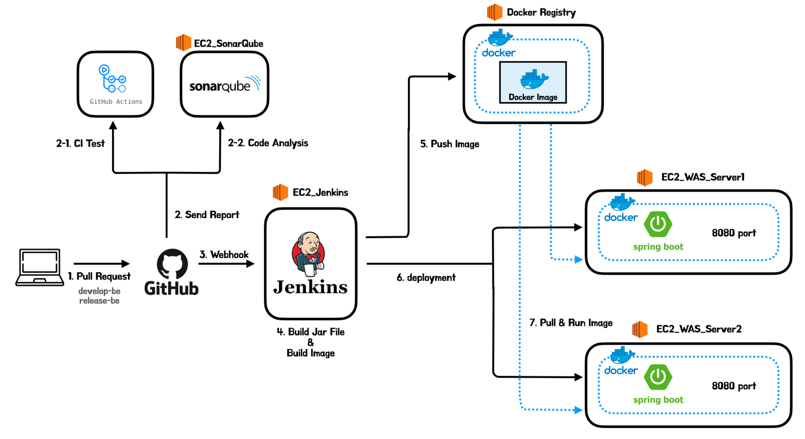
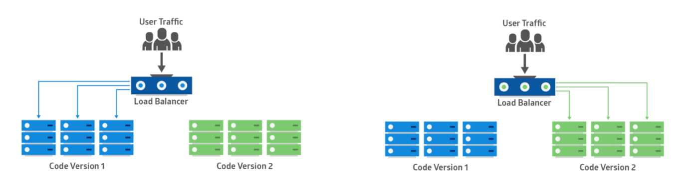
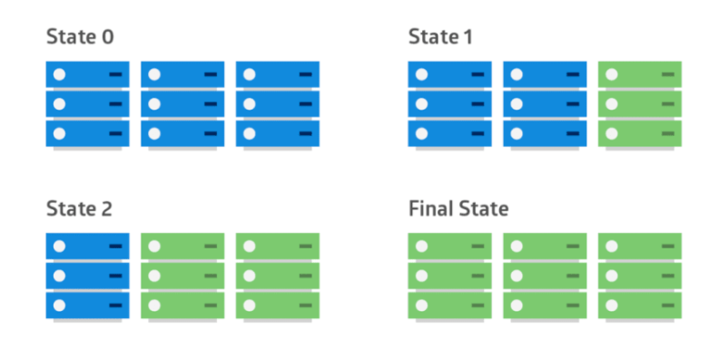
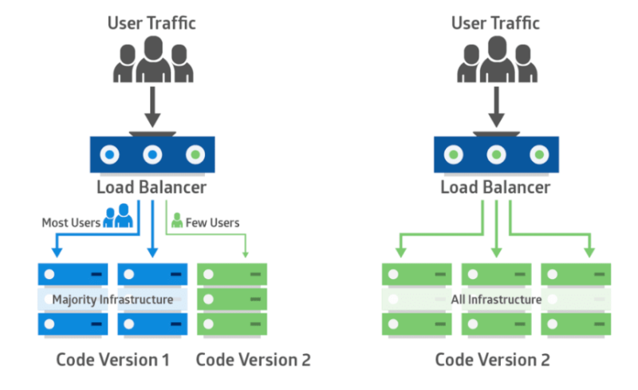
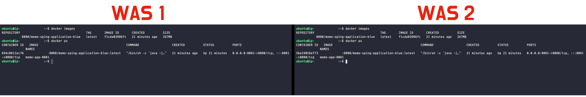
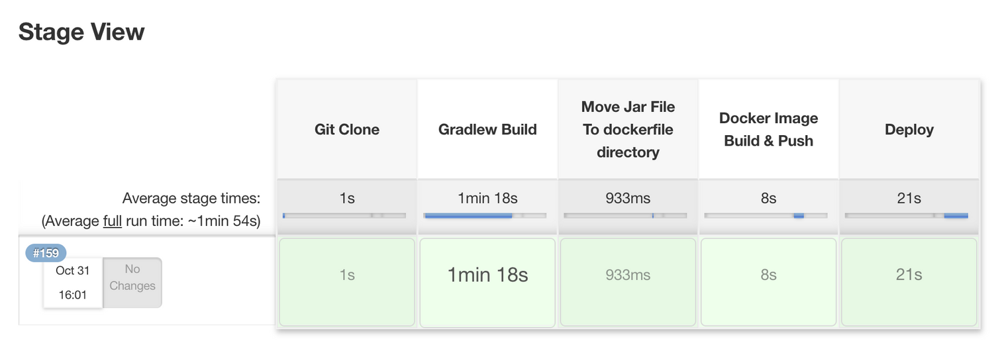
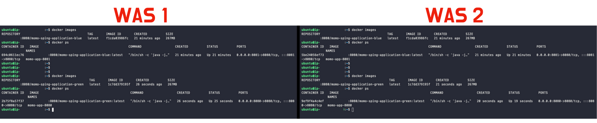
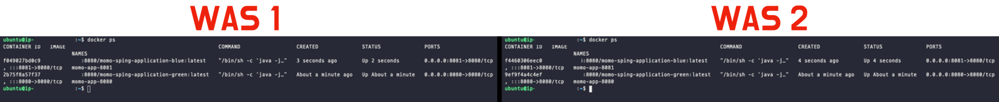
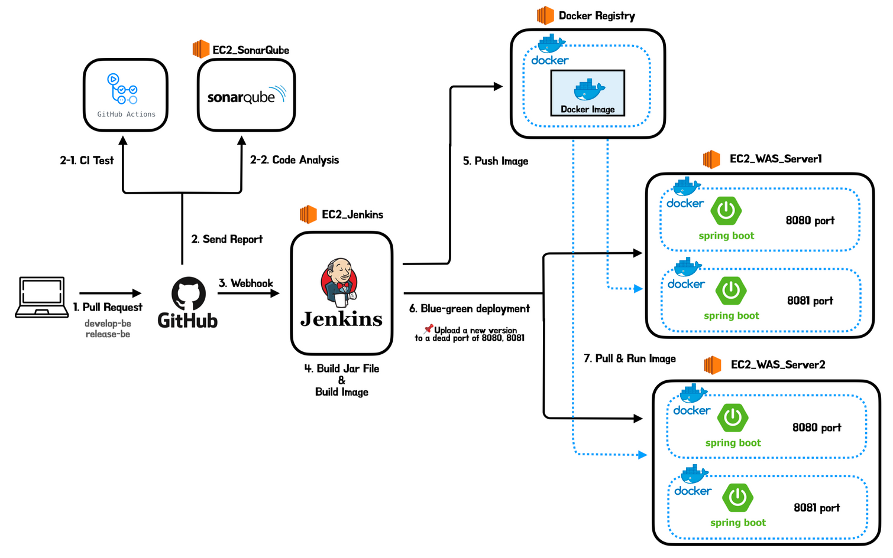

# 1. 들어가며

앞서 모모팀의 CI/CD구조에 Docker를 도입하는 작업과 로드 밸런싱을 하는 작업을 진행하였다. 해당 작업들을 진행한 이후 모모팀의 CI/CD구조는 아래와 같다.



간단히 구조를 설명하면 Jenkins에서는 JAR파일을 빌드 후, 해당 파일을 통해 실행 Docker 이미지를 만들어 Private Registry에 올리면 각각의 WAS 서버에서 이미지를 다운받아 실행하는 구조를 형성하고 있다.

지금의 구조에는 배포에 있어 한가지 문제점이 있다. 그 문제점은 바로 서버의 재배포가 일어날 때 서버가 중단되는 **다운타임(downtime)**이 존재한다는 것이다. 현재 사용중인 EC2에서 Spring 앱을 실행시키는데는 약 7초의 시간이 걸린다. 즉, 지금까지 항상 재배포를 할 때마다 Spring이 실행되는 7초라는 시간동안 서버가 중단되었던 것이다.

이러한 중간에 서버가 다운되며 발생하는 다운타임은 무중단 배포를 한다면 없앨 수 있다.

# 2. 무중단 배포란?

무중단 배포는 말 그대로 서비스의 버전이 변경되어 배포될 때, 운영중인 서비스가 중단되지 않고 새로운 버전을 배포하는 것을 의미한다. 무중단 배포의 핵심은 로드밸런서를 통해 연결된 두 개 이상의 (서로 다른 포트, IP를 가진) 인스턴스에 트래픽을 제어해 배포한다는 점이다.

무중단 배포에는 크게 3가지 방법이 존재한다. 지금부터 3가지 방법의 이론에 대해 자세히 알아보겠다.

# 3. 무중단 배포  방식

## 블루-그린 배포 (Blue-Green Deployment)



블루 그린 배포는 구버전과 동일한 구조의 신버전 인스턴스를 생성한 후, 로드 밸런서를 이용해 트래픽을 신버전으로 전환하는 배포 방식이다. 두 개의 인스턴스가 동일한 운영 환경을 이루기 때문에 실제 서비스 환경에서 신버전을 미리 테스트 할 수 있다는 장점이 있다. 또한 배포를 완료한 후, 구버전의 인스턴스를 지우는 작업을 하지 않는다면 해당 인스턴스는 남아있기에 빠른 롤백이 가능하다는 장점이 있다. 하지만 블루 그린 배포를 하기 위해서는 **시스템 자원이 2배로 필요하다는 단점**과 새로운 환경에 대한 테스트가 전제되어야한다는 단점이 존재한다.

## 롤링 배포 (Rolling Deployment)



롤링 배포는 사용중인 N개의 인스턴스에서 새로운 버전의 배포를 점진적으로 진행하는 가장 기본적인 방법이다. 인스턴스마다 새로운 버전의 배포를 순차적으로 진행하기 때문에 상황에 따라 쉽게 롤백할 수 있다는 장점이 존재한다. 하지만 해당 방법은 신버전을 배포할 때 N개의 서버로 분산되던 부하가 N-1개의 서버로 분산되어 서비스 처리 용량을 고려해야한다는 단점이 있다. 또한 무엇보다 배포가 진행되는 과정에서 **구버전과 신버전이 공존하는 상황이 발생하여 호환성 문제**가 발생할 수 있다.

## 카나리 배포(Canary Deployment)



카나리 배포는 잠재적인 문제 상황을 미리 발견하기 위한 방법으로 신버전의 제공 범위를 늘려가며 모니터링 및 피드백 과정을 거칠 수 있는 배포 방법이다. 로드 밸런서를 이용해 신버전의 제품을 경험하는 사용자를 조절할 수 있는 것이 특징이다. 해당 방법은 블루 그린과 유사하게 신버전 배포 이전에 실제 운영 환경에서 미리 테스트할 수 있다는 장점과 함께 단계적인 전환을 통해 부정적인 영향 최소화, 상황에 따른 트래픽 양을 조절할 수 있다는 장점도 존재한다. 하지만 롤링 배포와 마찬가지로 신버전과 구버전이 동시에 운영되어 호환성 문제가 발생할 수 있다.

# 4. 모모팀이 선택한 배포 방법

모모팀은 위의 세 가지 무중단 배포 방식중에 블루-그린 방법과 롤링 방법의 도입을 고민하였다. 초반에는 블루-그린의 경우 무조건 배포를 위한 동일한 환경의 EC2를 생성하여야하며, 해당 EC2가 운영중인 서버로 사용되지 않을 때는 항상 Idle하게 낭비되어야 한다고 생각하였기에 롤링 방식이 더 좋겠다고 생각했다. 롤링도 동 시간대에 2개의 버전이 서버에 올라가있다는 단점이 존재하였으나 불필요하게 EC2가 낭비되는 상황을 만드는 것보다는 더 낫다고 생각했다.

하지만 현재 우리의 인프라에는 Docker를 사용하여 하나의 EC2에서도 포트를 다르게 하면 여러개의 스프링 서버를 띄울 수 있는 상황이다. 즉, 무중단 배포를 위한 EC2를 만들지 않더라도 기존의 WAS EC2에서 포트가 다른 새로운 컨테이너를 실행하며 블루-그린 배포를 적용할 수 있다.

이렇게 걱정했던 블루-그린의 단점이 해결이 되어 모모팀은 최종적으로 포트 변경을 통한 블루-그린 배포를 채택하였다.

# 5. Jenkins, Docker를 통한 블루-그린 배포 진행하기

무중단 배포 적용과정을 설명하기 앞서 먼저 최종적으로 완성된 Jenkins 스크립트 파일을 보여준 후, 각각의 단계별 설명을 진행하겠다.

```bash
pipeline {
    agent any
    environment {
        JENKINS_ITEM_NAME = "Momo-Prod-BE"
        BRANCH = "develop-be"
        EXECUTE_PROFILE = "dev"
        IP1 = "{WAS_SERVER1_IP}"
        IP2 = "{WAS_SERVER2_IP}"
        SSH_CONNECTION1 = "ubuntu@{WAS_SERVER1_IP}"
        SSH_CONNECTION2 = "ubuntu@{WAS_SERVER2_IP}"
        NGINX_CONNECTION = "ubuntu@{NGINX_SERVER_IP}"
        SSH_CONNECTION_CREDENTIAL = "aws_key"
        CONTAINER = "{PRIVATE_REGISTRY_IP}/momo-sping-application"
    }
    stages {
        stage('Git Clone') {
            steps {
                git branch: BRANCH, url: 'https://github.com/woowacourse-teams/2022-momo.git'
                withCredentials([GitUsernamePassword(credentialsId: 'submodule_security_token', gitToolName: 'Default')]) {
                    sh 'git submodule update --init --recursive'
                }
            }
        }
        stage('Gradlew Build') {
            steps {
                dir("./backend") {
                    sh "./gradlew clean build"
                }
            }
        }
        stage('Move Jar File To dockerfile directory') {
            steps {
                sh "mv /var/lib/jenkins/workspace/${JENKINS_ITEM_NAME}/backend/build/libs/momo-0.0.1-SNAPSHOT.jar /var/lib/jenkins/workspace/${JENKINS_ITEM_NAME}/backend/docker/dockerfile/momo-0.0.1-SNAPSHOT.jar"
            }
        }
        stage('Docker Image Build & Push') {
            steps {
                dir("./backend/docker/dockerfile") {
                    script {
                        sh '''
#!/bin/bash

health_check() {
    DEFAULT_IF_FAIL="000"
    TARGET="http://$1/actuator/health"
    echo $(curl -s -o /dev/null -w "%{http_code}" "${TARGET}") || echo DEFAULT_IF_FAIL
}

SERVER1_8080_STATUS=$(health_check "${IP1}":8080)
SERVER2_8080_STATUS=$(health_check "${IP2}":8080)
if [ "${SERVER1_8080_STATUS}" -eq 200 ] || [ "${SERVER2_8080_STATUS}" -eq 200 ]; then
    docker build -t momo-sping-application-blue:latest ./
    docker tag momo-sping-application-blue:latest {PRIVATE_REGISTRY_IP}:8080/momo-sping-application-blue:latest
    docker push {PRIVATE_REGISTRY_IP}:8080/momo-sping-application-blue:latest
    
    docker rmi {PRIVATE_REGISTRY_IP}:8080/momo-sping-application-blue:latest
    docker rmi momo-sping-application-blue:latest
else
    docker build -t momo-sping-application-green:latest ./
    docker tag momo-sping-application-green:latest {PRIVATE_REGISTRY_IP}:8080/momo-sping-application-green:latest
    docker push {PRIVATE_REGISTRY_IP}:8080/momo-sping-application-green:latest
    
    docker rmi {PRIVATE_REGISTRY_IP}:8080/momo-sping-application-green:latest
    docker rmi momo-sping-application-green:latest
fi
                        '''
                    }
                }
            }
        }
        stage('Deploy') {
            steps {
                sshagent(credentials: [SSH_CONNECTION_CREDENTIAL]) {
                    script {
                        sh '''
#!/bin/bash

health_check() {
    DEFAULT_IF_FAIL="000"
    TARGET="http://$1/actuator/health"
    echo $(curl -s -o /dev/null -w "%{http_code}" "${TARGET}") || echo DEFAULT_IF_FAIL
}

# 1. Health Checking
echo "✅ "서버1 8080 포트 헬스 체크"
SERVER1_8080_STATUS=$(health_check "${IP1}":8080)
echo "✅ "서버2 8080 포트 헬스 체크"
SERVER2_8080_STATUS=$(health_check "${IP2}":8080)

# 2. if 8080 port is alive
if [ "${SERVER1_8080_STATUS}" -eq 200 ] || [ "${SERVER2_8080_STATUS}" -eq 200 ]; then
    echo "💥 8081 포트 배포 시작"
    TEMP=$(health_check "${IP1}":8081)
    if [ "${TEMP}" -eq 200 ]; then
        echo "🔪 서버 1 기존 8081포트 이미지 제거"
        ssh -o StrictHostKeyChecking=no -t "${SSH_CONNECTION1}" "docker rm -f momo-app-8081"
		ssh -o StrictHostKeyChecking=no -t "${SSH_CONNECTION1}" "docker rmi -f {PRIVATE_REGISTRY_IP}:8080/momo-sping-application-blue:latest"
    fi
    echo "🌈 서버 1 8081포트 배포 시작"
    ssh -o StrictHostKeyChecking=no -t "${SSH_CONNECTION1}" "docker pull ${CONTAINER}-blue:latest"
    ssh -o StrictHostKeyChecking=no -t "${SSH_CONNECTION1}" "docker run -d -p 8081:8080 -m 700m --cpus=1.8 -v /home/ubuntu/applicationlog:/momo -e PROFILE=${EXECUTE_PROFILE} --name momo-app-8081 ${CONTAINER}-blue:latest"
    echo "🌈 서버 1 8081포트 배포 성공"
    
    TEMP=$(health_check "${IP2}":8081)
    if [ "${TEMP}" -eq 200 ]; then
        echo "🔪 서버 2 기존 8081포트 이미지 제거"
        ssh -o StrictHostKeyChecking=no -t "${SSH_CONNECTION2}" "docker rm -f momo-app-8081"
		ssh -o StrictHostKeyChecking=no -t "${SSH_CONNECTION2}" "docker rmi -f {PRIVATE_REGISTRY_IP}:8080/momo-sping-application-blue:latest"
    fi
    echo "🌈 서버 2 8081포트 배포 시작"
    ssh -o StrictHostKeyChecking=no -t "${SSH_CONNECTION2}" "docker pull ${CONTAINER}-blue:latest"
    ssh -o StrictHostKeyChecking=no -t "${SSH_CONNECTION2}" "docker run -d -p 8081:8080 -m 700m --cpus=1.8 -v /home/ubuntu/applicationlog:/momo -e PROFILE=${EXECUTE_PROFILE} --name momo-app-8081 ${CONTAINER}-blue:latest"
    echo "🌈 서버 2 8081포트 배포 성공"

    echo "🏆 NGINX 재설정"
    for i in $(seq 100); do
        sleep 1
        SERVER1_8081_STATUS=$(health_check "${IP1}":8081)
        SERVER2_8081_STATUS=$(health_check "${IP2}":8081)
        if [ "${SERVER1_8081_STATUS}" -eq 200 ] && [ "${SERVER2_8081_STATUS}" -eq 200 ]; then
            ssh -o StrictHostKeyChecking=no -t ${NGINX_CONNECTION} 'cd /etc/nginx/sites-enabled && sudo rm * && cd ~/momo-conf && sudo cp momo-8081.conf /etc/nginx/sites-enabled/ && sudo nginx -s reload'
            break
        fi
    done
    
    echo "🔪 8080 포트 죽이기 "
    ssh -o StrictHostKeyChecking=no -t "${SSH_CONNECTION1}" 'docker rm -f momo-app-8080'
    ssh -o StrictHostKeyChecking=no -t "${SSH_CONNECTION2}" 'docker rm -f momo-app-8080'
    echo "🔪 8080 포트 죽이기 성공"
    
    echo "🔪 사용하지 않는 이미지 제거"
	ssh -o StrictHostKeyChecking=no -t "${SSH_CONNECTION1}" "docker rmi -f {PRIVATE_REGISTRY_IP}:8080/momo-sping-application-green:latest"
	ssh -o StrictHostKeyChecking=no -t "${SSH_CONNECTION2}" "docker rmi -f {PRIVATE_REGISTRY_IP}:8080/momo-sping-application-green:latest"

else
    echo "💥 8080 포트 배포 시작"
    TEMP=$(health_check "${IP1}":8080)
    if [ "${TEMP}" -eq 200 ]; then
        echo "🔪 서버 1 기존 8080포트 이미지 제거"
        ssh -o StrictHostKeyChecking=no -t "${SSH_CONNECTION1}" "docker rm -f momo-app-8080"
		ssh -o StrictHostKeyChecking=no -t "${SSH_CONNECTION1}" "docker rmi -f {PRIVATE_REGISTRY_IP}:8080/momo-sping-application-green:latest"
    fi
    echo "🌈 서버 1 8080포트 배포 시작"
    ssh -o StrictHostKeyChecking=no -t "${SSH_CONNECTION1}" "docker pull ${CONTAINER}-green:latest"
    ssh -o StrictHostKeyChecking=no -t "${SSH_CONNECTION1}" "docker run -d -p 8080:8080 -m 700m --cpus=1.8 -v /home/ubuntu/applicationlog:/momo -e PROFILE=${EXECUTE_PROFILE} --name momo-app-8080 ${CONTAINER}-green:latest"
    echo "🌈 서버 1 8080포트 배포 성공"
    
    TEMP=$(health_check "${IP2}":8080)
    if [ "${TEMP}" -eq 200 ]; then
        echo "🔪 서버 2 기존 8080포트 이미지 제거"
        ssh -o StrictHostKeyChecking=no -t "${SSH_CONNECTION2}" "docker rm -f momo-app-8080"
		ssh -o StrictHostKeyChecking=no -t "${SSH_CONNECTION2}" "docker rmi -f {PRIVATE_REGISTRY_IP}:8080/momo-sping-application-green:latest"
    fi
    echo "🌈 서버 2 8080포트 배포 시작"
    ssh -o StrictHostKeyChecking=no -t "${SSH_CONNECTION2}" "docker pull ${CONTAINER}-green:latest"
    ssh -o StrictHostKeyChecking=no -t "${SSH_CONNECTION2}" "docker run -d -p 8080:8080 -m 700m --cpus=1.8 -v /home/ubuntu/applicationlog:/momo -e PROFILE=${EXECUTE_PROFILE} --name momo-app-8080 ${CONTAINER}-green:latest"
    echo "🌈 서버 2 8080포트 배포 성공"

    echo "🏆 NGINX 재설정"
    for i in $(seq 100); do
        sleep 1
        SERVER1_8080_STATUS=$(health_check "${IP1}":8080)
        SERVER2_8080_STATUS=$(health_check "${IP2}":8080)
        if [ "${SERVER1_8080_STATUS}" -eq 200 ] && [ "${SERVER2_8080_STATUS}" -eq 200 ]; then 
            ssh -o StrictHostKeyChecking=no -t ${NGINX_CONNECTION} 'cd /etc/nginx/sites-enabled && sudo rm * && cd ~/momo-conf && sudo cp momo-8080.conf /etc/nginx/sites-enabled/ && sudo nginx -s reload'
            break
        fi
    done
    
    echo "🔪 8081 포트 죽이기 "
    ssh -o StrictHostKeyChecking=no -t "${SSH_CONNECTION1}" 'docker rm -f momo-app-8081'
    ssh -o StrictHostKeyChecking=no -t "${SSH_CONNECTION2}" 'docker rm -f momo-app-8081'
    echo "🔪 8081 포트 죽이기 성공"
    
    echo "🔪 사용하지 않는 이미지 제거"
	ssh -o StrictHostKeyChecking=no -t "${SSH_CONNECTION1}" "docker rmi -f {PRIVATE_REGISTRY_IP}:8080/momo-sping-application-blue:latest"
	ssh -o StrictHostKeyChecking=no -t "${SSH_CONNECTION2}" "docker rmi -f {PRIVATE_REGISTRY_IP}:8080/momo-sping-application-blue:latest"
fi
                        '''
                    }
                }
            }
        }
    }
}
```

> Docker 이미지를 빌드하고 푸쉬하기 전 단계들은 환경변수 설정을 제외하면 이전의 Docker 도입할 때의 코드에서 변경점이 없기에 설명 없이 넘어가도록 하겠다.
>
>
> 해당 스크립트에대해 알고 싶다면 아래의 포스트를 참고하길 바란다.
>
> [모모팀 인프라 개선기 1편 (Docker🐳 도입)](https://seongwon.dev/DevOps/20221021-%EB%AA%A8%EB%AA%A8%ED%8C%80-%EC%9D%B8%ED%94%84%EB%9D%BC-%EA%B0%9C%EC%84%A0%EA%B8%B0-1%ED%8E%B8/)
>

## 5.1. Docker Image Build & Push

```bash
        stage('Docker Image Build & Push') {
            steps {
                dir("./backend/docker/dockerfile") {
                    script {
                        sh '''
#!/bin/bash

health_check() {
    DEFAULT_IF_FAIL="000"
    TARGET="http://$1/actuator/health"
    echo $(curl -s -o /dev/null -w "%{http_code}" "${TARGET}") || echo DEFAULT_IF_FAIL
}

SERVER1_8080_STATUS=$(health_check "${IP1}":8080)
SERVER2_8080_STATUS=$(health_check "${IP2}":8080)
if [ "${SERVER1_8080_STATUS}" -eq 200 ] || [ "${SERVER2_8080_STATUS}" -eq 200 ]; then
    docker build -t momo-sping-application-blue:latest ./
    docker tag momo-sping-application-blue:latest {PRIVATE_REGISTRY_IP}/momo-sping-application-blue:latest
    docker push {PRIVATE_REGISTRY_IP}:8080/momo-sping-application-blue:latest
    
    docker rmi {PRIVATE_REGISTRY_IP}:8080/momo-sping-application-blue:latest
    docker rmi momo-sping-application-blue:latest
else
    docker build -t momo-sping-application-green:latest ./
    docker tag momo-sping-application-green:latest {PRIVATE_REGISTRY_IP}:8080/momo-sping-application-green:latest
    docker push {PRIVATE_REGISTRY_IP}:8080/momo-sping-application-green:latest
    
    docker rmi {PRIVATE_REGISTRY_IP}:8080/momo-sping-application-green:latest
    docker rmi momo-sping-application-green:latest
fi
                        '''
                    }
                }
            }
        }
```

해당 단계에서는 Stage의 이름대로 Docker Image를 빌드한 후 Private Registry에 Push하는 작업을 진행한다. 실행 스크립트에서 유심히 봐야할 부분은 2개의 WAS서버에서 8080포트를 사용중인지 Health 체크를 하고 사용 유무에 따라 다른 작업을 한다는 점이다.

만약 2개의 WAS서버중 8080포트를 사용하는 서버가 한개라도 존재하면 Jenkins에서는 `blue`라는 키워드가 붙은 `momo-sping-application-blue:latest` 이미지를 생성 후 registry에 push한다. 반대로 8080포트를 사용하는 서버가 존재하지 않으면 현재 8081포트에 `momo-sping-application-blue:latest` 컨테이너가 실행된다고 판단하여 8080포트에서 실행시킬 green 키워드가 붙은 새로운 버전의 `momo-sping-application-green:latest` 이미지를 생성 후 Push한다.

### 📌 이미지를 2개로 분리한 이유

Docker는 베이스 이미지가 같은 여러 개의 컨테이너를 만들어도 실제 PC에는 하나의 이미지만 존재한다. 이는 도커가 이미지는 읽기 전용으로 사용하고 여러개의 컨테이너가 해당 이미지 데이터를 읽으며 실행하기 때문이다.

만약 이미지를 분리하지 않고 하나의 이미지로 관리한다면 실행 서버에서 새로운 이미지를 Pull받았을 때, 현재 실행중인 컨테이너에 영향이 갈 수도 있다. 이러한 이유때문에 하나의 이미지를 사용하지 않고 blue, green이름이 붙은 2개의 이미지를 관리하도록 하고 있다.

이미지를 분리하면서 얻는 이점도 있다. 새로운 버전을 배포하였을 때, 예상하지 못한 오류들이 발생할 수 있다. 이전까지는 빠른 대처를 위해 배포 이전의 버전으로 돌리려면 Git에서 commit을 롤백하고 그 이후에 다시 배포하는 과정을 거쳐야했다. 하지만 이미지를 2개로 분리하며 최신 버전과 구 버전의 이미지가 Registry에 올라가 있게 되어 이제는 위의 과정을 거칠 필요 없이 단순히 Registry에 올라가있는 구 버전의 이미지를 Pull받아서 실행시키면 배포 이전의 버전으로 롤백할 수 있다.

## 5.2. Deploy

```bash
        stage('Deploy') {
            steps {
                sshagent(credentials: [SSH_CONNECTION_CREDENTIAL]) {
                    script {
                        sh '''
#!/bin/bash

health_check() {
    DEFAULT_IF_FAIL="000"
    TARGET="http://$1/actuator/health"
    echo $(curl -s -o /dev/null -w "%{http_code}" "${TARGET}") || echo DEFAULT_IF_FAIL
}

# 1. Health Checking
echo "✅ "서버1 8080 포트 헬스 체크"
SERVER1_8080_STATUS=$(health_check "${IP1}":8080)
echo "✅ "서버2 8080 포트 헬스 체크"
SERVER2_8080_STATUS=$(health_check "${IP2}":8080)

# 2. if 8080 port is alive
if [ "${SERVER1_8080_STATUS}" -eq 200 ] || [ "${SERVER2_8080_STATUS}" -eq 200 ]; then
    echo "💥 8081 포트 배포 시작"
    TEMP=$(health_check "${IP1}":8081)
    if [ "${TEMP}" -eq 200 ]; then
        echo "🔪 서버 1 기존 8081포트 이미지 제거"
        ssh -o StrictHostKeyChecking=no -t "${SSH_CONNECTION1}" "docker rm -f momo-app-8081"
		ssh -o StrictHostKeyChecking=no -t "${SSH_CONNECTION1}" "docker rmi -f {PRIVATE_REGISTRY_IP}:8080/momo-sping-application-blue:latest"
    fi
    echo "🌈 서버 1 8081포트 배포 시작"
    ssh -o StrictHostKeyChecking=no -t "${SSH_CONNECTION1}" "docker pull ${CONTAINER}-blue:latest"
    ssh -o StrictHostKeyChecking=no -t "${SSH_CONNECTION1}" "docker run -d -p 8081:8080 -m 700m --cpus=1.8 -v /home/ubuntu/applicationlog:/momo -e PROFILE=${EXECUTE_PROFILE} --name momo-app-8081 ${CONTAINER}-blue:latest"
    echo "🌈 서버 1 8081포트 배포 성공"
    
    TEMP=$(health_check "${IP2}":8081)
    if [ "${TEMP}" -eq 200 ]; then
        echo "🔪 서버 2 기존 8081포트 이미지 제거"
        ssh -o StrictHostKeyChecking=no -t "${SSH_CONNECTION2}" "docker rm -f momo-app-8081"
		ssh -o StrictHostKeyChecking=no -t "${SSH_CONNECTION2}" "docker rmi -f {PRIVATE_REGISTRY_IP}:8080/momo-sping-application-blue:latest"
    fi
    echo "🌈 서버 2 8081포트 배포 시작"
    ssh -o StrictHostKeyChecking=no -t "${SSH_CONNECTION2}" "docker pull ${CONTAINER}-blue:latest"
    ssh -o StrictHostKeyChecking=no -t "${SSH_CONNECTION2}" "docker run -d -p 8081:8080 -m 700m --cpus=1.8 -v /home/ubuntu/applicationlog:/momo -e PROFILE=${EXECUTE_PROFILE} --name momo-app-8081 ${CONTAINER}-blue:latest"
    echo "🌈 서버 2 8081포트 배포 성공"

    echo "🏆 NGINX 재설정"
    for i in $(seq 100); do
        sleep 1
        SERVER1_8081_STATUS=$(health_check "${IP1}":8081)
        SERVER2_8081_STATUS=$(health_check "${IP2}":8081)
        if [ "${SERVER1_8081_STATUS}" -eq 200 ] && [ "${SERVER2_8081_STATUS}" -eq 200 ]; then
            ssh -o StrictHostKeyChecking=no -t ${NGINX_CONNECTION} 'cd /etc/nginx/sites-enabled && sudo rm * && cd ~/momo-conf && sudo cp momo-8081.conf /etc/nginx/sites-enabled/ && sudo nginx -s reload'
            break
        fi
    done
    
    echo "🔪 8080 포트 죽이기 "
    ssh -o StrictHostKeyChecking=no -t "${SSH_CONNECTION1}" 'docker rm -f momo-app-8080'
    ssh -o StrictHostKeyChecking=no -t "${SSH_CONNECTION2}" 'docker rm -f momo-app-8080'
    echo "🔪 8080 포트 죽이기 성공"
    
    echo "🔪 사용하지 않는 이미지 제거"
	ssh -o StrictHostKeyChecking=no -t "${SSH_CONNECTION1}" "docker rmi -f {PRIVATE_REGISTRY_IP}:8080/momo-sping-application-green:latest"
	ssh -o StrictHostKeyChecking=no -t "${SSH_CONNECTION2}" "docker rmi -f {PRIVATE_REGISTRY_IP}:8080/momo-sping-application-green:latest"

else
		# 위와 실행 포트와 실행 이미지만 다른 중복로직이라 생략하겠다.
fi
                        '''
                    }
                }
            }
        }
```

이제 배포 과정을 살펴보겠다. 배포 스크립트도 길이상으로는 매우 길지만 코드를 보면 매우 간단한 것을 알 수 있다.

코드의 진행 순서는 아래와 같다.

1. **서버의 8080포트를 확인하며 8080, 8081중 어떤 포트로 배포할지 결정**

   배포 과정에서도 앞서 이미지를 빌드한 것과 같이 서버의 8080포트의 헬스 체크를 진행하며 새로운 버전의 이미지를 8080포트로 배포할지, 8081포트로 배포할지 판단한다.

    ```bash
    # 1. Health Checking
    echo "✅ "서버1 8080 포트 헬스 체크"
    SERVER1_8080_STATUS=$(health_check "${IP1}":8080)
    echo "✅ "서버2 8080 포트 헬스 체크"
    SERVER2_8080_STATUS=$(health_check "${IP2}":8080)
    
    # 2. if 8080 port is alive
    if [ "${SERVER1_8080_STATUS}" -eq 200 ] || [ "${SERVER2_8080_STATUS}" -eq 200 ]; then
    ```

2. **각각의 서버에 기존의 이미지 제거 후, 새로운 버전 배포**

   현재 8080포트를 사용하고 있다면 8081 포트에 실행되는 컨테이너와 8081에서 실행할 기존의 `momo-sping-application-blue` 이미지를 제거한다.

   > 과거에 정상적으로 동작하였으면 실행중인 이미지가 없겠지만 서비스의 안정성을 위해 다시 한번 삭제해준다.
   >

   컨테이너와 이미지를 제거하였으면 이제 private registry로부터 실행시킬 새로운 버전의 이미지를 다운받은 후, 실행을 한다.

   우리 서비스의 경우 2개의 WAS 서버를 사용중이어서 2개의 서버에 위의 과정을 각각 진행한다.

    ```bash
    echo "💥 8081 포트 배포 시작"
    TEMP=$(health_check "${IP1}":8081)
    if [ "${TEMP}" -eq 200 ]; then
        echo "🔪 서버 1 기존 8081포트 이미지 제거"
        ssh -o StrictHostKeyChecking=no -t "${SSH_CONNECTION1}" "docker rm -f momo-app-8081"
    ssh -o StrictHostKeyChecking=no -t "${SSH_CONNECTION1}" "docker rmi -f {PRIVATE_REGISTRY_IP}:8080/momo-sping-application-blue:latest"
    fi
    echo "🌈 서버 1 8081포트 배포 시작"
    ssh -o StrictHostKeyChecking=no -t "${SSH_CONNECTION1}" "docker pull ${CONTAINER}-blue:latest"
    ssh -o StrictHostKeyChecking=no -t "${SSH_CONNECTION1}" "docker run -d -p 8081:8080 -m 700m --cpus=1.8 -v /home/ubuntu/applicationlog:/momo -e PROFILE=${EXECUTE_PROFILE} --name momo-app-8081 ${CONTAINER}-blue:latest"
    echo "🌈 서버 1 8081포트 배포 성공"
    ```

3. **헬스체크를 통해 모든 서버에 배포가 완료되었는지 확인 및 Nginx에서 바라보는 포트 변경**

   새로운 버전의 배포 명령이 완료되었다면 헬스 체크를 통해 Spring이 온전히 올라갔는지 확인한다. 헬스 체크를 진행하는 이유는 앞서 언급했듯이 Spring이 실제로 실행되는 시간이 필요하기에 헬스 체킹 과정은 필수로 넣어야 한다. 해당 과정이 없을 경우 무중단 배포가 아니게 될 수 있다.

   헬스 체킹을 통해 Spring 서버가 정상적으로 실행됐다는 것이 판단되면 이제 Nginx의 설정을 변경해줘야 한다. 기존에는 8080포트를 바라봤다면 이제 8081포트로 연결하도록 해야한다.

   Nginx의 설정 변경을 해주려면 먼저 Nginx서버에 접속하여 8080포트를 바라보는 스크립트와 8081포트를 바라본는 서버를 각각 생성해줘야한다. 우리는 `/momo-conf` 디렉터리를 생성한 후, 해당 디렉터리에 `momo-8080.conf` 와 `momo-8081.conf` 설정 파일을 만들어뒀다. 설정 파일의 내용은 아래와 같다. 파일별로 각각 바라보는 포트만을 다르게 하면 된다.

    ```bash
    upstream springApp {
    	server {WAS_SERVER1_IP}:{PORT};
    	server {WAS_SERVER2_IP}:{PORT};
    }
    
    server {
    	listen 443 ssl;
    	server_name dev-api.moyeora.site;
    
    	ssl_certificate /home/ubuntu/momokeys/fullchain.pem;
    	ssl_certificate_key /home/ubuntu/momokeys/privkey.pem;
    
    	location / {
    		proxy_pass http://springApp;
    		proxy_buffer_size 128k;
    		proxy_buffers 4 256k;
    		proxy_busy_buffers_size 256k;
    	}
    }
    ```

   해당 설정이 정상적으로 완료되었다면 Jenkins에서 ssh를 통해 아래의 명령을 실행하면 자동으로 Nginx에서 바라보는 포트가 변경될 것이다.

    ```bash
    echo "🏆 NGINX 재설정"
    for i in $(seq 100); do
        sleep 1
        SERVER1_8081_STATUS=$(health_check "${IP1}":8081)
        SERVER2_8081_STATUS=$(health_check "${IP2}":8081)
        if [ "${SERVER1_8081_STATUS}" -eq 200 ] && [ "${SERVER2_8081_STATUS}" -eq 200 ]; then
            ssh -o StrictHostKeyChecking=no -t ${NGINX_CONNECTION} 'cd /etc/nginx/sites-enabled && sudo rm * && cd ~/momo-conf && sudo cp momo-8081.conf /etc/nginx/sites-enabled/ && sudo nginx -s reload'
            break
        fi
    done
    ```

   > Nginx의 설정을 변경하는 방법은 restart와 reload가 존재한다. reload의 경우 설정을 다시 불러오는 것이고 reatart는 말 그대로 Nginx자체를 종료했다가 실행하게 된다. restart를 하게 된다면 아주 찰나의 순간이지만 Nginx가 종료되는 시간이 존재하게 되어 우리는 reload를 하게 됐다.
>
4. **이전에 사용중이던 Port의 컨테이너와 이미지 제거**

   새로운 Spring서버를 띄우고 Nginx에서 바라보는 포트를 변경하는 작업이 모두 완료되었다. 이제 기존에 사용하던 포트에 연결된 컨테이너는 자원만 축내는 컨테이너가 된다. 이제 삭제하도록 하겠다.

    ```bash
    echo "🔪 8080 포트 죽이기 "
    ssh -o StrictHostKeyChecking=no -t "${SSH_CONNECTION1}" 'docker rm -f momo-app-8080'
    ssh -o StrictHostKeyChecking=no -t "${SSH_CONNECTION2}" 'docker rm -f momo-app-8080'
    echo "🔪 8080 포트 죽이기 성공"
    
    echo "🔪 사용하지 않는 이미지 제거"
    ssh -o StrictHostKeyChecking=no -t "${SSH_CONNECTION1}" "docker rmi -f {PRIVATE_REGISTRY_IP}:8080/momo-sping-application-green:latest"
    ssh -o StrictHostKeyChecking=no -t "${SSH_CONNECTION2}" "docker rmi -f {PRIVATE_REGISTRY_IP}:8080/momo-sping-application-green:latest"
    ```


# 6. 실행 결과 확인해보기

모든 설정을 마쳤으니 스크립트가 올바르기 실행되는지 확인해보겠다.

먼저 Jenkins 배포를 하기 전 각각의 EC2에 존재하는 이미지와 실행중인 컨테이너를 확인해보겠다. 현재 서버에는 각각 `momo-sping-application-blue:latest` 이미지가 존재하며 해당 이미지로 만든 `momo-app-8081` 이라는 이름의 컨테이너가 **8081**포트에서 실행중이다.



이제 새로운 배포를 위해 Jenkins 빌드를 해보겠다.



실행 후의 결과는 아래와 같다. 이미지를 확인해보면 알 수 있듯이 새로운 배포를 한 이후에는 8081 포트에서 실행되던 `momo-sping-application-blue:latest` 이미지와 컨테이너는 삭제되었고 **8080**포트에서 `momo-sping-application-green:latest` 이미지로 만든 `momo-app-8080` 컨테이너가 실행중인 것을 확인할 수 있다.



> 📌 배포 과정을 진행하는 중간에 각각의 서버에 Spring이 온전히 실행된 것을 확인하기 전까지는 8080, 8081 포트에서 컨테이너가 각각 실행하게 된다.
>
>
> 
>

# 7. 마치며

지금까지 무중단 배포란 무엇인가로부터 모모팀 서비스에 무중단 배포를 도입한 과정에 대해 알아봤다.

프로젝트에는 무중단 배포 적용을 하며 블루그린 배포 뿐만 아니라 롤링 배포도 직접 구현해봤다. 두 방법 모두 구현을 해본 결과 구현을 함에 있어 더 간단한 방법은 롤링 방법이었다. 하지만 해당 방법은 버전이 일치하지 않는 상황이 발생한다는 단점이 존재하여 이후에 블루그린 배포를 진행하였고 이번 포스트에서 기록한 최종 코드가 만들어졌다.

마지막으로 앞선 인프라 개선과 무중단 배포 과정을 거쳐 만들어진 모모팀의 CI/CD구조를 남기며 글을 마무리하겠다.



# 📚 Reference
- [무중단 배포 아키텍처[Zero Downtime Deployment] - 글로벌 서비스 운영의 필수 요소](https://www.samsungsds.com/kr/insights/1256264_4627.html)
- [docker-compose 무중단 배포 1편 (blue, green)](https://jay-ji.tistory.com/m/99)
- [Jenkins + Docker + Nginx 무중단 자동화 배포하기(Centos)](https://devbksheen.tistory.com/entry/Jenkins-Docker-Nginx-%EB%AC%B4%EC%A4%91%EB%8B%A8-%EB%B0%B0%ED%8F%AC%ED%95%98%EA%B8%B0)
