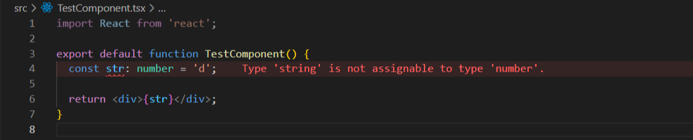

> 해당 포스트는 모모팀 크루 [유세지](https://github.com/usageness)와 [하리](https://github.com/LAH1203)가 작성했습니다.

이전까지 모두 모여라는 `Webpack`을 사용한 자바스크립트 프로젝트를 진행하며 babel을 트랜스파일러로 사용해왔습니다. 웹팩의 튜토리얼 문서에서 만날 수 있는 첫 번째 트랜스파일러이자 과거와 현재를 아울러 많은 사랑을 받고 있기 때문에, 대부분의 개발자 분들께서 한 번쯤은 사용해 본 기억이 있는 프로그램입니다.

그런데 얼마 전, 리팩토링을 진행하며 새로운 로더를 설치해서 사용하게 되었습니다. 결론부터 이야기하면 굉장히 만족스러웠는데, 왜 다른 로더를 사용하게 되었고, 그 결과가 어떻게 작용했는지에 대해 적어보도록 하겠습니다.

그 전에 먼저 바벨에 대해 간단히 알아봅시다.

#### **바벨이란?**

바벨은 최신 버젼의 자바스크립트 문법을 이전 버전에서도 사용할 수 있는 문법으로 변환하는 역할을 하는 트랜스파일러입니다. 자바스크립트의 버전은 하나가 아닌데, ECMA(European Computer Manufacturers Association)라고 하는 표준화 기구에서 편리한 자바스크립트 개발을 위해 매년마다 새로운 문법들을 표준으로 정하고 있으며, ES6, ES7, ... ES13 등의 이름으로 버전의 시점을 표시합니다.

현재 대부분의 브라우저는 자바스크립트의 최신 문법들을 지원하지만, 과거에 사용되던 IE와 같은 일부 브라우저의 경우 일정 시점 이후의 문법은 지원하지 않습니다. 그럼에도 아직까지 이용하는 사람들이 있기 때문에 이런 사용자들도 사이트를 이용할 수 있게 하려면 현재의 문법 대신 과거의 방식으로 구현하거나, 구현되지 않은 문법을 채워주는 폴리필(polyfil)이라고 하는 방법을 이용해야 합니다.

이러한 동작들을 개발자가 일일히 해주기엔 번거롭고, 그렇다고 하지 않으면 특정 문법을 사용하지 못하는 개발 환경은 그 자체로 문제 요소입니다. 바벨은 이러한 동작들을 대신 해줌으로써 문제를 깔끔하게 해결해주었습니다.


웹팩 환경에서는 **babel-loader**라고 하는 별도의 플러그인을 통해 프로젝트에 바벨을 적용해줄 수 있습니다. 아래처럼 module의 rules 부분에 지정할 파일들의 범위와 함께 구문을 추가해줍니다.

```javascript
// example of babel-loader
module: {
  rules: [
    {
      test: /\.m?js$/,
      exclude: /(node_modules|bower_components)/,
      use: {
        loader: "babel-loader",
        options: {
          presets: ["@babel/preset-env"],
        },
      },
    },
  ]
}
```

이렇게 바벨은 자바스크립트 환경에서 훌륭하게 동작할 수 있었습니다.

그런데, **타입스크립트 환경**이라면 어떨까요?

#### **타입스크립트 환경을 위한 Babel-loader 구성하기**

위에서 바벨은 자바스크립트를 변환해주는 트랜스파일러라고 설명했습니다. 타입스크립트 또한 런타임에는 자바스크립트가 되지만, 그것은 어디까지나 변환된 후의 이야기입니다. 위의 설정으로는 바벨이 ts 파일을 js 파일로 변환할 수 없습니다. Babel-loader가 타입스크립트 파일을 처리하려면 추가적인 플러그인이 필요합니다. 바로 **@babel/preset-typescript** 입니다.

사용중인 패키지 매니저를 이용해 @babel/preset-typescript 를 설치하고, 바벨이 해당 플러그인을 불러와서 사용할 수 있도록 options의 presets 부분에 추가해줍니다.

```javascript
// example of babel-loader with typescript
module: {
  rules: [
    {
      test: /\.ts$/,
      exclude: /(node_modules|bower_components)/,
      use: {
        loader: 'babel-loader',
        options: {
          presets: ['@babel/preset-env', '@babel/preset-typescript']
        }
      }
    }
  ]
}​
```

이제 바벨이 타입스크립트 파일도 읽을 수 있게 되었습니다!

#### **문제점**

다만 이렇게 구성된 babel-loader 설정에는 한 가지 문제가 있습니다. 바로 타입스크립트를 **읽기만** 한다는 점입니다. 이게 어떤 의미인지 예시를 통해 확인해보겠습니다.



여기 타입이 잘못 지정된 코드가 있습니다. 숫자를 타입으로 갖는 변수에 문자열이 들어왔기 때문에 vscode의 타입 체커가 잘못되었다며 오류 내용을 알려주고 있습니다. 이 상태로 `webpack-dev-server`를 통해 실행해보겠습니다.


타입 에러가 발생할 것이라는 예상과는 다르게, 멀쩡히 동작하는 모습입니다.

이것은 babel-loader가 타입스크립트 파일을 변환하는 방식 때문에 발생하는 문제입니다. babel-loader는 빌드가 이루어질경우 별다른 타입 체크 없이 단순히 코드에서 타입을 모두 지워버립니다. 덕분에 빌드 속도가 꽤 빠른 편입니다.

```typescript
// 원본 코드
const str: number = "d"

// babel-loader에 의해 변환된 코드
var str = "d"
```

강력한 타입 체크는 타입스크립트의 장점이었는데, 이렇게 되면 언어의 큰 장점 하나를 잃는 셈이 됩니다. 코드도 변환하고, 타입 체크도 할 수 있는 방법은 없을까요?

#### **빌드 시에 타입을 체크하는 플러그인**

[**fork-ts-checker-webpack-plugin**](https://github.com/TypeStrong/fork-ts-checker-webpack-plugin)을 사용하면 빌드 시에 별도로 타입을 체크해서 런타임에 결과를 확인할 수 있습니다. 컴파일은 컴파일대로 보내고, 타입 체크를 위한 과정은 따로 동작하여 기존의 빌드 속도와 큰 차이가 없다는 특징이 있습니다.

플러그인답게 적용하는 방법도 간단합니다. 모듈을 설치한뒤 웹팩 설정 파일에 불러와서 plugin 프로퍼티에 넣어주면 적용이 끝납니다.

```javascript
const ForkTsCheckerWebpackPlugin = require('fork-ts-checker-webpack-plugin');

...

plugins: [
  new ForkTsCheckerWebpackPlugin(),
],
```


이번에는 오류를 잘 잡아주고 있네요. 다만 왼쪽 터미널의 메시지를 잘 보시면 컴파일 자체는 에러 없이 완료되고 있습니다. 여기서 fork-ts-checker-webpack-plugin의 타입 체킹은 컴파일과는 무관하게 진행되는 것을 확인할 수 있습니다.

#### **ts-loader**

그러나 굳이 babel-loader를 사용해야한다는 제약만 버리면, 이 과정을 한 번에 완료할 수 있습니다. 바로 [**ts-loader**](https://github.com/TypeStrong/ts-loader)를 사용하는 방법입니다.

ts-loader는 babel-loader와 달리 별도의 프리셋을 추가할 필요가 없으며, 빌드시 타입 체크도 자동으로 진행해주기 때문에 타입스크립트의 장점들을 십분 활용할 수 있습니다. 위에서 언급했던 타입 체크 플러그인인 fork-ts-checker-webpack-plugin 또한 ts-loader와 같은 그룹인 TypeString 팀에서 개발되었습니다.

적용하는 과정도 매우 간단한데, 모듈을 설치하고 rules에 추가해주면 끝입니다.


ts-loader의 단점이라고 한다면, 아무래도 타입 체킹 과정이 있다보니 babel-loader보다 빌드 속도가 느립니다. 다만 이 부분은 babel-loader처럼 동작하는 옵션인 **transpileOnly: true** 를 적용시켜주는것으로 극복할 수 있습니다.

또는 fork-ts-checker-webpack-plugin을 적용해주면, 굳이 별다른 옵션을 주지 않아도 transpileOnly가 자동으로 true로 설정됩니다.

또 다른 단점은 로더 자체적으로 HMR(Hot Module Replacement) 이라고 불리는 기능을 정식으로 지원하지 않는다는 점입니다. 코드에 변경 사항이 생기면 실행중인 코드를 그에 맞게 갈아끼워 재빌드 시간을 단축 시켜주는 기능인데, 몇 가지 커스텀을 해주어야 비슷하게 사용할 수 있다는 점이 단점이라고 할 수 있을 것 같네요.

#### **esbuild-loader**

다른 선택지로는 떠오르는 로더인 [**esbuild-loader**](https://github.com/privatenumber/esbuild-loader)가 있습니다. 엄청나게 빠른 빌드 속도를 자랑하는 로더이며, 편리한 기능도 계속해서 업데이트 되고 있습니다. 현재 모두 모여라의 production 모드에서 빌드 로더로 사용하고 있기도 합니다.


다른 로더와 기능 자체는 다를게 없는데, 속도가 그렇게 빠르다고 하니 한 번 사용해볼만한 가치는 있어 보였습니다. 모두 모여라에서 실제로 사용해 본 결과 아래와 같았습니다.


왼쪽은 compileOnly: true를 적용한 ts-loader이고, 오른쪽은 esbuild-loader입니다. 한 번만 실행하면 튀는 값이 나올 것같아 두 로더 모두 세 번씩 실행해보았는데 세 번 모두 비슷하게 나왔습니다.

각각 약 16초와 11초 정도의 빌드 시간이 걸렸는데, 수치로 보면 빌드 시간을 약 **30%**정도 단축시킨 효과가 있네요. 지금이야 프로젝트 크기가 작아서 크게 느껴지진 않지만, 나중에 프로젝트 크기가 정말 커졌을때 적용시킨다면 몇 분 내지는 몇 십분까지도 단축시킬 수 있을 것 같습니다.

#### **마무리**

어떤 로더를 선택하던, 모두 훌륭한 로더들이니 각각의 특징이나 장점을 보고 상황에 맞는 로더를 선택해서 사용하시는게 제일 좋아보입니다. 현재 모두 모여라의 경우에는 development 모드에는 안전한 타입 체킹을 활용한 개발을 위해 ts-loader에 fork-ts-checker-webpack-plugin을 함께 사용했고, production 모드에서는 위에서 말씀 드렸듯이 빠른 빌드 및 라이브 서버 적용을 위해 esbuild-loader를 사용하고 있습니다.

긴 글 읽어주셔서 감사드리고, 모두 모여라 팀의 경험이 로더를 선택하시는데 조금이나마 도움이 되었다면 기쁠 것 같습니다.
