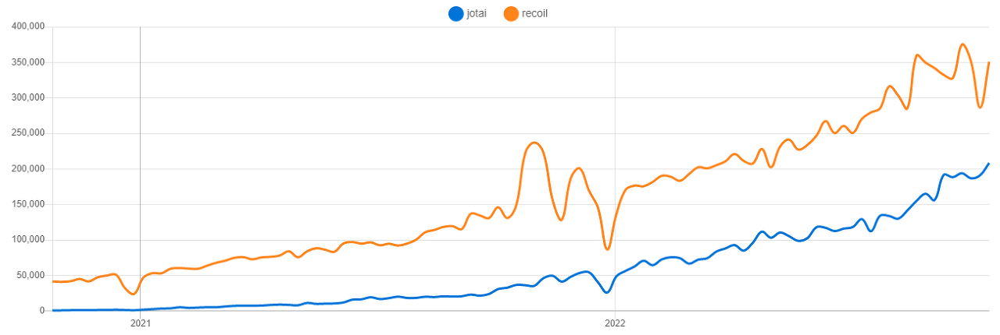
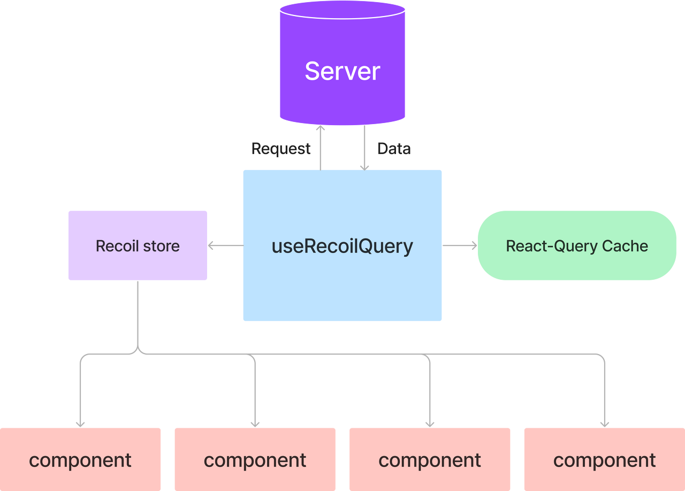
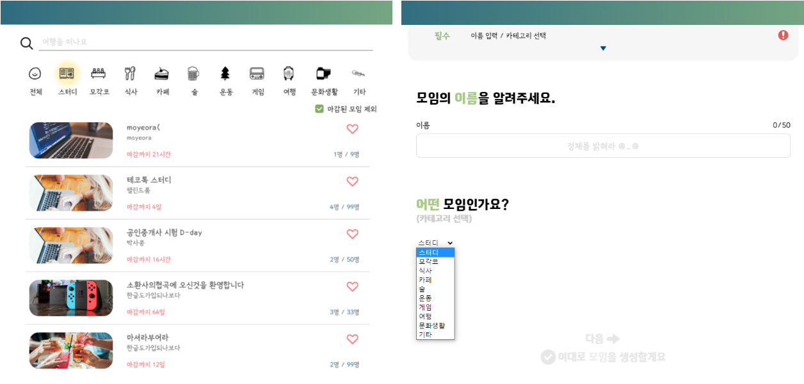
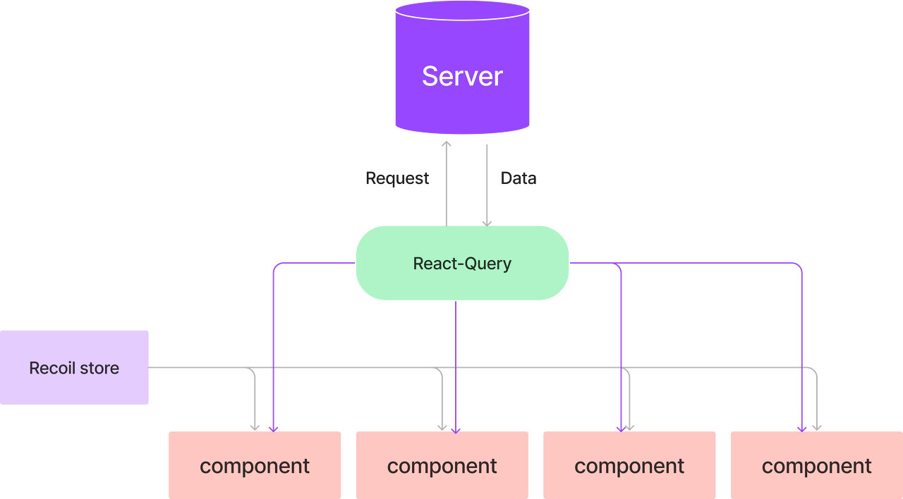

> 해당 포스트는 모모팀 크루 [유세지](https://github.com/usageness)가 작성했습니다.

모두 모여라의 정식 스프린트가 모두 마무리 되고, 본격적인 유지보수와 리팩토링 단계에 들어갔습니다. 시간적인 여유가 생겨 사용되고 있는 기술 스택들을 깊게 공부해보며 발견했는데 현재 사용중인 라이브러리들 중 라이브러리가 추구하는 방향 또는 기능과 일치하지 않는 부분을 발견하였습니다.

무엇인가 이상한 점을 느껴 전체적인 데이터 관리 플로우를 점검해보았는데, 나름 잘 사용하고 있었다는 초기의 생각과는 달리 데이터 관리의 일관성이 무너진 상태였습니다. 저희 팀이 처음보는 라이브러리를 사용하며 어떤 착각을 했었는지, 그 실패의 경험을 글로 옮겨보려합니다.

### **무엇이 문제였을까?**

문제가 되는 라이브러리는 프로젝트의 상태 관리를 담당하는 `recoil`과 통신을 담당하는 `react-query` (현재 tanstack-query) 두 가지였습니다.

먼저 recoil은 전역 상태를 관리하는 라이브러리입니다. 전역 store에서 상태들을 관리하며 컴포넌트가 각 상태를 구독하고 있는 형태로 사용하게 됩니다. 일반적인 전역 상태로는 context api를 사용할 수도 있지만, 상태가 변경되는 경우 해당 상태를 구독하고 있는 컴포넌트의 하위 컴포넌트들에도 불필요하게 리렌더링이 발생한다는 단점이 있습니다.

반면 recoil은 내부적으로 ref를 통해 상태를 전달하여 이러한 리렌더링을 방지할 수 있고, atomic concept를 차용하여 리액트의 상태에 가깝게 사용할 수 있다는 장점이 있습니다. 유사한 라이브러리로는 jotai가 있습니다.

jotai는 recoil과 유사한 개념으로 동작하고 상대적으로 더 가볍습니다. 다만 훌륭한 공식 문서가 존재하고, 많은 사람들의 선택을 받은 점을 고려하여 recoil을 선택하게 되었습니다. recoil에 대한 자세한 정보는 프론트 팀의 [하리](https://github.com/LAH1203)가 [잘 정리해 준 글](https://lah1203.netlify.app/post/8)이 있어 자세히는 적지 않겠습니다.

<center>



</center>

다음은 react-query입니다. 일반적인 연결을 넘어 응답값 캐싱, 무한 스크롤을 위한 메서드(useInfiniteScroll) 등 다양한 기능들을 지원해주고 있어 많은 인기를 끌고 있는 라이브러리입니다. 모두 모여라 팀도 불필요한 네트워크 요청을 줄이고, 이러한 편의기능을 이용하기 위해 react-query를 채택하였습니다.

### **프로젝트 초기**

프로젝트 초기에 데이터들을 어떻게 관리할지에 대해 이야기를 나누었는데, 데이터를 여러 곳에 나누어 저장해두면 관리하기 어렵다고 생각했습니다. 특히 react-query를 통해 받아오는 데이터는 자동으로 캐싱이 되기 때문에 이렇게 사용하면 혼란이 발생할 여지가 있다고 느꼈습니다. 두 데이터들을 모두 한 곳에서 관리해주어야 할 필요성을 느꼈고, 그 결과 아래와 같은 코드가 탄생하였습니다.

```typescript
const useRecoilQuery = <T>(
  recoilState: RecoilState<T>,
  key: string,
  getFunc: () => Promise<T>,
  staleTime = Infinity,
  suspense = true
) => {
  const [state, setState] = useRecoilState(recoilState)
  const { isLoading, data, refetch } = useQuery(key, getFunc, {
    staleTime,
    suspense,
  })

  useEffect(() => {
    if (!data) return

    setState(data)
  }, [data, setState])

  return { state, isLoading, refetch }
}
```

useRecoilQuery는 react-query를 통해 받은 응답값을 곧바로 recoil에 저장할 수 있는 커스텀 훅입니다. 이런식으로 응답값을 저장하고 실제로 사용하는 컴포넌트에서는 recoil에 저장된 값만을 참조한다면 데이터 참조에 나름의 일관성이 생기게 될 것이라 생각했습니다.

<center>



</center>

실제로 useRecoilQuery를 이용했던 곳은 프로젝트를 통 틀어 두 곳인데, 예시를 보겠습니다.

### **카테고리**

첫 번째는 useCategory입니다. 카테고리의 목록을 서버에서 넘겨받아 메인 페이지의 필터링 섹션을 비롯하여 모임 생성 페이지의 카테고리 선택 섹션등에 사용하고 있습니다.



카테고리 정보 또한 여러 곳에서 사용하기 때문에 아래처럼 커스텀 훅으로 만들어 분리해주었습니다.

```typescript
/* useCategory.ts */
const useCategory = () => {
  const { state: categories } = useRecoilQuery(
    categoryState,
    QUERY_KEY.CATEGORY,
    requestCategory,
  );

  return categories;
};

...

/* category 데이터를 사용할 때 */
const categories = useCategory();
```

위의 useRecoilQuery를 보시면 staleTime이 Infinity로 지정되어 페이지에서 벗어나지 않는 한 받아온 응답값은 만료되지 않는 상태가 됩니다. 따라서 다른 페이지에서 useCategory를 통해 카테고리 값에 접근하더라도 새롭게 카테고리 데이터를 요청하지 않는다는 원래의 목적에는 부합하나, **그것뿐이라면 굳이 recoil에 저장해 줄 이유가 사라지게 됩니다.**

카테고리는 서버에서 요청받는 값이지만, 사용자가 서비스를 이용하던 도중에 변경될 일은 사실상 없습니다. 따라서 react-query를 이용한 캐싱은 불필요한 기능이므로, 코드를 걷어내도록 하겠습니다.

```typescript
const categoryState = selector<CategoryType[]>({
  key: "categoryState",
  get: async () => {
    const categories = await requestCategory()

    return categories
  },
})
```

recoil의 전역 상태를 관리하는 store에서 카테고리 상태 부분을 변경해줍니다. 기존의 react-query 대신, selector에서 데이터 요청 함수를 직접 호출하여 반환합니다. 이렇게되면 recoil의 selector 내부에서 해당 값이 캐싱되어 react-query를 사용하지 않고도 사용한 것처럼 동작하게 됩니다.

### **모임 상세정보**

두 번째는 모임 상세 정보입니다. 상세 정보의 경우 서비스를 이용하며 계속 변경되어야 하고, 같은 요청이더라도 데이터가 stale 되는 시점을 임의로 컨트롤 해야합니다. (로그인 여부에 따른 호스트, 찜, 참여 여부 등이 달라지기 때문입니다.)

이 경우에는 react-query를 이용하는게 타당하다고 판단했습니다. recoil을 이용하여 전역에서 사용할 수 있도록 해주는게 큰 이득이 아닐 뿐더러 **데이터를 직접 갱신할 필요**가 있기 때문입니다.

```typescript
/* Detail.tsx */
const { state: data } = useRecoilQuery(
  groupDetailState,
  QUERY_KEY.GROUP_DETAILS,
  () => requestGroupDetail(Number(id)),
  0
)
```

상세 페이지의 useRecoilQuery() 요청 부분입니다. 이 부분을 아래처럼 useQuery()로 변경해주었습니다.

```typescript
const { data } = useQuery(QUERY_KEY.GROUP_DETAILS, () =>
  requestGroupDetail(Number(id))
)
```

이제 모임 상세정보는 react-query에 의해서만 관리되며, 프로젝트 내에서 useRecoilQuery가 사용되는 부분이 하나도 남지 않았기에 훅을 제거할 수 있습니다.



사용되지 않는 훅을 제거하고 나니 그동안 보이지 않던 문제들도 보이기 시작했습니다. 컴포넌트에서 로그인 상태에 따른 사이드 이펙트를 선언해주는 부분인데, 적당한 위치가 아니라는 생각이 들었습니다.

```typescript
/* Main 컴포넌트의 모임 목록 갱신 함수 */
useEffect(() => {
  queryClient.invalidateQueries([QUERY_KEY.GROUP_SUMMARIES])
  // eslint-disable-next-line react-hooks/exhaustive-deps
}, [accessTokenProvider.get()])

/* Detail 컴포넌트의 모임 상세 정보 갱신 함수 */
useEffect(() => {
  queryClient.invalidateQueries(QUERY_KEY.GROUP_DETAILS)
  // eslint-disable-next-line react-hooks/exhaustive-deps
}, [accessTokenProvider.get()])
```

현재 모임 데이터들을 갱신해주는 부분입니다. 둘 모두 로그인 여부(accessToken의 변동)에 따라 모임 정보를 새롭게 받기 위해 해당 Query key를 이용해 캐시 무효화를 시켜주는 상황입니다.

각 컴포넌트에서 로그인 상태 변동 여부를 통해 데이터를 관리하려 했지만, 로그인 상태를 관리하고 있는 훅이 있는 상황에 컴포넌트에서 무효화를 시켜줄 필요가 없습니다. 기존에 로그인 상태와 동작을 관리하던 useAuth 훅 내부에서 수행하는 것이 적절해보이므로 옮겨주었습니다.

```typescript
/* 로그인 상태를 관리하는 커스텀 훅 */
const useAuth = () => {
  const [{ isLogin, user }, setLoginInfo] = useRecoilState(loginState);

  ...

  const queryClient = useQueryClient();

  useEffect(() => {
    queryClient.invalidateQueries(QUERY_KEY.GROUP_DETAILS);
    queryClient.invalidateQueries(QUERY_KEY.GROUP_SUMMARIES);
    // eslint-disable-next-line react-hooks/exhaustive-deps
  }, [isLogin]);

  ...

}
```

이것으로 컴포넌트는 데이터를 표시해주는 역할 하나만 해주고 있습니다. 데이터 관리의 주체를 명확히 해 준 덕분인지 다른 부분들도 보이기 시작해 컴포넌트가 한결 깨끗해진 모습입니다.

### **마무리**

라이브러리의 철학을 제대로 이해하지 못하고 사용한 결과, 원하는대로 동작은 하더라도 비효율적이고 혼란스럽게 동작하는 코드를 만들게 되었습니다. 아마 중간부터 합류한 개발자가 있었다면 분명 의문을 표시했을 데이터 흐름이었습니다.

recoil은 클라이언트의 상태를 관리하고, react-query는 서버의 데이터를 관리하는 라이브러리이므로 둘의 역할은 분명히 나누어졌어야 합니다. 그러한 특성을 무시하고 그 둘을 합치려는 시도를 했기 때문에 결국 어딘가 이상한 구조가 되어버렸고, 라이브러리의 기능들을 100% 활용할 수 없었습니다. 클라이언트의 데이터와 서버의 데이터를 각각 recoil과 react-query를 이용해 따로 관리해주는게 지금으로서는 최선의 방법인것 같습니다.

잘못된 구조로 시작하여 추가적으로 시간을 쓰게 됐지만 이제라도 문제를 느끼고 역할에 따라 적절히 분리할 수 있어 정말 다행이라고 생각합니다. 추가로, 문제가 됐던 부분 이외에 불필요한 부분까지 발견하고 제거할 수 있어서 생각보다 변경이 더 많아졌습니다. 이래서 하나의 개선이 있어야 그 다음 개선으로 갈 수 있다고 하는 것 같네요.

모두 모여라에선 이러한 과정을 거쳐 이전보다 우아한 방법으로 두 라이브러리를 사용할 수 있게 되었습니다.
